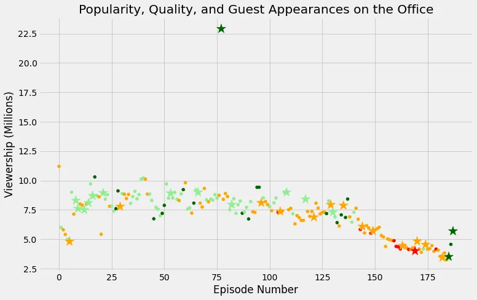
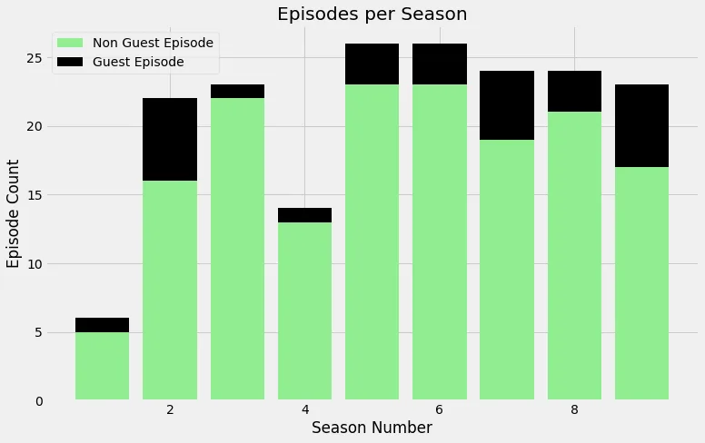

- 

The office, a Mockumentary American television series that depicts the everyday work lives of office employees in the Scranton, Pennsylvania, branch of the fictional Dunder Mifflin Paper Company.

It is 9 season, 201 episodes long., aired on NBC from March 24, 2005, to May 16, 2013.

***In this blog***, we derive insights and visualizations from the data set of The Office series, to understand the episodes rating range and its popularity, the number of views.. etc. using some libraries such as **matplot and seaborn.**

The Data set was published on **kaggle** from [here](https://www.kaggle.com/nehaprabhavalkar/the-office-dataset) by **Prabhavalker**, its details are as the following:

- **episode_number:** Canonical episode number.
- **season:** Season in which the episode appeared.
- **episode_title:** Title of the episode.
- **description:** Description of the episode.
- **ratings:** Average IMDB rating.
- **votes:** Number of votes.
- **viewership_mil:** Number of US viewers in millions.
- **duration:** Duration in number of minutes.
- **release_date:** Airdate.
- **guest_stars:** Guest stars in the episode (if any).
- **director:** Director of the episode.
- **writers:** Writers of the episode.
- **has_guests:** True/False column for whether the episode contained guest stars.
- **scaled_ratings:** The ratings scaled from 0 (worst-reviewed) to 1 (best-reviewed).

**Looking at the data:**

We start by importing the data, by looking at its types it seems we need to change the column date from object type to date type.

```python
# Use this cell to begin your analysis, and add as many as you would like!
import numpy as np
import pandas as pd
import matplotlib.pyplot as plt

plt.rcParams['figure.figsize'] = [11, 7]

office_data = pd.read_csv("datasets/office_episodes.csv", parse_dates=['release_date'])
office_data.head()
```

By typing the info and the shape, it has 188 data and 14 attributes, one is an index.

```python
office_data.shape
```

```python
(188, 14)
```

```python
office_data.info()
```

```python
<class 'pandas.core.frame.DataFrame'>
RangeIndex: 188 entries, 0 to 187
Data columns (total 16 columns):
 #   Column          Non-Null Count  Dtype
---  ------          --------------  -----
 0   episode_number  188 non-null    int64
 1   season          188 non-null    int64
 2   episode_title   188 non-null    object
 3   description     188 non-null    object
 4   ratings         188 non-null    float64
 5   votes           188 non-null    int64
 6   viewership_mil  188 non-null    float64
 7   duration        188 non-null    int64
 8   release_date    188 non-null    datetime64[ns]
 9   guest_stars     29 non-null     object
 10  director        188 non-null    object
 11  writers         188 non-null    object
 12  has_guests      188 non-null    bool
 13  scaled_ratings  188 non-null    float64
 14  colors          188 non-null    object
 15  sizes           188 non-null    int64
dtypes: bool(1), datetime64[ns](1), float64(3), int64(5), object(6)
memory usage: 22.3+ KB
```

**2. Data Exploratory:**

By looking at the null values if any:

```python
office_data.isnull().sum()
```

```python
episode_number      0
season              0
episode_title       0
description         0
ratings             0
votes               0
viewership_mil      0
duration            0
release_date        0
guest_stars       159
director            0
writers             0
has_guests          0
scaled_ratings      0
dtype: int64
```

It seems there are 159 episodes with out guests stars and 188-159 = 29 episodes that had guests stars.

Resetting index to the episode_number column:

```python
office_data = office_data.reset_index(drop=True)
office_data.set_index('episode_number')
office_data.info()
```

##### Analysis Rating & Viewerships in Appearance of Guest Stars:

We need to compare the viewerships and ratings between episodes with guests and episode without guests.

So, we change colors - making a color scheme - according to the following:

- Ratings < 0.25 are colored "**red**"
- Ratings >= 0.25 and < 0.50 are colored "**orange**"
- Ratings >= 0.50 and < 0.75 are colored "**lightgreen**"
- Ratings >= 0.75 are colored "**darkgreen**"

Preparing a list of colors accordingly:

```python
cols = []
for i, row in office_data.iterrows():
    if row['scaled_ratings'] < 0.25:
        cols.append('red')
    elif row['scaled_ratings'] < 0.5:
        cols.append('orange')
    elif row['scaled_ratings'] < 0.75:
        cols.append('lightgreen')
    else:
        cols.append('darkgreen')
cols
```

Then,

We create a **sizing system**, such that episodes with guest appearances have a marker size of 250 and episodes without are sized 25.

```python
sizes =[]
for i, rows in office_data.iterrows():
    if rows['has_guests'] == False:
        sizes.append(25)
    else:
        sizes.append(250)

sizes
```

Now, we append these two lists to the office dtaframe as two new columns:

```python
office_data['colors'] = cols
office_data['sizes'] = sizes

office_data.info()
```

```python
<class 'pandas.core.frame.DataFrame'>
RangeIndex: 188 entries, 0 to 187
Data columns (total 16 columns):
 #   Column          Non-Null Count  Dtype
---  ------          --------------  -----
 0   episode_number  188 non-null    int64
 1   season          188 non-null    int64
 2   episode_title   188 non-null    object
 3   description     188 non-null    object
 4   ratings         188 non-null    float64
 5   votes           188 non-null    int64
 6   viewership_mil  188 non-null    float64
 7   duration        188 non-null    int64
 8   release_date    188 non-null    datetime64[ns]
 9   guest_stars     29 non-null     object
 10  director        188 non-null    object
 11  writers         188 non-null    object
 12  has_guests      188 non-null    bool
 13  scaled_ratings  188 non-null    float64
 14  colors          188 non-null    object
 15  sizes           188 non-null    int64
dtypes: bool(1), datetime64[ns](1), float64(3), int64(5), object(6)
memory usage: 22.3+ KB
```

For the next step, we create two subsets of the dataframe based on the noguest vs has_guests, this is done using the has_guests column:

```python
office_with_guests = office_data[office_data['has_guests']== True]
office_withNo_guests = office_data[office_data['has_guests']== False]
```

Then, the most important step, plotting the two sub sets in the same figure, by adding colors and sizes we created previously to assign sizes and colors to the subsets figures, and then adding a star marker to distinguish between the two.

```python
fig=plt.figure()
plt.style.use('fivethirtyeight')

plt.scatter(x=office_withNo_guests['episode_number'], y=office_withNo_guests['viewership_mil'],
            c=office_withNo_guests['colors'], s=office_withNo_guests['sizes'])

plt.scatter(x=office_with_guests['episode_number'], y=office_with_guests['viewership_mil'],
            c=office_with_guests['colors'], s=office_with_guests['sizes']
           ,marker='*')

plt.title("Popularity, Quality, and Guest Appearances on the Office")
plt.xlabel("Episode Number")
plt.ylabel("Viewership (Millions)")
plt.show()
```



Also, we might want to know the names of guests in the most watched episode with guests, so:

```python
max_view = office_data['viewership_mil'].max()
print(max_view)

top_star = office_data[office_data['viewership_mil'] == max_view]['guest_stars']
print(top_star)
print(office_data['viewership_mil'].idxmax())
```

```python
22.91
77    Cloris Leachman, Jack Black, Jessica Alba
Name: guest_stars, dtype: object
77
```

As seen, They are: Cloris Leachman, Jack Black, Jessica Alba

In the episode 77 with 22.91 million views.

We can visualize the ratio between episodes with guests and no guests in each season using a bar chart as the following:

```python
No_guests = office_withNo_guests['season'].value_counts(sort = False)
with_guests = office_with_guests['season'].value_counts(sort = False)

fig, ax = plt.subplots()
No_guests_b = ax.bar(No_guests.index, No_guests, color ='lightgreen', label = 'Non Guest Episode')
with_guests_b = ax.bar(with_guests.index, with_guests, color ='black', bottom = No_guests,label = 'Guest Episode')
ax.set_xlabel('Season Number')
ax.set_ylabel('Episode Count')
ax.set_title('Episodes per Season')

ax.legend()
plt.show()
```



we can see clearly that the second and the ninth seasons had the most numbers of guests in their episodes.

#### References,

1. 'The Office' series datasets was downloaded from Kaggle [**here**](https://www.kaggle.com/nehaprabhavalkar/the-office-dataset)**.**
2. Investigating Appearance of Guest Stars in 'The Office' Series [**here**](https://www.datainsightonline.com/post/investigating-appearance-of-guest-stars-in-the-office-series)**.**
3. DataCamp's Unguided Project: "Investigating Netflix Movies and Guest Stars in The Office" [**here**](https://projects.datacamp.com/projects/1170)**.**
4. *The Office* (American TV series), wikipedia [**here**](https://en.wikipedia.org/wiki/The_Office_(American_TV_series)).
