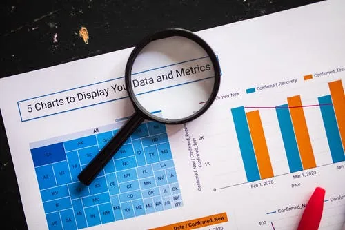

By [Gilbert Temgoua](https://www.github.com/tem-ctrl)

## Introduction

Visualization is one critical step in drawing insights from data in that it allows to view patterns, distribution and relationships in data. In fact, good figures and tables are very helpful in communicating about the data. There exist many libraries which offer the possibility to visualize data, among which according to me, seaborn is the best fit for data science. It is a high-level data visualization library built on top of Matplotlib. In this tutorial, one step after another we will go through the data scientists' favorite plots offered by seaborn. We will use the **food recipes dataset** from Datacamp. This tutorial is organized in three main parts relational plots, categorical plots and distribution plots.

First of all we load the necessary packages, pandas for importing the data, seaborn under its common alias sns, pyplot from matplotlib since seaborn uses it.

```python
import pandas as pd
from matplotlib import pyplot as plt
import seaborn as sns
sns.set()
```

```python
data = pd.read_csv('recipes.csv')
data.head(3)
```

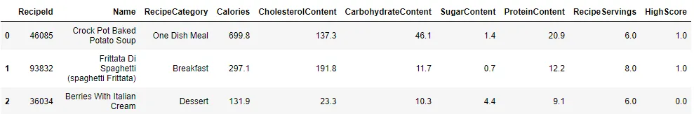

## 1. Relational plots

These are plots that show relationships between parts of data and how they relate to other variables. In the following lines, we will discuss and illustrate the two types of relational plots:

- **Scatter plots**;
- **Line plots**;

### 1.1. Scatter plot

This kind of plot shows the joint distribution of two variables, represented by a cloud of points. The number of points is the same as the number of data points, this means both variables must be of the same length. Once the cloud is displayed, it allows human eyes to rapidly detect potential relationships between both coordinates (variables), not only but also the variables used as **hue** and/or **size**.
seaborn offers two different level functions to draw scatter plots:

- A figure-level function **relplot()** in which we set the **kind** parameter to **scatter** or nothing as it is also the default value of that parameter.
- An axis-level function **scatterplot()**.

For illustration, let's visualize the relation ship between the **Energy (Calories)** and the **Sugar** contained in each recipe (**SugarContent**). The size of each cloud point will be given by its score (**HighScore** column).

```python
fig, ax = plt.subplots()
sns.scatterplot(x='SugarContent', y='Calories', size='HighScore', data=data, ax=ax)
ax.set_title('Relationship between Energy and Sugar content per recipe')
ax.set_xlabel('Sugar')
plt.show()
```

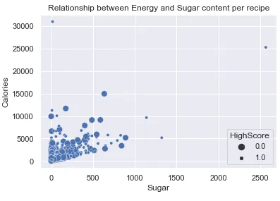

In the above code, the **ax** parameter is to in indicate to seaborn which **matplotlib.axes._subplots.AxesSubplot** object to use. When not specified, it uses the default axes object (**current figure**) created by pyplot. This is equivalent to the following code, notice the parameter **ax** has been removed, this is because **relplot(), a figure-level function** is a **FacetGrid** object, equivalent to **plt.subplots()** that can include more than one Axes. This time the color of each cloud point depends on its score (**HighScore** column).

```python
g = sns.relplot(x='SugarContent', y='Calories', data=data, hue='HighScore')
g.fig.suptitle('Relationship between Energy and Sugar content per recipe', fontsize=10)
g.fig.subplots_adjust(top=.9) # To avoid title displaying on the figure
g.set_xlabels('Sugar')
plt.show()
```

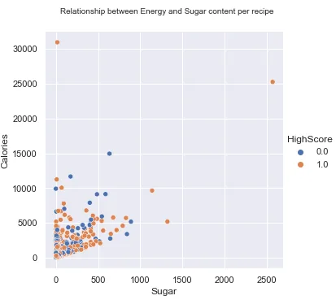

### 1.2. Line plot

A scatter plot is highly efficient in showing potential relationships in data but there are cases where they are less suitable than a line plot. For example when we want to visualize how a certain quantity varies evolves over time. This can be done using **relplot()** by specifying **kind = 'line'** or directly by **lineplot()**.

```python
fig, ax = plt.subplots()
sns.lineplot(x='SugarContent', y='Calories', data=data, ax=ax)
ax.set_title('Relationship between Energy and Sugar content per recipe')
ax.set_xlabel('Sugar')
plt.show()
```

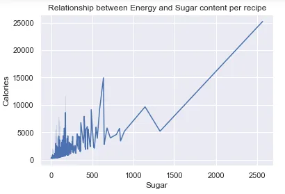

*Note : The* ***lineplot()*** *sortes the data in crescending order before plotting it. This default behaviour can be ovewritten by specifying the parameter* ***sort = False****.*

## 2. Categorical plots

Relational plots were about showing relationships between numeric data. What if some data are divided into groups or categories? Seaborn offers one **figure-level function, catplot()** which, with the **kind** parameter, covers 8 **axes-level functions** divived into 3 categories:

- Categorical scatterplots:

  - **stripplot()** (with kind="strip"; the default)
  - **swarmplot()** (with kind="swarm")

- Categorical distribution plots:

  - **boxplot()** (with kind="box")
  - **violinplot()** (with kind="violin")
  - **boxenplot()** (with kind="boxen")

- Categorical estimate plots:

  - **pointplot()** (with kind="point")
  - **barplot()** (with kind="bar")
  - **countplot()** (with kind="count")

In this tutorial, we will cover one function per category, namely **stripplot, boxplot** and **countplot**.

**2.1. Strip plot**
The column **HighScore** of the data has only two possible values which describe the popularity of recipes: **1.0 (Popular)** or **0.0 (Unpopular)**. We will plot the bee swarm representation of the **Calories** column grouped by their popularity that is **HighScore** column. Unlike the relational plots where we used both figure-level and axes-level functions, here we will only illustrate axes-level functions.

```python
sns.stripplot(x = 'HighScore', y='Calories', data=data)
plt.show()
```

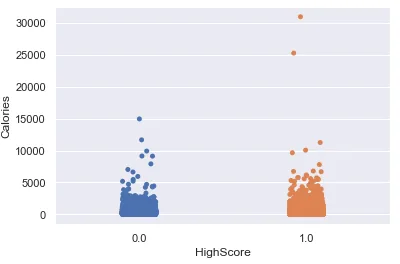

This plot allows to have an overview of the distribution of data across its different categories.

### 2.2. Box plot

The categorical scatter plots become less informative when the size of the data gets high. The geometrical visualization comes in handy in this case as it provides a rapid summary statistics of the data across its different categories. The illustration below gives some summary statistics of **Calories** in each recipes category.

```python
sns.boxplot(x = 'HighScore', y='Calories', data=data, showfliers=False)
plt.xlabel('')
plt.title('Distribution of Calories per recipes category')
plt.xticks([0, 1], ['Unpopular', 'Popular'])
plt.show()
```

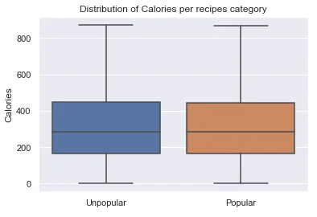

The line inside the box represents the **median** while the upper and lower bounds represent the 75𝑡ℎ and the 25𝑡ℎ **quartiles** respectively, giving the **Inter Quartile Range (IQR)** . The whiskers, that is the upper and lower horizontal lines give the boundaries out of which each data point is considered and **outliers**, by default they are located at 1.5∗𝐼𝑄𝑅. The parameter **showfliers** controls whether to display outliers or not.

### 2.3. Count plot
As indicated by its name, this type of plot permits to estimate ("count") the number of data points per category.

```python
sns.countplot(x = 'HighScore', data=data)
plt.xlabel('')
plt.ylabel('')
plt.title('Total number of recipes per category')
plt.xticks([0, 1], ['Unpopular', 'Popular'])
plt.show()
​
```

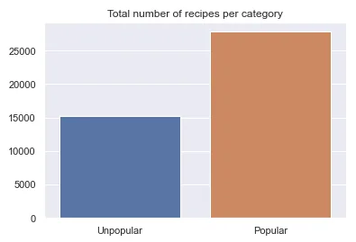

## 3. Distribution plots

An efficient data analysis should lean on understanding and interpreting its distribution, thus answering questions like: What is the main tendency in data? Is data skew or symmetrically distributed?... Seaborn offers 4 axes-level functions: **kdeplot(), ecdfplot(), histplot** and **rugplot()**; enclosed by 3 figure-level functions namely : **displot(), pairplot()** and **jointplot()**. In this part of the tutorial, we will only illustrate **displot()** with its 3 axes-level functions as follows:

- **histplot()** for a histogram
- **kdeplot()** for a kernel density estimate
- **ecdfplot()** for an **empirical cumulative density function**.

### 3.1. Histplot

By default, it divides the data into 50 bins of equal amplitude and plot their frequency (number of data points per bin). The number of bins is controlled by the parameter **bins** which accepts an integers as values. Let's visualize as a histogram the quantity of proteins in recipes. Because the data has some points farther from the mean and median, we will create a new dataframe **df** by sorting **data** on **Calories** column in ascending order then we will take 42000 out of ≈43000 data points, thus eliminating outliers.

```python
df = data.sort_values('Calories')[['Calories', 'HighScore']].iloc[0:42000]
```

```python
sns.histplot(x='Calories', data=df, bins=20)
# sns.displot(df, x='Calories', bins=20)
plt.show()
```

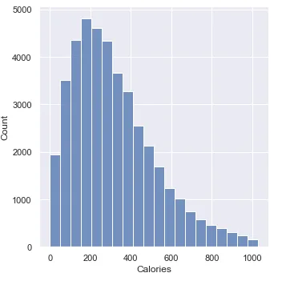

### 3.2. Kde plot
Its aims is to provide a plot of the kde which is a non-parametric way to estimate the probability density function of the data.

```python
sns.kdeplot(x='Calories', data=df)
plt.title('Kernel Density Estimate of recipes Calories')
plt.show()
```

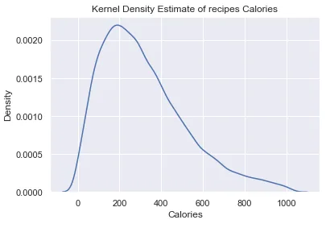

We can notice that this plot has the same shape as the above histogram.

### 3.3. Ecdf plot

```python
sns.ecdfplot(x='Calories', data=df)
plt.title('ECDF of recipes calories')
plt.show()
```

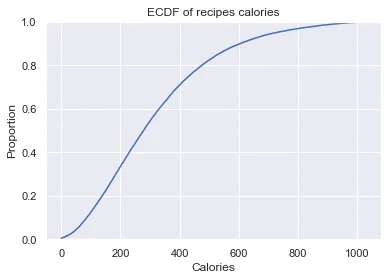

## Conclusion

In this tutorial we covered few data visualization functions from seaborn and it is clear that this python library is the most accomplished one for data scientist due to its ease of use, simple syntax and especially hierarchization, most importantly it leverages the power of matplotlib to make it less cumbersome and clearer.

Find the notebook attached to this article [here](https://github.com/tem-ctrl/intro_data_viz_seaborn).
