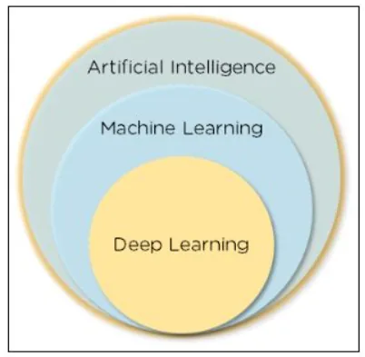
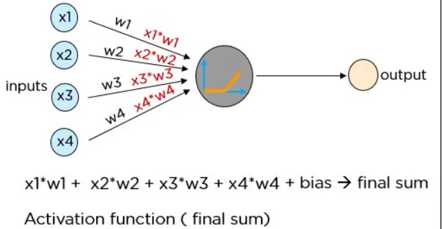
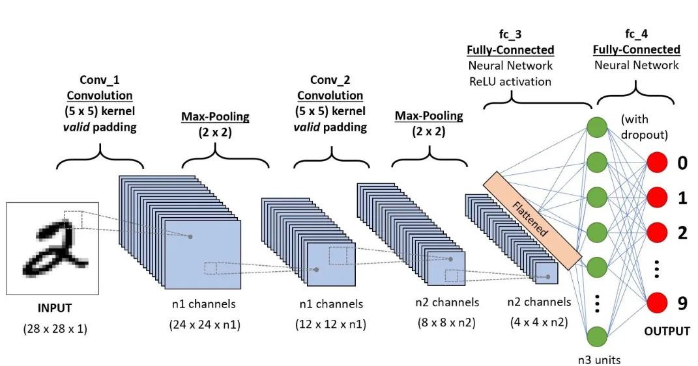

**What is Deep Learning?**

Deep learning is a branch of machine learning which is completely based on artificial neural networks, because the neural network is going to imitate human brain, so deep learning is also a kind of imitating human brain .



## Importance of Deep Learning
- Machine learning only works with structured and semi-structured data sets, while deep learning works with structured and unstructured data.
- Deep learning algorithms can perform complex operations efficiently, while machine learning algorithms cannot

**What are neural networks?**

A neural network is a system modeled on the human brain, composed of an input layer, several hidden layers and an output layer. The data is transmitted as input to the neurons. Information is transferred to the next layer using appropriate weights and biases. The output is the final value predicted by the artificial neuron.



## Neural Network with Keras and basics of Deep Learning

**What is Keras?**

Tensorflow used to be the most widely used deep learning library, however, it was difficult to understand with for beginners. A simple one-layer network involves a substantial amount of code. With Keras, however, the whole process of creating the structure of a neural network, as well as training and monitoring it, becomes extremely simple.

*Keras Models*

Keras models are divided into two categories:

- Keras Functional API
- Keras Sequential Model

**A. Keras Sequential API**

This allows us to develop models layer by layer. However, it does not allow us to create models with many inputs or outputs. It works well for simple layer stacks with a single input and output tensor.

This paradigm fails when one of the stack layers has many inputs or outputs. Even if we want a nonlinear topology, it does not fit.

```python
from keras.models import Sequential
from keras.layers import Dense
model=Sequential()
model.add(Dense(64,input_shape=4,))
mode.add(Dense(32)
```

**B. Keras Functional API.**

The functional API can be used to create models with various inputs and outputs. It also allows us to share these layers. In other words, we can use Keras functional API to build layer graphs.

```python
from keras.models import Model
from keras.layers import Input, Dense
input=Input(shape=(32,))
layer=Dense(32)(input)
model=Model(inputs=input,outputs=layer)
```

**the different layers of the neural network**

Each neural network is based on layers. The Layers API offers a comprehensive set of tools for building neural network architectures.

```python
ann = models.Sequential([
        layers.Flatten(input_shape=(32,32,3)),
        layers.Dense(3000, activation='relu'),
        layers.Dense(1000, activation='relu'),
        layers.Dense(10, activation='softmax')
    ])
```

The Layer Activations class provides many activation functions such as ReLU, Sigmoid, Tanh, Softmax, etc. The Layer Weight Initializers class provides methods for various weight initializations.

```python
cnn = models.Sequential([
    layers.Conv2D(filters=32, kernel_size=(3, 3), activation='relu', input_shape=(32, 32, 3)),
    layers.MaxPooling2D((2, 2)),

    layers.Conv2D(filters=64, kernel_size=(3, 3), activation='relu'),
    layers.MaxPooling2D((2, 2)),

    layers.Flatten(),
    layers.Dense(64, activation='relu'),
    layers.Dense(10, activation='softmax')
])
```

**Using Keras to train neural networks**



Consider the MNIST dataset, which is included in the Keras dataset class. To categorize handwritten images of digits 0 through 9, we will build a basic sequential convolutional neural network.

```python
from keras.preprocessing.image import ImageDataGenerator
datagen = ImageDataGenerator(
rotation_range=10,
zoom_range=0.1,
width_shift_range=0.1,
height_shift_range=0.1
)
```

```python
epochs = 10
 batch_size = 32
 history = model.fit_generator(datagen.flow(x_train, y_train, batch_size=batch_size), epochs=epochs,
 validation_data=(x_test, y_test), steps_per_epoch=x_train.shape[0]//batch_size
)
```

**output:**

```python
Epoch 1/10
1563/1563 [==============================] - 55s 33ms/step - loss: 1.6791 - accuracy: 0.3891
Epoch 2/10
1563/1563 [==============================] - 63s 40ms/step - loss: 1.1319 - accuracy: 0.60360s - loss:
Epoch 3/10
1563/1563 [==============================] - 66s 42ms/step - loss: 0.9915 - accuracy: 0.6533
Epoch 4/10
1563/1563 [==============================] - 70s 45ms/step - loss: 0.8963 - accuracy: 0.6883
Epoch 5/10
1563/1563 [==============================] - 69s 44ms/step - loss: 0.8192 - accuracy: 0.7159
Epoch 6/10
1563/1563 [==============================] - 62s 39ms/step - loss: 0.7695 - accuracy: 0.73471s
Epoch 7/10
1563/1563 [==============================] - 62s 39ms/step - loss: 0.7071 - accuracy: 0.7542
Epoch 8/10
1563/1563 [==============================] - 62s 40ms/step - loss: 0.6637 - accuracy: 0.76941s - l
Epoch 9/10
1563/1563 [==============================] - 60s 38ms/step - loss: 0.6234 - accuracy: 0.7840
Epoch 10/10
1563/1563 [==============================] - 58s 37ms/step - loss: 0.5810 - accuracy: 0.7979
```

**Conclusion**

Deep learning mimics the neural pathways of the human brain in processing data, using them for decision making, object detection, speech recognition and language translation.
