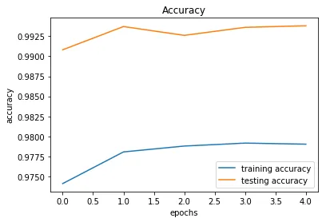
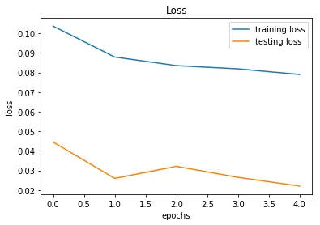

Keras is a high-level neural networks API running on top of Tensorflow. It enables fast experimentation through a high-level, user-friendly, modular, and extensible API. Keras can also be run on both CPU and GPU.

In this article, we will go over the basics of Keras, including the two most used Keras models (Sequential and Functional), the core layers, and some preprocessing functionalities.

**Installing Keras**

Keras is a central part of the tightly-connected TensorFlow 2 ecosystem and therefore is automatically installed when installing Tensorflow. If you haven't installed Tensorflow yet, take a look at the installation instructions.

Once TensorFlow is installed, import Keras via:

```python
from tensorflow import keras
```

**Loading in a dataset**

Keras provides seven different datasets, which can be loaded using Keras directly. These include image datasets, a [house price](https://keras.io/api/datasets/boston_housing/), and a [movie review](https://keras.io/api/datasets/imdb/) dataset.

This article will use the MNIST dataset, which contains 70000 28x28 grayscale images with ten different classes. Keras splits it into a training set with 60000 instances and a testing set with 10000 instances.

```python
from tensorflow.keras.datasets import mnist
(x_train, y_train), (x_test, y_test) = mnist.load_data()
```

To feed the images to a convolutional neural network, we transform the data frame into four dimensions. This can be done using NumPy's reshape method. We will also transform the data into floats and normalize it.

```python
x_train = x_train.astype('float32')
x_test = x_test.astype('float32')
x_train /= 255
x_test /= 255
x_train = X_train.reshape(X_train.shape[0], 28, 28, 1)
x_test = X_test.reshape(X_test.shape[0], 28, 28, 1)
```

We will also transform our labels into a one-hot encoding using the to_categorical method from Keras.

```python
from tensorflow.keras.utils import to_categorical
y_train = to_categorical(y_train, 10)
y_test = to_categorical(y_test, 10)
```

**Creating a model with the sequential API**

The easiest way of creating a model in Keras is by using the sequential API, which lets you stack one layer after the other. The problem with the sequential API is that it doesn't allow models to have multiple inputs or outputs, which are needed for some problems.

Nevertheless, the sequential API is a perfect choice for most problems.

To create a convolutional neural network, we create a Sequential object and use the add function to add layers.

```python
from tensorflow.keras.models import Sequential
from tensorflow.keras.layers import Conv2D, MaxPool2D, Dense, Flatten, Dropout

model = Sequential()
model.add(Conv2D(filters=32, kernel_size=(5,5), activation='relu', input_shape=x_train.shape[1:]))
model.add(Conv2D(filters=32, kernel_size=(5,5), activation='relu'))
model.add(MaxPool2D(pool_size=(2, 2)))
model.add(Dropout(rate=0.25))
model.add(Conv2D(filters=64, kernel_size=(3, 3), activation='relu'))
model.add(Conv2D(filters=64, kernel_size=(3, 3), activation='relu'))
model.add(MaxPool2D(pool_size=(2, 2)))
model.add(Dropout(rate=0.25))
model.add(Flatten())
model.add(Dense(256, activation='relu'))
model.add(Dropout(rate=0.5))
model.add(Dense(10, activation='softmax'))
```

The code above first creates a Sequential object and adds a few convolutional, max-pooling, and dropout layers. It then flattens the output and passes it two a last dense and dropout layer before passing it to our output layer. If you aren't confident build a convolutional neural network(CNN), check out this great tutorial.

The sequential API also supports another syntax where the layers are passed to the constructor directly.

```python
from tensorflow.keras.models import Sequential
from tensorflow.keras.layers import Conv2D, MaxPool2D, Dense, Flatten, Dropout

model = Sequential([
    Conv2D(filters=32, kernel_size=(5,5), activation='relu', input_shape=x_train.shape[1:]),
    Conv2D(filters=32, kernel_size=(5,5), activation='relu'),
    MaxPool2D(pool_size=(2, 2)),
    Dropout(rate=0.25),
    Conv2D(filters=64, kernel_size=(3,3), activation='relu'),
    Conv2D(filters=64, kernel_size=(3,3), activation='relu'),
    MaxPool2D(pool_size=(2, 2)),
    Dropout(rate=0.25),
    Flatten(),
    Dense(256, activation='relu'),
    Dropout(rate=0.5),
    Dense(10, activation='softmax')
])
```

**Creating a model with the Functional API**

Alternatively, the functional API allows you to create the same models but offers you more flexibility at the cost of simplicity and readability.

It can be used with multiple input and output layers and shared layers, which enables you to build complex network structures.

When using the functional API, we always need to pass the previous layer to the current layer. It also requires the use of an input layer.

```python
from tensorflow.keras.models import Model
from tensorflow.keras.layers import Conv2D, MaxPool2D, Dense, Flatten, Dropout, Input

inputs = Input(shape=x_train.shape[1:])

x = Conv2D(filters=32, kernel_size=(5,5), activation='relu')(inputs)
x = Conv2D(filters=32, kernel_size=(5,5), activation='relu')(x)
x = MaxPool2D(pool_size=(2, 2))(x)
x = Dropout(rate=0.25)(x)

x = Conv2D(filters=64, kernel_size=(3,3), activation='relu')(x)
x = Conv2D(filters=64, kernel_size=(3,3), activation='relu')(x)
x = MaxPool2D(pool_size=(2, 2))(x)
x = Dropout(rate=0.25)(x)

x = Flatten()(x)
x = Dense(256, activation='relu')(x)
x = Dropout(rate=0.5)(x)
predictions = Dense(10, activation='softmax')(x)

model = Model(inputs=inputs, outputs=predictions)
```

The functional API is also often used for transfer learning which we will look at in another article.

**Compile a model**

Before we can start training our model, we need to configure the learning process. For this, we need to specify an optimizer, a loss function, and optionally some metrics like accuracy.

The loss function is a measure of how good our model is at achieving the given objective.

An optimizer is used to minimize the loss(objective) function by updating the weights using the gradients.

```python
model.compile(
    loss='categorical_crossentropy',
    optimizer='adam',
    metrics=['accuracy']
)
```

**Augmenting Image data**

Augmentation is the process of creating more data from existing data. For images, you can do little transformations like rotating the image, zooming into the image, adding noise, and many more.

This helps to make the model more robust and solves the problem of insufficient data. Keras has a method called ImageDataGenerator which can be used for augmenting images.

```python
from tensorflow.keras.preprocessing.image import ImageDataGenerator

datagen = ImageDataGenerator(
  rotation_range=10,
  zoom_range=0.1,
  width_shift_range=0.1,
  height_shift_range=0.1
)
```

This ImageDataGenerator will create new images that have been rotated, zoomed in or out, and shifted in width and height.

**Fit a model**

Now that we defined and compiled our model, it's ready for training. We would generally use the fit method to train a model, but because we are using a data generator, we will use fit_generator and pass it our generator, X data, y data, the number of epochs, and the batch size. We will also pass it a validation set so we can monitor the loss and accuracy on both sets and steps_per_epoch, which is required when using a generator and is just set to the length of the training set divided by the batch_size.

```python
epochs = 3
batch_size = 32
history = model.fit_generator(datagen.flow(x_train, y_train, batch_size=batch_size), epochs=epochs,
                              validation_data=(x_test, y_test), steps_per_epoch=x_train.shape[0]//batch_size)
```

This outputs:

```python
Epoch 1/5
1875/1875 [==============================] - 22s 12ms/step - loss: 0.1037 - acc: 0.9741 - val_loss: 0.0445 - val_acc: 0.9908
Epoch 2/5
1875/1875 [==============================] - 22s 12ms/step - loss: 0.0879 - acc: 0.9781 - val_loss: 0.0259 - val_acc: 0.9937
Epoch 3/5
1875/1875 [==============================] - 22s 12ms/step - loss: 0.0835 - acc: 0.9788 - val_loss: 0.0321 - val_acc: 0.9926
Epoch 4/5
1875/1875 [==============================] - 22s 12ms/step - loss: 0.0819 - acc: 0.9792 - val_loss: 0.0264 - val_acc: 0.9936
Epoch 5/5
1875/1875 [==============================] - 22s 12ms/step - loss: 0.0790 - acc: 0.9790 - val_loss: 0.0220 - val_acc: 0.9938
```

**Visualizing the training process**

We can visualize our training and testing accuracy and loss for each epoch to get an intuition about the performance of our model. The accuracy and loss over epochs are saved in the history variable we got while training, and we will use Matplotlib to visualize this data.

```python
import matplotlib.pyplot as plt
plt.plot(history.history['accuracy'], label='training accuracy')
plt.plot(history.history['val_accuracy'], label='testing accuracy')
plt.title('Accuracy')
plt.xlabel('epochs')
plt.ylabel('accuracy')
plt.legend()
```



```python
plt.plot(history.history['loss'], label='training loss')
plt.plot(history.history['val_loss'], label='testing loss')
plt.title('Loss')
plt.xlabel('epochs')
plt.ylabel('loss')
plt.legend()
```



In the graphs above, we can see that our model isn't overfitting as well as that we could train more epochs because the validation loss is still decreasing.

**Resources**

- [Keras documentation](https://www.tensorflow.org/api_docs/python/tf/keras)
- [Keras Github](https://github.com/keras-team/keras)

**Conclusion**

Keras is a high-level neural networks API running on top of Tensorflow. It enables fast experimentation through a high-level, user-friendly, modular, and extensible API. Keras can also be run on both CPU and GPU.
