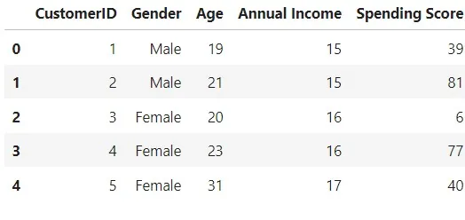
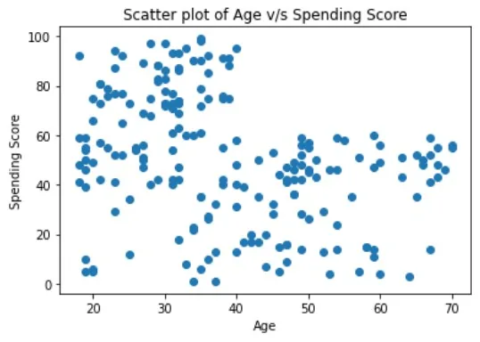
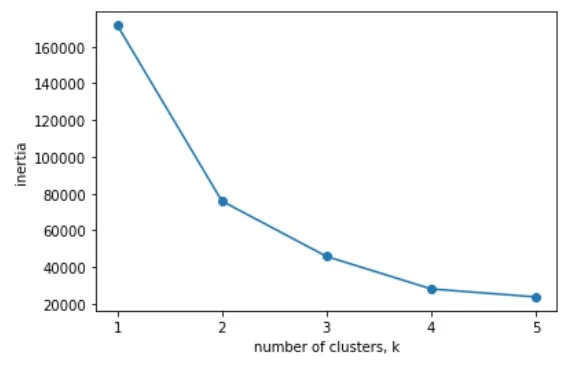
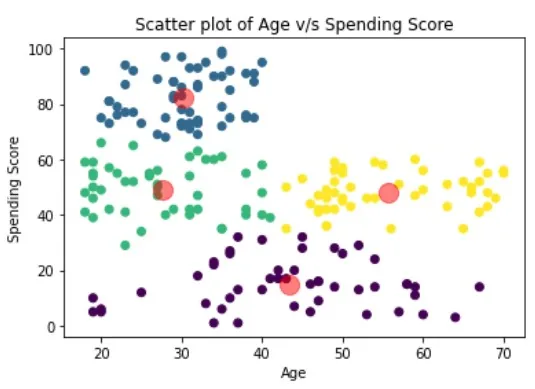
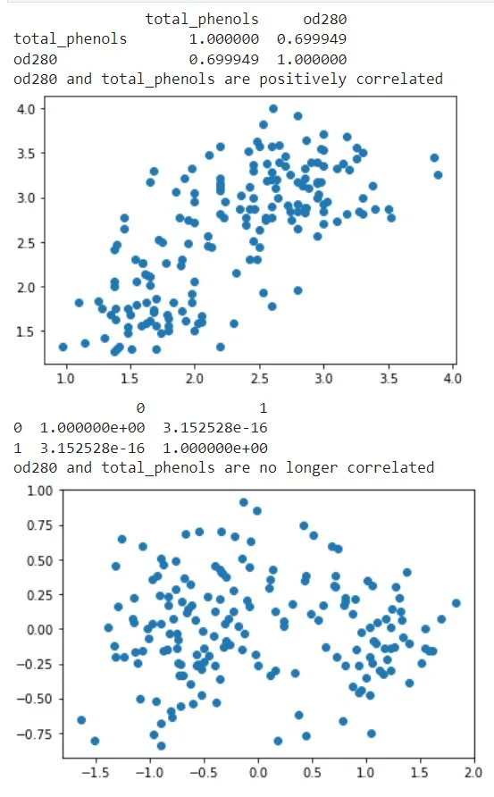
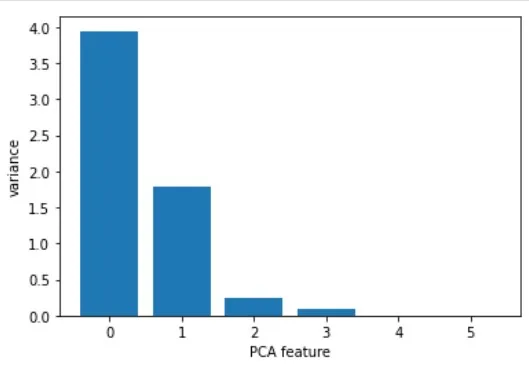

Machine learning is the field that teaches machines and computers to learn from existing data to make predictions on new data. In this article we will learn how to use Python to perform supervised learning and unsupervised learning, two essential components of machine learning.

```python
import numpy as npimport pandas as pd
import matplotlib.pyplot as plt
from sklearn.neighbors import KNeighborsClassifier
from sklearn.preprocessing import OneHotEncoder
from sklearn.linear_model import LinearRegression, Ridge
from sklearn.model_selection import train_test_split,
cross_val_score
from sklearn.cluster import KMeans
from sklearn.decomposition import PCA
from sklearn.preprocessing
import StandardScalerfrom sklearn.pipeline
import make_pipeline

import warnings
warnings.filterwarnings('ignore')
```

## Supervised Learning

Supervised learning is defined by its use of labeled datasets to train algorithms that to classify data or predict outcomes accurately.

### Classification

Classification is a task that requires the use of machine learning algorithms that learn how to assign a class label to examples from the problem domain. An easy to understand example is classifying emails as “spam” or “not spam”, people as “male” or “female”.

We will begin our study with a small dataset designed to provide an idea about whether a person's gender can be predicted with an acuuracy significantly above 50% based on their personal preferences.

We will fit a k-Nearest Neighbors classifier to the dataset.

```python
df = pd.read_csv("gender_data_set.csv")
print(df.info())
print(df.head())
```

```python
<class 'pandas.core.frame.DataFrame'>
RangeIndex: 66 entries, 0 to 65
Data columns (total 5 columns):
 #   Column                Non-Null Count  Dtype
---  ------                --------------  -----
 0   Favorite Color        66 non-null     object
 1   Favorite Music Genre  66 non-null     object
 2   Favorite Beverage     66 non-null     object
 3   Favorite Soft Drink   66 non-null     object
 4   Gender                66 non-null     object
dtypes: object(5)
memory usage: 2.7+ KB
None
  Favorite Color Favorite Music Genre Favorite Beverage Favorite Soft Drink  \
0           Cool                 Rock             Vodka          7UP/Sprite
1        Neutral              Hip hop             Vodka     Coca Cola/Pepsi
2           Warm                 Rock              Wine     Coca Cola/Pepsi
3           Warm     Folk/Traditional           Whiskey               Fanta
4           Cool                 Rock             Vodka     Coca Cola/Pepsi

  Gender
0      F
1      F
2      F
3      F
4      F
```

Scikit-learn does not work with string value on KNN. So we need to implement a function to return the response and the features arrays after encoding the strings to numeric values.

```python
def encoder(df):
'''
Encode categorical features as a one-hot numeric array
'''
y = df['Gender'] # response pandas serie
X = df.drop('Gender', axis=1) # features array

ency = OneHotEncoder(handle_unknown='ignore')
ency.fit(np.array(y).reshape(-1, 1))

encX = OneHotEncoder(handle_unknown='ignore')
encX.fit(X)

y = ency.transform(np.array(y).reshape(-1, 1)).toarray()
X = encX.transform(X).toarray()

return X, y
```

```python
X, y = encoder(df)

# K-NN classifier with 7 neighbors
knn = KNeighborsClassifier(n_neighbors=7)

knn.fit(X, y)
y_pred = knn.predict(X)

# Measuring model performance
print(knn.score(X, y), "   not a good start ;)")
print(ency.inverse_transform(y_pred)[:5])
```

```python
0.7121212121212122    not a good start ;)
[['M']
 ['M']
 ['F']
 ['F']
 ['F']]
```

## Regression

Regression is best suited to problems that requires a continuous outcome. We will learn about fundamental concepts in regression and apply them to predict the maximum temperature given the minimum temperature.

```python
df = pd.read_csv("summary_of_weather.csv", low_memory=False)
df = df[["MaxTemp", "MinTemp"]]
print(df.head())
```

```python
     MaxTemp    MinTemp
0  25.555556  22.222222
1  28.888889  21.666667
2  26.111111  22.222222
3  26.666667  22.222222
4  26.666667  21.666667
```

```python
y = df['MaxTemp'].values.reshape(-1, 1)
X = df['MinTemp'].values.reshape(-1, 1)
```

```python
X_train, X_test, y_train, y_test = train_test_split(X,
    y,test_size=0.3, random_state=42)
reg_all = LinearRegression()
reg_all.fit(X_train, y_train)
y_pred = reg_all.predict(X_test)
reg_all.score(X_test, y_test)
```

```python
0.7710802890827995
```

#### K-fold Cross-validation

Cross-validation is a technique used to resist the dependence on the way that the data is split. So, we begin by spliting the dataset into k groups or folds, then we hold out the first fold as a test set, fit our model on the remaining folds, predict on the test set, and compute the metric of interest (here R squared). Next, we hold out the second fold as our test set and do the same thing as the first fold. We continue doing this to all the folds. As a result we get k values of R squared from which we can compute statistics of interest, such as the mean...

```python
reg = LinearRegression()
cv_results = cross_val_score(reg, X, y, cv=5)
print(cv_results)
print(np.mean(cv_results))
```

```python
[0.61699036 0.81851337 0.82021727 0.65761298 0.25587764]
0.6338423249654739
```

Learning about linear regression and how to use it in scikit-learn is an essential first step toward using regularized linear models.

Ridge regression belongs a class of regression tools that use L2 regularization. The other type of regularization, L1 regularization, limits the size of the coefficients by adding an L1 penalty equal to the absolute value of the magnitude of coefficients. This sometimes results in the elimination of some coefficients altogether, which can yield sparse models. L2 regularization adds an L2 penalty, which equals the square of the magnitude of coefficients. All coefficients are shrunk by the same factor (so none are eliminated). Unlike L1 regularization, L2 will not result in sparse models.

```python
X_train, X_test, y_train, y_test = train_test_split(X,
    y,test_size=0.3, random_state=42)
ridge = Ridge(alpha=0.1, normalize=True)
ridge.fit(X_train, y_train)
ridge_pred = ridge.predict(X_test)
ridge.score(X_test, y_test)
```

```python
0.7647910633122196
```

## Unsupervised learning

Unsupervised learning finds patterns in data but without a specific prediction task in mind.

We will introduce the k-means clustering. It finds clusters of samples
Clustering is the task of dividing the population or data points into a number of groups such that data points in the same groups are more similar to other data points in the same group than those in other groups.

### KMeans Clustering

The K-means algorithm identifies k number of centroids, and then allocates every data point to the nearest cluster, while keeping the centroids as small as possible. The ‘means’ in the K-means refers to averaging of the data; that is, finding the centroid.

```python
df = pd.read_csv('segmented_customers.csv')
df.head()
```



### *2D Clustering based on Age and Spending*

```python
Scoreplt.scatter(x='Age', y='Spending Score', data=df)

plt.xlabel('Age')
plt.ylabel('Spending Score')
plt.title('Scatter plot of Age v/s Spending Score')

plt.show()
```



#### Deciding K value

```python
samples = df[['Age', 'Spending Score']].values
ks = range(1, 6)
inertias = []
for k in ks:
    # Create a KMeans instance with k clusters: model
    model = KMeans(n_clusters=k)
    model.fit(samples)
    inertias.append(model.inertia_)
 plt.plot(ks, inertias, '-o')
 plt.xlabel('number of clusters, k')plt.ylabel('inertia')
 plt.xticks(ks)
 plt.show()
```



#### Applying KMeans for k=4

```python
model = KMeans(n_clusters=4)
labels = model.fit_predict(samples)
centroids = model.cluster_centers_
plt.scatter(x='Age', y='Spending Score', data=df, c=labels)
# plot the centroids
plt.scatter(x=centroids[:,0], y=centroids[:, 1], c='red', alpha=0.5, s=200)
plt.xlabel('Age')
plt.ylabel('Spending Score')
plt.title('Scatter plot of Age v/s Spending Score')
plt.show()
```



### Principal Component Analysis

Dimension reduction summarizes a dataset using its common occuring patterns. In this paragraph, you'll learn about the most fundamental of dimension reduction techniques, "Principal Component Analysis" ("PCA"). PCA is often used before supervised learning to improve model performance and generalization. It can also be useful for unsupervised learning.

```python
df = pd.read_csv('wine.csv')[['total_phenols', 'od280']]
samples = df.values
print(df.corr())
print("od280 and total_phenols are positively correlated")
plt.scatter(x=samples[:,0], y=samples[:, 1])
plt.show()
model = PCA()
model.fit(samples)
transformed = model.transform(samples)
transformed_df = pd.DataFrame(transformed)
print(transformed_df.corr())
print("od280 and total_phenols are no longer correlated")
plt.scatter(x=transformed[:,0], y=transformed[:, 1])
plt.show()
```



PCA aligns principal components with the axes.

```python
print(model.components_)
```

```python
[[-0.64116665 -0.76740167]
 [-0.76740167  0.64116665]]
```

#### Intrinsic dimension of the fish data

```python
scaler = StandardScaler()
df = pd.read_csv('fish.csv').drop('A', axis=1)
samples = np.array(df)
pca = PCA()
pipeline = make_pipeline(scaler, pca)
pipeline.fit(samples)
features = range(pca.n_components_)
plt.bar(features, pca.explained_variance_)
plt.xlabel('PCA feature')
plt.ylabel('variance')
plt.show()
```



We have 2 PCA features with significant variance, so the reasonable choice for the intrinsic dimension of the fish measurements would be 2.

```python
pca = PCA(n_components=2)
pca.fit(samples)
transformed = pca.transform(samples)
print(transformed.shape)
```

```python
(85, 2)
```

[Github](https://github.com/Jihed503/Data_Science_Notebooks/blob/main/8_Supervised_Unsupervised_Learning_in_Python/Supervised_Unsupervised_Learning_in_Python.ipynb)
