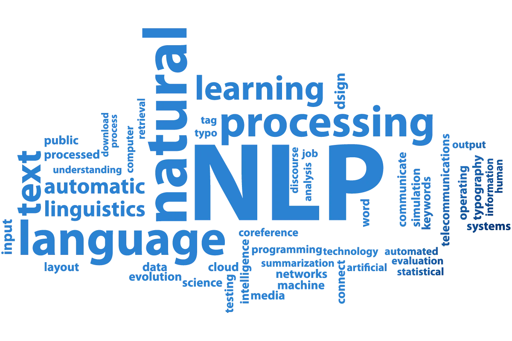
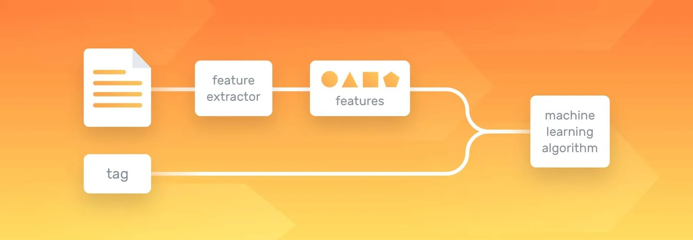
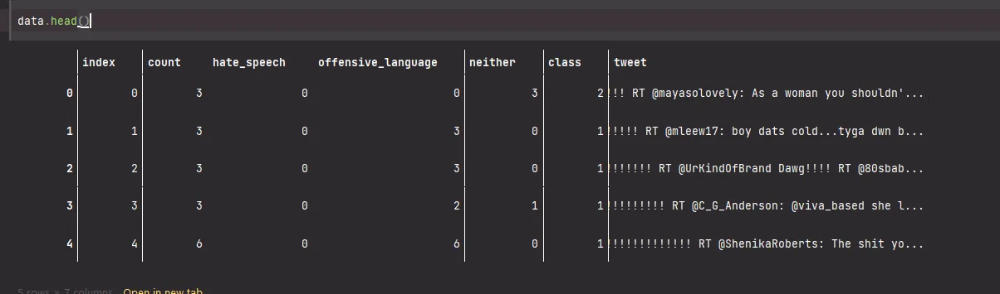
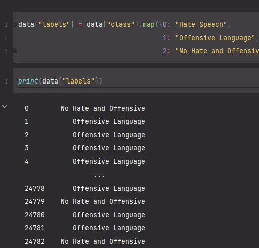
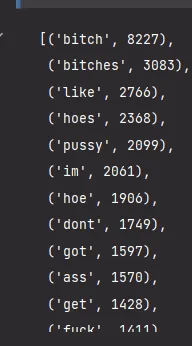

Natural Language Processing(NLP) is a field of Artificial Intelligence(AI) that makes human language intelligible to machines. NLP combines the power of linguistics and computer science to study the rules and structure of language, and create intelligent systems (run on machine learning and NLP algorithms) capable of understanding, analyzing, and extracting meaning from text and speech. Natural Language Toolkit, or NLTK, is a Python package that can be used for NLP.

NLP is used to understand the structure and meaning of human language by analyzing different aspects like syntax, semantics, and pragmatics. Then, computer science transforms this linguistic knowledge into a rule-based, machine learning algorithm that can solve specific problems and perform desired tasks.

There are many benefits of NLP, but here are just a few benefits:

- **Perform large-scale analysis.** Natural Language Processing helps machines automatically understand and analyze huge amounts of unstructured text data, like social media comments, customer support tickets, online reviews, news reports, and more.
- **Tailor NLP tools to your industry.** Natural language processing algorithms can be tailored to your needs and criteria, like complex, industry-specific language – even sarcasm and misused words.

#### Natural Language Processing(NLP) Working



Using text validation, NLP tools transform the text into something a machine can understand, then machine learning algorithms are fed training data and expected outputs (tags) to train machines to make associations between a particular input and its corresponding output.

#### Terms used in Natural Language Processing:

#### Tokenization
Process split an input sequence into tokens where we can think of a token as a useful unit for semantic processing

**Stop Words**

Words that are so common to language that removing them doesn’t affect the overall message enough to lose meaning.

Example: “a", "an”, “the” etc.

**Lemmatizations**

Process of grouping together the different inflected forms of a word so they can be analyzed as a single item

Example: “running” and “runs” are converted to its lemma form “run”

**TF-IDF(Term Frequency – Inverse Document Frequency)**

A feature extraction technique to convert text into a matrix (or vector) of features

Let's take an example of detecting offensive and hate speech using NLP techniques.

### NOTE: This example consists of some inappropriate words which are used for the purpose of example only.
First, we have imported libraries used for NLP such as nltk i.e. natural language toolkit.

```python
import numpy as np
import pandas as pd
import matplotlib.pyplot as plt
import string
import re
import nltk
from nltk.util import pr
from sklearn.feature_extraction.text import CountVectorizer
from sklearn.model_selection import train_test_split
from sklearn.tree import DecisionTreeClassifier
from nltk.corpus import stopwords
import warnings
warnings.filterwarnings('ignore')
stemmer = nltk.SnowballStemmer("english")
nltk.download('stopwords')
stopword=set(stopwords.words('english'))
```

Top 5 columns in the dataset. In the class section, we have classes that matched their label i.e. Class 1 is Hate speech and Class 2 is Offesnvive Langauge.





```python
def clean(text):
    text = str(text).lower()
    text = re.sub('\[.*?\]', '', text)
    text = re.sub('https?://\S+|www\.\S+', '', text)
    text = re.sub('<.*?>+', '', text)
    text = re.sub('[%s]' % re.escape(string.punctuation), '', text)
    text = re.sub('\n', '', text)
    text = re.sub('\w*\d\w*', '', text)
    text = [word for word in text.split(' ') if word not in stopword]
    text=" ".join(text)
    text = [stemmer.stem(word) for word in text.split(' ')]
    text=" ".join(text)
    return text
data["tweet"] = data["tweet"].apply(clean)
```

Applying text cleaning for removal of symbols like @, #, ? etc.

**Removing Stop Words in Tokenization**
We can use NLTK’s built-in library of stop words to remove them in a tokenizing function.

```python
stop_words = set(stopwords.words('english'))

def process_tweet(text):
    tokens = nltk.word_tokenize(text)
    stopwords_removed = [token.lower() for token in tokens if token.lower() not in stop_words]
    return stopwords_removed

# applying the above function to our data/features
processed_data = list(map(process_tweet, data))

total_vocab = set()
for comment in processed_data:
    total_vocab.update(comment)
len(total_vocab)
```

Now that the stop words are removed and the corpus is tokenized, let’s take a look at the top words in this corpus.

```python
# morphing `processed_data` into a readable list
flat_filtered = [item for sublist in processed_data for item in sublist]
# getting frequency distribution
clean_corpus_freqdist = FreqDist(flat_filtered)
# top 20 words in cleaned corpus
clean_corpus_freqdist.most_common(20)
```



**Lemmatization**
This last method reduces each word into a linguistically valid **lemma**, or root word. It does this through linguistic mappings, using the WordNet lexical database.

*# creating a list with all lemmatized outputs*
lemmatizer = WordNetLemmatizer()
lemmatized_output = []

*for* listy *in* processed_data:
 lemmed = ' '.join([lemmatizer.lemmatize(w) *for* w *in* listy])
 lemmatized_output.append(lemmed)
