"Natural language processing is an area of research in computer science and artificial intelligence (AI) concerned with processing natural languages such as English or Mandarin. This processing generally involves translating natural language into data (numbers) that a computer can use to learn about the world. And this understanding of the world is sometimes used to generate natural language text that reflects that understanding."- Natural Language Processing in action, pg. 4.

The definition sets the scope of NLP in artificial intelligence, that we are analysing data, translating and drawing insights from the data.

We will import the following 2 packages 1. re and 2. nltk.tokenize. From nltk.tokenize will grab the word_tokenize and sent_tokenize packages

```python
# Libraries
import re
from nltk.tokenize import word_tokenize, sent_tokenize
```

We create an example of data we will use.

sample_text = "'My name is Ntandoyenkosi Matshisela, a 30 year old data analyst from Zimbabwe. I did my Masters degree at the National University of Science and Technology, Zimbabwe, where I specialised in Operations Research and Statistics, 2018. Prior to this I did a BSc in Operations Research and Statistics finishing it in 2015. My research interests are statistical computing and machine learning.😊 \n Most of the times, like 5 times a week, I tweet about [#Python](https://www.datainsightonline.com/blog/hashtags/Python), [#Rstats](https://www.datainsightonline.com/blog/hashtags/Rstats) and [#R](https://www.datainsightonline.com/blog/hashtags/R). The tweeter handle is @matshisela😂. \n ◘Ŧ, ₦ ✔ \n I love gifts🎁, pizza 🍕, sandwich🥪'"

**Search and Match**

We can search or match for words and numbers. To do so we use ***re.search,*** for words we use “\w” and digits we “\d”. We can accommodate more letters and digits by adding a plus sign (+).

```python
# Let us match words
word_regex = r"\w+"
print(re.search(word_regex, sample_text))
number_regex = "\d+"
print(re.search(number_regex, sample_text))
```

**Findall**

We can search for capital letters by stating [A-Z] in our pattern. Further we include the full word which has the capital letter.

```python
# Write a pattern to match sentence endings: sentence_endings
capital_words = r"[A-Z]\w+"
print(re.findall(capital_words, sample_text))
```

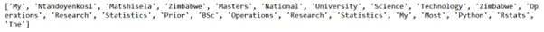

We can look for the lower case words by:

```python
lower_cases = r"[a-z]\w+"
print(re.findall(lower_cases, sample_text))
```

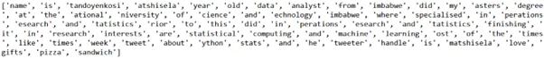

Similarly digits can be found by:

```python
digits = r"\d+"
print(re.findall(digits, sample_text))
```

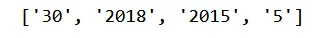

```python
# Looking for words with hash tags
wild_card = r"[#]\w+"
print(re.findall(wild_card, sample_text))
```

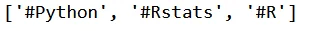

**Word Tokenization**

In the nltk library we can do the same things we have done above and indeed more. We download the following packages by running the following.

```python
import nltk
nltk.download('punkt')
```

We can get the first 20 objects by:

```python
word_tokens = word_tokenize(sample_text)
word_tokens[:20]
```

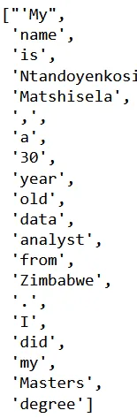

Another cool thing is that we can split by sentences by:

```python
#sentences
sent_tokens = sent_tokenize(sample_text)
sent_tokens
```

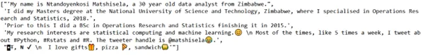

As you can see we have split the text file by sentences.

**Advanced Tokenization**

Another source of the data is tweeter where people post a lot of information mostly words. People also tag using @, for example @matshisela, and they use # to highlight a subject e.g. [#Rstats](https://www.datainsightonline.com/blog/hashtags/Rstats). To delve into the analysis we use the following

```python
from nltk.tokenize import regexp_tokenize
from nltk.tokenize import TweetTokenizer
We can use the following pattern to filter the topics
pattern1 = r"#\w+"
hashtags = regexp_tokenize(sample_text, pattern1)
hashtags
```

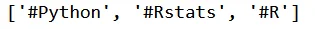

We can include the # hashtags and mentions in one line by

```python
pattern2 = r"[.@#]\w+"
mention_hashtags = regexp_tokenize(sample_text, pattern2)
mention_hashtags
```

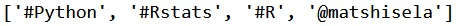

The TweetTokenizer can be instantiated by TweetTokenizer() which is used in the for loop.

```python
tknzr = TweetTokenizer()
all_tokens = [tknzr.tokenize(t) for t in sample_text]
all_tokens[:10]
```

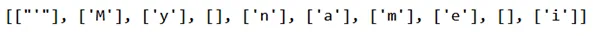

Emojis can be also used. The unicodes can be used to capture these like:

```python
## Non ascii tokenization
emoji = "['\U0001F300-\U0001F5FF'|'\U0001F600-\U0001F64F'|'\U0001F680-\U0001F6FF'|'\u2600-\u26FF\u2700-\u27BF']"
print(regexp_tokenize(sample_text, emoji))
```

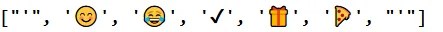

**Charting Words**

We can chart the distribution of the length of words. The following code outputs a chart that shows this distribution.

```python
import matplotlib.pyplot as plt
words = word_tokenize(sample_text)
word_lengths = [len(w) for w in words]
plt.hist(word_lengths)
plt.show()
```

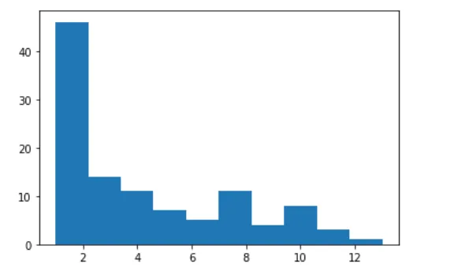

**Word counts with bag of words**

We can also show how many times a word has been used using the word tokenizer. We then get the most used word from the most used to the least used.

```python
## Word Counts with bag of words
from collections import Counter
# lets convert words to lower case so that we capture all words the same
tokens = word_tokenize(sample_text)
lower_tokens = [t.lower() for t in tokens]
word_number = Counter(lower_tokens)
print(word_number.most_common(10))
```

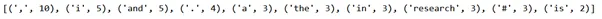

## More commas are used in the sample text. This doesn’t give us a lot of information. We can do text preprocessing to get a conceptual understanding

## Simple Text Preprocessing
There are 3 preprocessing tasks one can do which are

1. Lemmatization
2. Lowercasing
3. Removing unwanted tokens

We can use the alphabetic words by using:

```python
# Let us look for alphabetic words
alpha_only = [t for t in lower_tokens if t.isalpha()]
alpha_only[:10]
```

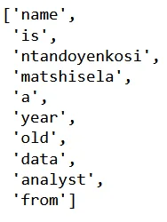

As you can see we have removed the commas and the non-alphabetic objects

We can remove the English stop words such as in this list to get a sense of the usage of the real words

```python
# Let us remove stop words, shall we
english_stops = ['the', 'they', 'i', 'my', 'to', 'and', 'a', 'in', 'is', 'did', 'of']
no_stops = [t for t in alpha_only if t not in english_stops]
no_stops[:10]
```

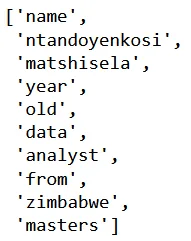

We can then use the word net lemmatizer to find the most used words by:

```python
from nltk. stem import WordNetLemmatizer
#nltk.download('wordnet')
wordnet_lemmatizer = WordNetLemmatizer()
lemmatized = [wordnet_lemmatizer.lemmatize(t) for t in no_stops]
# Bag of words
word_number2 = Counter(lemmatized)
print(word_number2.most_common((10)))
```

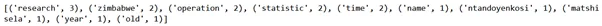

As you can see that the most used words are research, which is what I am. Another striking use is Zimbabwe, where I come from too. Now think of, say if we have a large text file, more insights would be derived

The code to generate the above code and output is [here](https://github.com/Matshisela/Introduction-to-Natural-language-processing)

The concepts learnt came from the [Datacamp](https://app.datacamp.com/learn/courses/introduction-to-natural-language-processing-in-python) NLP lesson
