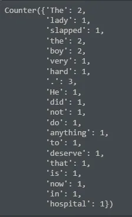

**Natural Language Processing (NLP)**

Application of computational methods to the analysis and synthesis of spoken and written natural language is known as **Natural Language Processing (NLP)**. It is an academic discipline devoted to employing statistics and computers to interpret language. Some interesting applications of NLP include:

1. Topic Identification
2. Chatbots
3. Text classification
4. Translation
5. Sentiment analysis and others.

In this blog, we will talk about some NLP basic concepts like regular expressions (regex), tokenization, amongst others.

### Regular Expressions (Regex)

Regular expressions are strings with special syntax that allow us to match patterns in other strings. The applications of regular expressions include:

1. Find all web links in a document.
2. Parse email addresses.
3. Remove/Replace unwanted strings or characters.

It can be used easily with Python via the **"re library"**. There are hundreds of regular expression patterns available and the choice is based on the application you want. Some examples are:

1. \w+ which is used to match words.
2. \d which is used to match digits.
3. \s is used to match spaces.
4. .\* is known as wildcard and used to match both characters and numbers.

### Tokenization

Tokenization is the process of turning a string or document into **tokens** (smaller chunks). This is usually one step of preparing a text for NLP. There a lot of rules and theories governing tokenization. Regular expressions can help you create your own rules for tokenization. Usually tokenization does the following:

1. Breaking out words or sentences.
2. Separating punctuation.
3. Separating all hashtags in a tweet.

A library usually used for tokenization is **"nltk library"**. Nltk stands for **"Natural Language Toolkit"**. Below is how this library helps:

```python
#Importing the needed libraries
from nltk.tokenize import word_tokenize
import nltk

#Downloading nltk needed resources into notebook
nltk.download('punkt')

#Generating tokens for Hello World!
word_tokenize("Hello World!")
```

**Output:** ['Hello', 'World', '!']

Tokenization is important because:

1. Easier to map part of speech.
2. Matching common words.
3. Removing unwanted tokens.

We will use NLP for simple topic identification in this blog. Simple topic identification is a technique used to discover topics across text documents. This will be done using the bag-of-words approach.

```python
#Importing the needed libraries
from nltk.tokenize import word_tokenize
from collections import Counter

#Counting the individual words or topics in the sentence
Counter(word_tokenize("The lady slapped the boy very hard. He did not do anything to deserve that. The boy is now in the hospital."))
```

**Output:**



### Feature Engineering for NLP

For any ML algorithm, the data fed into it must be in a tabular form and must be numerical. One-hot encoding helps to automatically encode categorical columns in a dataset. The preprocessing/feature engineering steps usually used in natural language processing applications include:

1. **Text-preprocessing:** This involves steps like converting words into their lowercase and base form. For example: Participation converted to its lowercase as participation and its base-form as participate.
2. **Vectorization:** This involves the conversion of the preprocessed texts from step 1 into a set of numerical training features.
3. **Basic features:** This is where the actual feature engineering takes place. Here features like: number of words, number of characters, average length of words, tweets, etc.
4. **POS tagging:** This is known as Part Of Speech tagging to know the different parts of speech present in your text where it is a pronoun, verb, etc.
5. **Named Entity Recognition:** This helps to know whether a particular noun is referring to a person, organization, or country.

GitHub repository link for code: <https://github.com/Jegge2003/NLP/blob/main/NLPIntro.ipynb>
