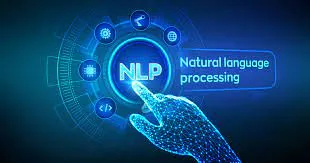

Natural language processing (NLP) is a field that focuses on making computer algorithms understand natural human language. Natural Language Toolkit, or NLTK, is a Python package that can be used for NLP.
Unstructured data with human-readable text makes up a large portion of the data you could be examining. You must first preprocess the data before you can analyze it programmatically. This tutorial will provide you an overview of the different types of text preparation tasks you may perform with NLTK so that you can use them in future projects. You'll also learn how to do some basic text analysis and visualize data.

Tokenizing

You may easily split up text by word or sentence by tokenizing it. This will enable you to work with smaller chunks of text that are still somewhat cohesive and comprehensible even when taken out of context. It's the initial step toward transforming unstructured data into structured data that can be analyzed more easily.
When analyzing text, you'll tokenize words by word and sentences by sentence. Here are the benefits of both forms of tokenization:

- Tokenizing by word: Words are the atoms of natural language. They're the tiniest unit of meaning that can nevertheless be understood on its own. Tokenizing your text word by word allows you to spot words that appear frequently. If you were to look at a bunch of employment adverts, you could notice that the word "Python" appears frequently. That could indicate a significant demand for Python expertise, but you'd have to dig deeper to find out.
- Tokenizing by sentence: Tokenizing by sentence allows you to see more context and understand how the words relate to one another. Is the word "Python" surrounded by a lot of bad adjectives because the recruiting manager dislikes Python? Is there a greater number of phrases from the area of herpetology than from the domain of software development, indicating that you may be working with a whole different type of Python than you anticipated?

To tokenize by word and sentence, import the required components of NLTK as follows:

```python
from nltk.tokenize import sent_tokenize, word_tokenize
```

You can now generate a string to tokenize once you've imported everything you need. You can use the following quote from Dune:

```python
example_string = """Muad'Dib learned rapidly because his first training was in how to learn.And the first lesson of all was the basic trust that he could learn.It's shocking to find how many people do not believe they can learn,and how many more believe learning to be difficult."""
```

To separate example string into sentences, use sent_tokenize():

```python
import nltk
import ssl
try:_
    create_unverified_https_context = ssl._create_unverified_context
except        AttributeError:
                pass
else:
ssl._create_default_https_context = _create_unverified_https_contextnltk.download()
```

```python
sent_tokenize(example_string)
```

Tokenizing example_string by sentence gives you a list of three strings that are sentences:

1. "Muad'Dib learned rapidly because his first training was in how to learn."
2. 'And the first lesson of all was the basic trust that he could learn.'
3. "It's shocking to find how many people do not believe they can learn, and how many more believe learning to be difficult."

Now try tokenizing example_string by word:

```python
word_tokenize(example_string)
```

You got a list of strings that NLTK considers to be words, such as:

- "Muad'Dib"
- 'training'
- 'how'

But the following strings were also considered to be words:

- "'s"
- ','
- '.'

See how "It's" was split at the apostrophe to give you 'It' and "'s", but "Muad'Dib" was left whole? This happened because NLTK knows that 'It' and "'s" (a contraction of “is”) are two distinct words, so it counted them separately. But "Muad'Dib" isn’t an accepted contraction like "It's", so it wasn’t read as two separate words and was left intact.

Filtering Stop Words

Stop words are terms that you want to ignore and filter out of your text while it's being processed. Stop words like 'in,' 'is,' and 'an' are frequently employed as stop words because they don't offer much significance to a text on their own.

Stemming

Stemming is a text processing task that involves reducing words to their root, or the most fundamental portion of the word. The roots of the terms "helping" and "helper," for example, are the same. Stemming allows you to focus on a word's essential meaning rather than the specifics of how it's being used.

Understemming and overstemming are two ways stemming can go wrong:

- Understemming happens when two related words should be reduced to the same stem but aren’t. This is a false negative.
- Overstemming happens when two unrelated words are reduced to the same stem even though they shouldn’t be. This is a false positive.

Tagging Parts of Speech

Part of speech is a grammatical term that refers to the roles that words play in sentences when they are used together. Parts of speech tagging, or POS tagging, is the process of classifying words in your text according to their function. There are eight parts of speech in English:

Some sources put category articles (such as "a" or "the") among the parts of speech, whereas others consider them adjectives. Articles are referred to as determiners in NLTK.

Lemmatizing

You can return to lemmatizing now that you're familiar with components of speech. Lemmatizing, like stemming, reduces words to their basic meaning, but instead of a fragment of a word like 'discoveri,' it gives you a whole English word that makes sense on its own.

A lemma is a word that represents an entire set of words, which is referred to as a lexeme.

Chunking

Tokenizing helps you to recognize words and sentences, whereas chunking allows you to recognize phrases.

A phrase is a word or group of words that works as a single unit to perform a grammatical function. Noun phrases are built around a noun.

Chunking groups words using POS tags and then applies chunk tags to those groups. Because chunks don't overlap, each word can only appear in one chunk at a time.

A chunk grammar is a set of rules that govern the chunking of sentences. Regexes, or regular expressions, are frequently used.

Chinking

Chinking and chunking go hand in hand, although chinking is used to eliminate patterns while chunking is used to add them.

Using Named Entity Recognition (NER)

Noun phrases that relate to specific locations, individuals, organizations, and so on are referred to as named entities. You may find named entities in your texts and determine what type of named entity they are using named entity recognition.

Model Validation in Python

Model validation is a technique for determining how near a model's predictions are to reality. Model validation, on the other hand, refers to calculating the accuracy (or evaluation metric) of the model you're training.
There are several methods for validating your machine learning models, which we'll go over below:

1. Model Validation with Gradio

While this isn't strictly a technique, I consider it a plus because it can be used as an additional validation step for nearly any machine learning model. Gradio was introduced to me about a month ago, and I've been a vocal supporter ever since. It comes in handy for a variety of reasons, including the opportunity to validate and test your model using your own data.

Gradio incredibly useful when validating my models for the following reasons:

1. It allows me to interactively test different inputs into the model.
2. It allows me to get feedback from domain users and domain experts (who may be non-coders)
3. It takes 3 lines of code to implement and it can be easily distributed via a public link.

2. Train/Validate/Test Split

This is the most popular method for model validation. The model's dataset is divided into three sections: training, validation, and the test sample. These sets are defined as follows:

- Training set: The dataset on which a model trains. All the learning happens on this set of data.
- Validation set: This dataset is used to tune the model(s) trained from the dataset. Here, this is also when a final model is chosen to be tested using the test set.
- Test set: The generalizability of a model is tested against the test set. It is the final stage of evaluation as it gives a signal if the model is ready for real-life application or not.

The purpose of this strategy is to see how the model responds to new data. The dataset is divided into percentages based on the scope of your project and the quantity of resources available.

The following python code implements this method. The training, validation, and test set will be 60%, 20%, and 20% of the total dataset respectively:

3. K-Fold Cross-Validation

The train/test split is solved by using K-fold cross-validation. K-fold cross-validation divides the dataset into K folds or portions, with each fold serving as a test set at some point.
Consider a 4-fold cross-validation set: with four folds, the model will be evaluated four times, with each fold serving as the test set and the remaining folds serving as the training set. The final evaluation of the model is just the average of all k tests. The technique is well demonstrated in the figure below.

4. Leave-one-out Cross-Validation

Leave-one-out is a variant of K fold validation in which the training set contains all occurrences of the dataset except one data point, and the test set contains the remaining observation. Let's say we have a dataset with M instances, with M-1 as the training set and one as the test set.
This clarifies the approach's name. For each instance in the dataset, one model is constructed and tested in LOOCV. The requirement for data sampling is eliminated because the method uses every instant.

5. Stratified K-Fold Cross-Validation

The stratified k-fold method is an extension of the simple k-cross-validation approach, which is typically used to solve classification problems. Unlike k-cross-validation, the splits in this method are not random. Stratification guarantees that each test fold is representative of all strata of the data, with each class being equally represented throughout all test folds.
Let's look at a simple classification problem where our machine learning model determines whether the image contains a cat or a dog. If we have a dataset with 70% of photographs of cats and 30% of pictures of dogs, we will keep the 70/30 ratio for each fold in the stratified k-Fold.

When working with smaller datasets and maintaining the class ratio, this strategy is ideal. To satisfy the required requirements, the data is sometimes over or undersampled.
