#### *Types of data*
1. **Categorical**

- Categorical data represents groups or categories.
- Examples:
  Car brands: Audi, BMW and Mercedes.
  Answers to yes/no questions: yes and no

**2. Numerical**

- Numerical data represents numbers. It is divided into two groups: discrete and continuous. Discrete data can be usually counted in a finite matter, while continuous is infinite and impossible to count.
- Examples:
  Discrete: children you want to have, SAT score
   Continuous: weight, height

#### Levels of measurement
1. **Qualitative**

There are two qualitative levels: nominal and ordinal. The nominal level represents categories that cannot be put in any order, while ordinal represents categories that can be ordered.

**Examples:**

- Nominal: four seasons (winter, spring, summer, autumn)
- Ordinal: rating your meal (disgusting, unappetizing, neutral, tasty, and delicious)

2. **Quantitative**

There are two quantitative levels: interval and ratio. They both represent “numbers”, however, ratios have a true zero, while intervals don’t.

**Examples**:

- Interval: degrees Celsius and Fahrenheit
- Ratio: degrees Kelvin, length

##### Graphs and tables that represent categorical variables
1- **Frequency distribution tables**: show the category and its corresponding absolute frequency.

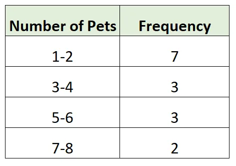

2- **Bar charts:**  are very common. Each bar represents a category. On the y-axis we have the absolute frequency.

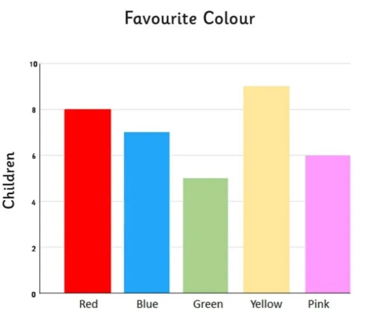

3- **Pie charts**: are used when we want to see the share of an item as a part of the total. Market share is almost always represented with a pie chart.

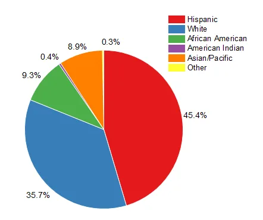

4- **The Pareto diagram**: is a special type of bar chart where the categories are shown in descending order of frequency, and a separate curve shows the cumulative frequency.

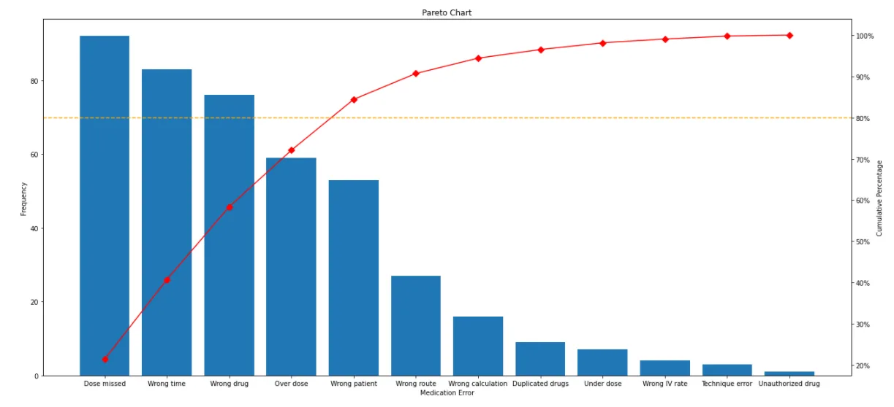

##### Numerical variables. Frequency distribution table and histogram
Frequency distribution tables for numerical variables are different than the ones for categorical. Usually, they are divided into intervals of equal (or unequal) length. The tables show the interval, the absolute frequency and sometimes it is useful to also include the relative (and cumulative) frequencies.

The interval width is calculated using the following formula:

𝐼𝑛𝑡𝑒𝑟𝑎𝑙 𝑤𝑖𝑑𝑡ℎ =( 𝐿𝑎𝑟𝑔𝑒𝑠𝑡 𝑛𝑢𝑚𝑏𝑒𝑟 − 𝑠𝑚𝑎𝑙𝑙𝑒𝑠𝑡 𝑛𝑢𝑚𝑏𝑒𝑟) / 𝑁𝑢𝑚𝑏𝑒𝑟 𝑜𝑓 𝑑𝑒𝑠𝑖𝑟𝑒𝑑 𝑖𝑛𝑡𝑒𝑟𝑣𝑎𝑙𝑠

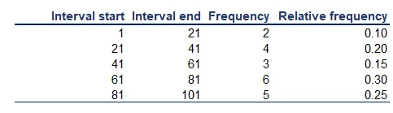

Histograms are the one of the most common ways to represent numerical data. Each bar has width equal to the width of the interval. The bars are touching as there is continuation between intervals: where one ends -> the other begins.

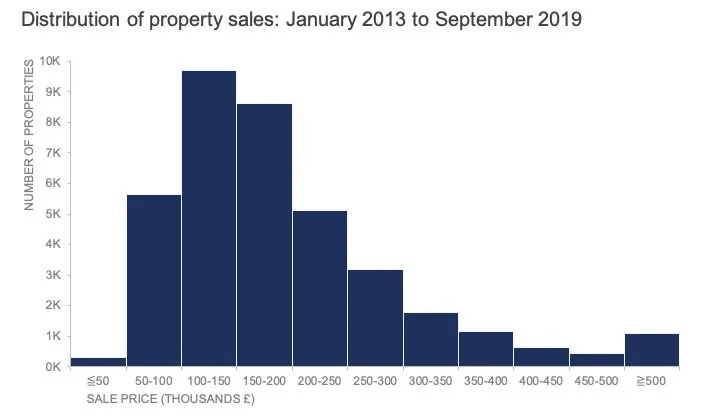

##### Graphs and tables for relationships between variables
**Cross tables**

Cross tables (or contingency tables) are used to represent categorical variables. One set of categories is labeling the rows and another is labeling the columns. We then fill in the table with the applicable data. It is a good idea to calculate the totals. Sometimes, these tables are constructed with the relative frequencies as shown in the table below.

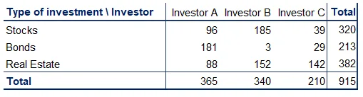

A common way to represent the data from a cross table is by using a side-by-side bar chart.

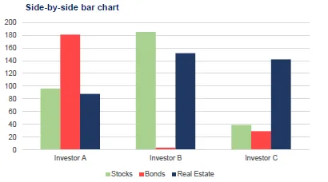

###### Scatter plots

When we want to represent two numerical variables on the same graph, we usually use a scatter plot. Scatter plots are useful especially later on, when we talk about regression analysis, as they help us detect patterns (linearity, homoscedasticity).

Scatter plots usually represent lots and lots of data. Typically, we are not interested in single observations, but rather in the structure of the dataset.

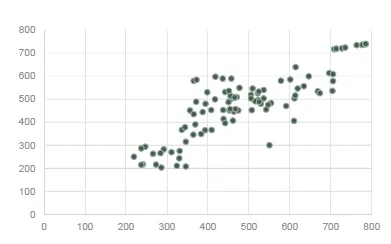

A scatter plot that looks in the following way (down) represents data that doesn’t have a pattern. Completely vertical ‘forms’ show no association.

Conversely, the plot above shows a linear pattern, meaning that the observations move together.

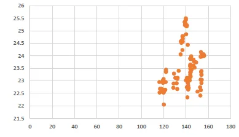

Now, lets talk about Mean, median and mode

##### Mean
The mean is the most widely spread measure of central tendency. It is the simple average of the dataset. Note: easily affected by outliers

The formula to calculate the mean is:

x̄ = (x1,x2,x3,…,xn)/n

##### Median
The median is the midpoint of the ordered dataset. It is not as popular as the mean, but is often used in academia and data science. That is since it is not affected by outliers.

In an ordered dataset, the median is the number at position (n+1)/2

If this position is not a whole number, it, the median is the simple average of the two numbers at positions closest to the calculated value.

##### Mode
The mode is the value that occurs most often. A dataset can have 0 modes, 1 mode or multiple modes.

The mode is calculated simply by finding the value with the highest frequency.

And finally, **Skewness**

- Skewness is a measure of asymmetry that indicates whether the observations in a dataset are concentrated on one side.
- Right (positive) skewness looks like the one in the graph. It means that the outliers are to the right (long tail to the right).
- Left (negative) skewness means that the outliers are to the left.
- Usually, you will use software to calculate skewness.

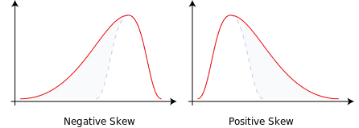

Formula to calculate skewness:

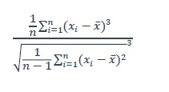
