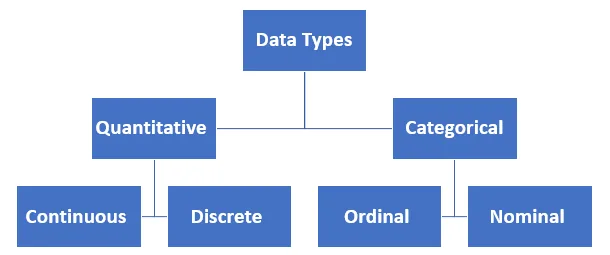
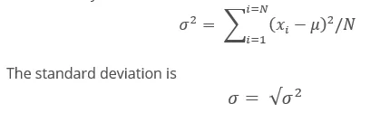
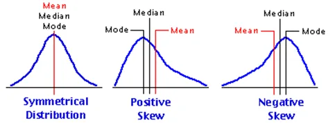

I’ll try here to summarize the introduction of statistics

**Data Types**

There are two data types: **Quantitative** and **Categorical**.

**Quantitative** data takes on numeric values that allow us to perform mathematical operations (number of students, age of students, etc.).

**Categorical** are data used to be divided into groups or can take on one of a limited, and usually fixed, number of possible values (like marital status –sex, etc.).

We can divide categorical data into two types: **Ordinal** and **Nominal**.

**Ordinal** data take on a ranked ordering (like military rank, Income level).

**Nominal** data do not have an order or ranking (like race, gender).

We can divide quantitative data into two types **continuous** and **discrete**.

**Continuous** data can be split into smaller and smaller units, and still a smaller unit exists (like height, age - we can measure the units of the age in years, months, days, hours, seconds, but there are still smaller units that could be associated with the age).

**Discrete** data only takes on countable values (like number of students, number of cars).

#### Analyzing Categorical Data

**Categorical** data is analyzed usually by looking at the counts or proportion of individuals that fall into each group. For example, if we were looking at the sex of students, we would care about how many students are of each sex.

#### Analyzing Quantitative Data

There are four main aspects to analyzing **Quantitative** data.

1. Measures of Center

2. Measures of Spread

3. The Shape of the data.

4. Outliers

## Measures of Center

There are three measures of center:

1. Mean

2. Median

3. Mode

## The Mean

The mean is the average or the **expected value** in mathematics. We calculate the mean by adding all of our values together and dividing by the number of values in our dataset.

## The Median

The **median** splits our data so that 50% of our values are lower and 50% are higher. How we calculate the median depends on if we have an even number of observations or an odd number of observations.

#### Median for Odd Values

If we have an **odd** number of observations, the **median** is simply the number in the **direct middle**. For example, if we have 5 observations, the median is the third value when our numbers are ordered from smallest to largest. If we have 7 observations, the median is the fourth value.

#### Median for Even Values

If we have an **even** number of observations, the **median** is the **average of the two values in the middle**. For example, if we have 6 observations, we average the third and fourth values together when our numbers are ordered from smallest to largest.

In order to compute the median, we MUST sort our values first.

## The Mode

The **mode** is the most frequently observed value in our dataset.

There might be multiple modes for a particular dataset or no mode at all.

#### No Mode

If all observations in our dataset are observed with the same frequency, there is no mode. If we have the dataset:

1, 1, 2, 2, 3, 3, 4, 4

There is no mode because all observations occur the same number of times.

#### Many Modes

If two (or more) numbers share the maximum value, then there is more than one mode. If we have the dataset:

1, 2, 3, 3, 3, 4, 5, 6, 7, 7, 7, 8, 9

There are two modes 3 and 7, because these values share the maximum frequencies at 3 times, while all other values only appear once.

Measures of Spread

**Measures of Spread** are used to provide us an idea of how to spread out our data are from one another. Common measures of spread include:

1. **Range**

2. **Interquartile Range (IQR)**

3. **Standard Deviation**

4. **Variance**

We have to define first the five-number summary which consists of 5 values:

1. **Minimum:** The smallest number in the dataset.

2. **Q1**​: The value such that 25% of the data fall below.

3. **Q2**​: The value such that 50% of the data fall below.

4. **Q3**​: The value such that 75% of the data fall below.

5. **Maximum:** The largest value in the dataset.

**Q2**​ is the median, we get **Q1 the same way we get Q2 which is the median but just for the first half of data, the same way Q3 but for the second half of data.**

## Range

The **range** is then calculated as the difference between the **maximum** and the **minimum**.

## IQR

The **interquartile range** is calculated as the difference between **Q3**​ and **Q1**​.

### Standard Deviation and Variance
The **standard deviation** is one of the most common measures for talking about the spread of data. It is defined as **the average distance of each observation from the mean**.

To find the variance we first find the mean average of the values, then subtract the mean from each value, then square each of these values, then add them up, then divide by the number of values.

## Shape

The distribution of our data is frequently associated with one of the three **shapes**:

**1. Right-skewed (Positive skewed)**

**2. Left-skewed (Negative skewed)**

**3. Symmetric** (frequently normally distributed)

## The relation between shape, mean, and median

|  |  |
| --- | --- |
| **Shape** | **Mean vs. Median** |
| Symmetric (Normal) | Mean = Median |
| Right-skewed | Mean > Median |
| Left-skewed | ​Mean < Median |

## Outliers

We learned that **outliers** are points that fall very far from the rest of our data points.

There is a rule called the 1.5 rule for outliers that says that any data point greater than **Q3 + 1.5 IQR** is a high outlier, and any data point less than **Q1 – 1.5 IQR** is a low outlier.
