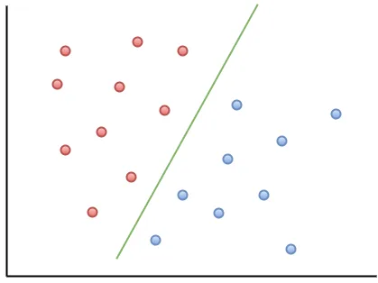
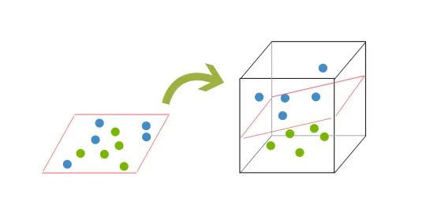
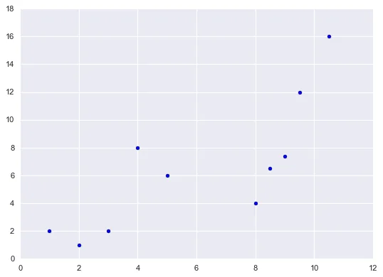
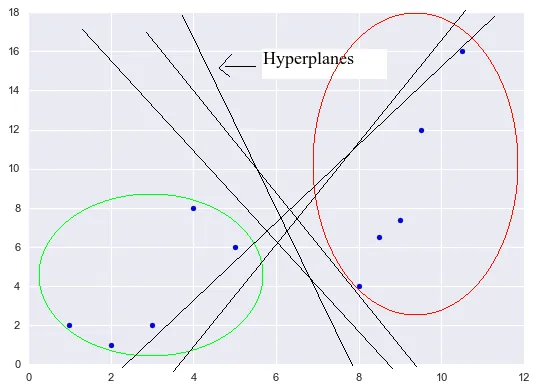
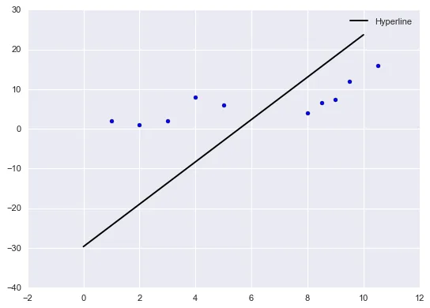

In machine learning, Support Vector Machines ( SVMs) are categorized as supervised learning models. In layman's terms, SVMs are machine learning models used for these three important things listed below:

- Classifying different items, things or objects
- Implementing regression analysis
- Detecting outliers in the dataset.

More often, SVMs are commonly used for classification problems. In this article, we will focus on a simple classification problem only.

The major principle of SVMs is the idea of creating a hyperplane that divides the dataset into two classes. Let's look at the image below to get a clear idea about it.

*Fig 1. Linearly Separable Data*

In the above image having two categorical features, a single line separates red dots and blue dots. Hence, the purpose is to find the line that separates features. But, will we always get the line? Can the real world data be perfect to easily categorize? What if the features is mixed like the image below?

*Fig.2 Mixed data*

To understand in detail, first of all, let's understand what hyperplane and support vector are.

## Hyperplane
Hyperplane is a subspace whose dimension is one less than that of its ambient space. It means, if a plane is in 4-D, then it's hyperplane is in 3-D. As seen above, in a 2-D space, the hyperplane is a line (1-D) or a hyperline.

## Support Vectors
Support vectors are the data points nearest to the hyperplane. If those data points are removed, it will alter the positioning of the hyperplane.

Okay. So, we know two basic terms. Now, how can we get the accurate hyperplane? To know about it, we need to know what is margin. Margin refers to the distance between the hyperplane and the data point. The goal is to choose the greatest possible margin within a training set. What happens if we didn't get a clear hyperplane? This is where things get trickier. As seen in Fig.2, we won't get a clear hyperplane since the data points is mixed. In such cases, we need to move from 2-D to 3-D.

See the figure below to have a clear understanding of shifting from 2-D to 3-D.

*Fig.3 Shifting from 2-D to 3-D*

This mapping of data in higher dimension form is called kernelling. Now, the hyperplane is a 2-D surface as presented by red square in Fig.3 inside cube. Real world data is full of noise. One of the disadvantages of SVM is that it is less effective on noisier datasets with overlapping classes.

Up until now, I hope we have grasped a basic understanding of what SVM is and the underlying aim behind it.

**Working in Python**

I am going to perform simple SVC machine learning with Python using non-problematic datapoints for illustration purposes. First of all, let's import the basic dependencies.

**Importing dependencies**

*import numpy as np*

*from matplotlib import style*

*import matplotlib.pyplot as plt*

*from sklearn import svm*

*style.use('seaborn')*

Our major dependencies are numpy (for creating arrays), matplotlib (for visualization) and sklearn( for performing SVM ). Since, seaborn is one of my favorite package, I have styled graphs to 'seaborn' type. We can also directly import seaborn package using *'import seaborn as <var>'* for additional features.

**Creating a dataset**

Let's create a dataset now.

Say independent variable is x and dependent variable is y, we create

## x = [1, 2, 3 , 4, 5, 8, 8.5, 9.5, 10.5 ,9]

## y = [2, 1, 2, 8, 6, 4, 6.5, 12, 16, 7.4]

The graph of x and y is shown below.

*Fig.4 Scatterplot of x and y*

From the graph, we can easily divide the points into two classes with the help of eye just like the figure below.

*Fig.5 Hyperplanes*

However, our aim is to find the hyperplane having the greatest possible margin within a dataset.

With that in mind, we are going ahead to continue with our two-featured sample. In order to feed data in our machine learning algorithm, we need to compile an array of features rather than to create separate x and y.

**Compiling an array from x and y using numpy**

## X=np.array(list(zip(x, y)))

Now we need to label this array for training. In unsupervised learning, labelling is not used. Just by looking at the graph we can see we have coordinate pairs that are "low" numbers (circled with green) and coordinate pairs that are "higher" numbers (circled) in red in Fig.5. If we assign 0 to the lower coordinate pairs and 1 to the higher feature pairs. Then, y=[0,0,0,0,0,1,1,1,1,1].

**Defining a classifier**

Now, we define our classifier.

*svm_clf= svm.SCV(kernel='linear', C=0.8)*

svm.SCV has two parameters **'kernel'** and **'C'**. Kernel specifies the kernel type to be used in the algorithm. It must be one of ‘linear’, ‘poly’, ‘rbf’, ‘sigmoid’, ‘precomputed’ or a callable. Since we are dealing with two features, I have set the kernel to linear. 'C' is the parameter of the error terms. In other words, "how badly" we want to classify our data is determined by C. The default value of 'C' is 1.0

**Fitting and Prediction**

Now, we fit X and y using the classifier.

*svm_clf.fit(X,y)*

We get the output like this which consists of different parameters which are not so important as of now.

*SVC(C=0.8, cache_size=200, class_weight=None, coef0=0.0,*
 *decision_function_shape='ovr', degree=3, gamma='auto_deprecated',*
 *kernel='linear', max_iter=-1, probability=False, random_state=None,*
 *shrinking=True, tol=0.001, verbose=False)*

Now we predict and test.

*svm_clf.predict([[4,5]])[0]*

It gives the output 0 as expected. (Lower part)

Let's try for higher values.

*svm_clf.predict([[8,8]])[0]*

It gives the output 1 (Upper part)

Now, it's time to visualize the data and see the best hyperplane.

**Visualization**

First of all, we find the coefficients.

*coeffs=svm_clf.coef_[0]*

## # a= -c0/c1

*a= -coeffs[0]/ coeffs[1]*

## xx=np.linspace(0,10)

## [#y](https://www.datainsightonline.com/blog/hashtags/y)=(-c0/c1)\*x-i0/c1

*yy=a\*xx-svm_clf.intercept_[0]/coeffs[1]*

*tt=plt.plot(xx,yy,'-k',label="Hyperline")*

*plt.scatter(x,y)*

*plt.legend()*

*Fig.6 Hyperline graph using SVM*

That's it. We have visualized the hyperline of 2-D graph using SVM classifier. We also predicted some x,y values and got the correct output.

I hope you have understood the basic concepts of SVM and how to perform linear 2-D classification in Python with it.

Thank you for reading. Do post your queries in the comment section if any. Cheers!!

To know more about me and my work, visit my LinkedIn page: <https://www.linkedin.com/in/subarna577/>
