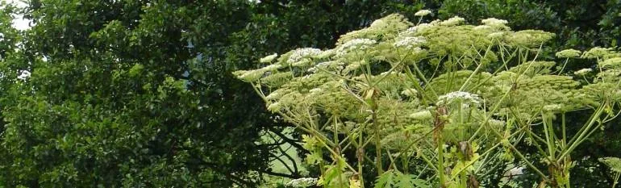

Currently, monitoring of ecosystems and plant distribution depends on expert knowledge. Trained scientists visit designated areas and record the species that inhabit them.

Using such highly skilled personnel is costly, inefficient, and insufficient because humans cannot cover large areas when sampling.

for that in this tutorial we will identify more precisely if the images of forests and foliage contain invasive hydrangeas or not using a machine learning model

my project is divided into two parts data analysis and machine learning

we start with data analysis

you can download dataset from this link [Invasive Species Monitoring | Kaggle](https://www.kaggle.com/competitions/invasive-species-monitoring/data)

The dataset contains photos taken in a Brazilian national forest. In some of the photos, there is hydrangea, a beautiful invasive species native to Asia. Based on the training images and labels provided, the participant must predict the presence of the invasive species in the test image set.

**File descriptions**

**train.7z -** the training set (contains 2295 images).

**train_labels.csv -** the correct labels for the training set.

**test.7z -** the test set (contains 1531 images), ready to be labeled by your algorithm.

**sample_submission.csv -** a sample submission file in the correct format.

**Data fields**

**name -** name of the sample image file (numbers)

i**nvasive -** probability that the image contains an invasive species. A probability of 1 means that the species is present.

In first step i import the required libraries

```python
import matplotlib.pyplot as plt
from sklearn.datasets import load_files
from skimage.io import imread_collection
from keras.utils import np_utils
import numpy as np
import pandas as pd
from glob import glob
import os
import math
from sklearn.model_selection import train_test_split
```

Load the CSV into a train_labels

```python
train_labels = pd.read_csv("../dataset/train_labels.csv")
train_labels.head()
```

we use shape to give the dimensions of the table

```python
train_labels.shape
```

we use unique to Find the *unique* elements of an array

```python
train_labels['invasive'].unique()
```

```python
train_labels['name'].unique()
```

here we will Sort a Datab y the values of one or more columns group by invasive and group by name

```python
train_labels.groupby('invasive').size().sort_values(ascending=False)
```

```python
train_labels.groupby('name').size().sort_values(ascending=False)
```

Now to show the proportion of invasive labels in training data sets we use reset_index(name='counts')

```python
train_labels.groupby(['invasive']).size().reset_index(name='counts')
```

```python
train_labels.groupby(['name']).size().reset_index(name='counts')
```

now let's read the training data and examine the total pictures

img_path = "../dataset/train/"

```python
y = []
file_paths = []
for i in range(len(train_labels)):
    file_paths.append( img_path + str(train_labels.iloc[i][0]) +'.jpg' )
    y.append(train_labels.iloc[i][1])
y = np.array(y)
file_paths[:15]
```

and this code plot some picture from array

```python
import cv2
image = cv2.imread(file_paths[15])
plt.figure(figsize=(16,16))
plt.imshow(image)
```

To examine the total pictures i use the code below

```python
def number_of_file(my_dir):
    return str(len(os.listdir(my_dir)))

print("# of training files: {}".format(number_of_file("../dataset/train")))
print("# of testing files: {}".format(number_of_file("../dataset/test")))
```

we will now visualize some images

we will create variable to store image using imread() function

and display the image using imshow() function

```python
def img_visual(path, smpl, dim_y):

    smpl_pic = glob(smpl)
    fig = plt.figure(figsize=(20, 14))

    for i in range(len(smpl_pic)):
        ax = fig.add_subplot(round(len(smpl_pic)/dim_y), dim_y, i+1)
        plt.title("{}: Height {} Width {} Dim {}".format(smpl_pic[i].strip(path),
                                                         plt.imread(smpl_pic[i]).shape[0],
                                                         plt.imread(smpl_pic[i]).shape[1],
                                                         plt.imread(smpl_pic[i]).shape[2]
                                                        )
                 )
        plt.imshow(plt.imread(smpl_pic[i]))

    return smpl_pic

smpl_pic = img_visual('..dataset/train\\', '../dataset/train/112*.jpg', 4)
```

to involves a wide range of visualisation techniques we will visualuse this pictures with transformation:

**cv2.cvtColor()** method is used to convert an image from one color space to another

```python
def visual_with_transformation (pic):

    for idx in list(range(0, len(pic), 1)):
        ori_smpl = cv2.imread(pic[idx])
        smpl_1_rgb = cv2.cvtColor(cv2.imread(pic[idx]), cv2.COLOR_BGR2RGB)
        smpl_1_gray =  cv2.cvtColor(cv2.imread(pic[idx]), cv2.COLOR_BGR2GRAY)

        f, ax = plt.subplots(1, 3,figsize=(30,20))
        (ax1, ax2, ax3) = ax.flatten()
        train_idx = int(pic[idx].strip("../dataset/train\\").strip(".jpg"))
        print("The Image name: {} Is Invasive?: {}".format(pic[idx].strip("train\\"),
                                                           train_labels.loc[train_labels.name.values == train_idx].invasive.values)
             )
        ax1.set_title("Original - BGR")
        ax1.imshow(ori_smpl)
        ax2.set_title("Transformed - RGB")
        ax2.imshow(smpl_1_rgb)
        ax3.set_title("Transformed - GRAY")
        ax3.imshow(smpl_1_gray)
        plt.show()

visual_with_transformation(smpl_pic)
```

**PART2 : ML**

# Importing data and pre-processing

# training dataset

# validation dataset

# Preprocessing the Test set - Building the CNN

we start with importing data and pre-processing : Data preprocessing in machine learning refers to the technique of preparing

```python
traindf=pd.read_csv('..//dataset/train_labels.csv',dtype=str)

def append_ext(fn):
    return fn+".jpg"

traindf["name"]=traindf["name"].apply(append_ext)
print(traindf)
```

in # training dataset we will Takes the data frame and path to a directory + generates batches.

```python
train_data=ImageDataGenerator(rescale=1./255.,validation_split=0.25)
training_set=train_data.flow_from_dataframe(
dataframe=traindf,
directory="../dataset/train/",
x_col="name",
y_col="invasive",
subset="training",
batch_size=32,
seed=42,
shuffle=True,
class_mode="binary",
target_size=(128,128))
```

and the same for the validation dataset

```python
validation_dataset=train_data.flow_from_dataframe(
dataframe=traindf,
directory="../dataset/train/",
x_col="name",
y_col="invasive",
subset="validation",
batch_size=32,
seed=42,
shuffle=True,
class_mode="binary",
target_size=(128,128))
```

and now we will build the CNN

in first step create a Sequential model, we will create an empty neural network

and then we will Add two convolution layer, followed by a ReLU layer

and add two pooling layer

secondly we will convert 3D matrices to 1D vector with flatten

and add a fully-connected layer, followed by a ReLU layer and another layer followed by a sigmoid layer

```python
cnn = tf.keras.models.Sequential()

cnn.add(tf.keras.layers.Conv2D(filters=32,kernel_size=3,activation='relu',input_shape=[128,128,3]))
cnn.add(tf.keras.layers.MaxPool2D(pool_size=(2,2),strides=2))

cnn.add(tf.keras.layers.Conv2D(filters=32,kernel_size=3,activation='relu'))
cnn.add(tf.keras.layers.MaxPool2D(pool_size=(2,2),strides=2))

cnn.add(tf.keras.layers.Flatten())

cnn.add(tf.keras.layers.Dense(units=128,activation='relu'))

cnn.add(tf.keras.layers.Dense(units=1,activation='sigmoid'))
```

And now in trainning we will compile the network and train on the data (training_set,validation_data)

```python
cnn.compile(optimizer='adam',loss='binary_crossentropy',metrics=['accuracy'])

cnn.fit(x = training_set,validation_data = validation_dataset, epochs=20)
```

in the image test we will check the presence of an image

from keras.preprocessing import image

```python
test_img = image.load_img('../dataset/test/34.jpg', target_size = (128, 128))
test_img = image.img_to_array(test_img)
# extra dimension added to make a 'batch' with one image in it, axis : where do you want to add the extra dimension
test_img = np.expand_dims(test_img, axis = 0)
result = cnn.predict(test_img)
training_set.class_indices
# [0][0] because result is also in a batch
if result[0][0] == 1:
  prediction = 'present'
else:
  prediction = 'absent'
print(prediction)
```

finally we will make a Prediction of the results for the test set

```python
batch_result = []

for i in range(1,1532):
  test_img = image.load_img('../dataset/test/' + str(i) + '.jpg', target_size = (128, 128))
  test_img = image.img_to_array(test_img)
  # extra dimension added to make a 'batch' with one image in it, axis : where do you want to add the extra dimension
  test_img = np.expand_dims(test_img, axis = 0)
  result = cnn.predict(test_img)
  batch_result.append({'name': i, 'invasive': result[0][0]})
print(batch_result)
```

and we can generate the result in a csv file with this code :

```python
result_df = pd.DataFrame(batch_result)
result_df.to_csv('submission.csv', index=False)
```

I hope you enjoyed this post

to see the complete code you can visit this [github link](https://github.com/rabebbenothmen/Data-Insight2021/tree/main/Capstone%20project)
