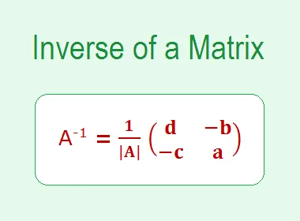

The inverse of a matrix is just a reciprocal of the matrix as we do in normal arithmetic for a single number which is used to solve the equations to find the value of unknown variables.

The inverse of a matrix is that matrix which when multiplied with the original matrix will give an identity matrix. The inverse of a matrix exists only if the matrix is non-singular i.e., determinant should not be 0. Using determinant and adjoint, we can easily find the inverse of a square matrix using below formula,

```python
if det(A) != 0
    A-1 = adj(A)/det(A)
else
    "Inverse doesn't exist"
```

Inverse of a Matrix using NumPy

Python provides a very easy method to calculate the inverse of a matrix. The function numpy.linalg.inv() which is available in the python NumPy module is used to compute the inverse of a matrix.

First we Import numpy package

```python
import numpy as np
```

Taking a 3 \* 3 matrix as

```python
A = np.array([[4, 3, 6],[2, 5, 9],[8, 6, 3]])
```

Now, calculating the inverse of the matrix as

```python
print(np.linalg.inv(A))
```
