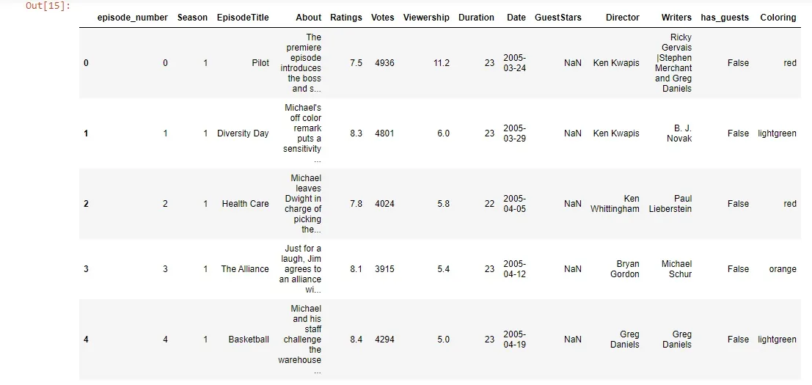
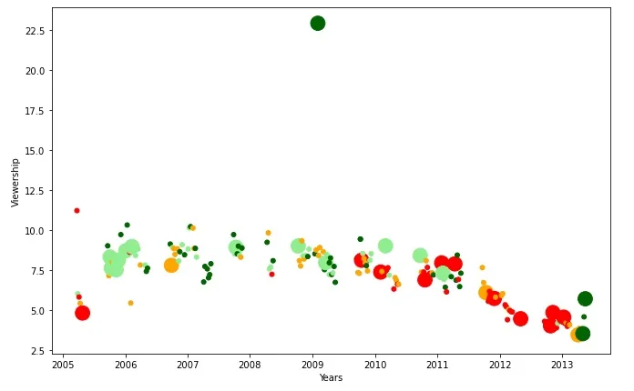
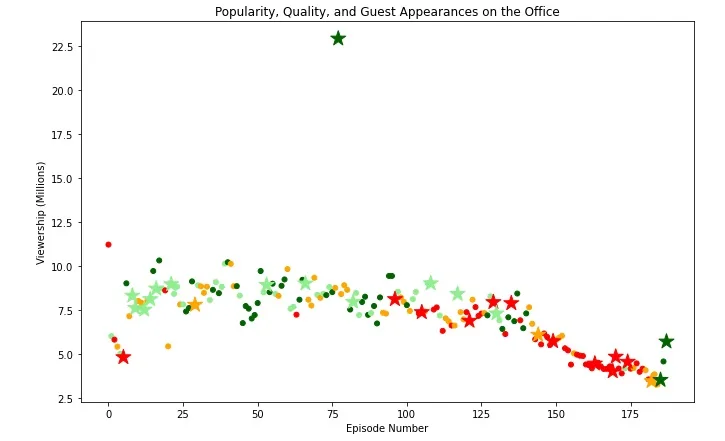
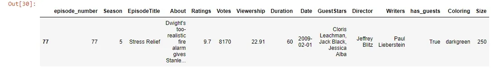
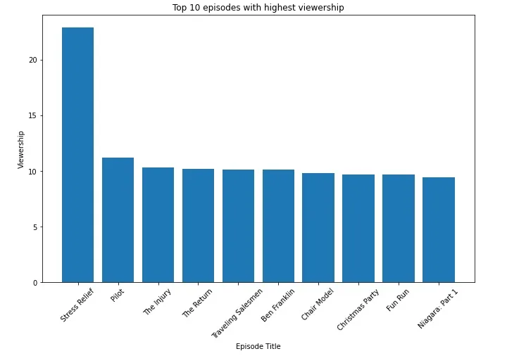
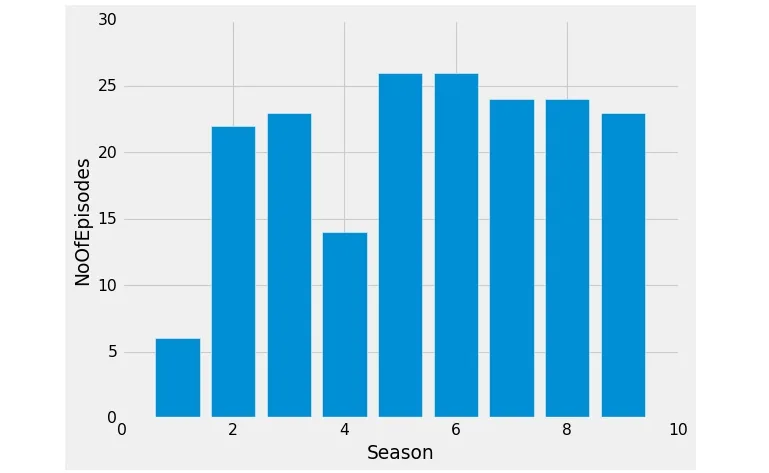
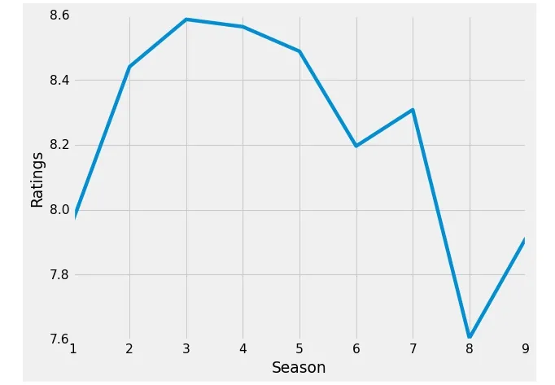
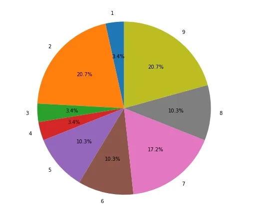

**The Office!** What started as a British mockumentary series about office culture in 2001 has since spawned ten other variants across the world, including an Israeli version (2010-13), a Hindi version (2019-), and even a French Canadian variant (2006-2007). Of all these iterations (including the original), the American series has been the longest-running, spanning 201 episodes over nine seasons.

The data set was downloaded from Kaggle [here](https://www.kaggle.com/nehaprabhavalkar/the-office-dataset). And also this is one of the DataCamp projects.

We will go through the available data set which contains some characteristics and features for each episode as follows:

- **episode_number:** Canonical episode number.
- **season:** Season in which the episode appeared.
- **episode_title:** Title of the episode.
- **about:** Description of the episode.
- **ratings:** Average IMDB rating.
- **votes:** Number of votes.
- **viewership:** Number of US viewers in millions.
- **duration:** Duration in the number of minutes.
- **Date:** Airdate.
- **guest_stars:** Guest stars in the episode (if any).
- **director:** Director of the episode.
- **writers:** Writers of the episode.

#### Importing required libraries and reading the data

```python
import pandas as pd
import matplotlib.pyplot as plt
import numpy as np
plt.rcParams['figure.figsize']=[11,7]

# Here we imported the data, and set the Date column to be: #datetime not object

df=pd.read_csv('the_office_series.csv',parse_dates=['Date'])
```

#### Data preprocessing

```python
df.info()
```

```python
 <class 'pandas.core.frame.DataFrame'>
RangeIndex: 188 entries, 0 to 187
Data columns (total 12 columns):
 #   Column        Non-Null Count  Dtype
---  ------        --------------  -----
 0   Unnamed: 0    188 non-null    int64
 1   Season        188 non-null    int64
 2   EpisodeTitle  188 non-null    object
 3   About         188 non-null    object
 4   Ratings       188 non-null    float64
 5   Votes         188 non-null    int64
 6   Viewership    188 non-null    float64
 7   Duration      188 non-null    int64
 8   Date          188 non-null    datetime64[ns]
 9   GuestStars    29 non-null     object
 10  Director      188 non-null    object
 11  Writers       188 non-null    object
dtypes: datetime64[ns](1), float64(2), int64(4), object(5)
memory usage: 17.8+ KB
```

In the original data set, the data type of the 'Date' column was an object and we fix that to be date-time when we import the data before this step. Also If we looked at the column we would notice that the first column should be named as episode number as follows:

```python
df.rename(columns={'Unnamed: 0':'episode_number'},inplace=True)
```

From the data we see that the only column that has null values is guest stars, so we will create a column that contains Boolean values to evaluate whether there is a guest star or not so we can easily deal with this column:

```python
guest=df.GuestStars.isnull()
has_guest=[False if i else True for i in guest]

df['has_guests']=has_guest
```

#### Exploratory data analysis

if we want to visualize our data as an example in scatter plot we need to differentiate the points on our visualization, so we will add a column for color and this will be based on the 'Ratings' column as follows:

```python
colors = ["red", "orange", "lightgreen", "darkgreen"]
ratings=df['Ratings']
q1=ratings.quantile(0.25)
q2=ratings.quantile(0.5)
q3=ratings.quantile(0.75)
q4=ratings.max()

quantile_list=[q1,q2,q3,q4]
```

we extract from the 'Ratings' column the first quartile, second quartile(median), third quartile, and the maximum number. After that, we add those numbers to the 'quantile_list'.

```python
indexed_color_dict={}
for i in range(len(quantile_list)):
    indexed_color_dict[quantile_list[i]]=colors[i]
indexed_color_dict
```

```python
Out[8]: {7.8: 'red', 8.2: 'orange', 8.6: 'lightgreen', 9.8: 'darkgreen'}
```

Here we create a dictionary whose keys are the numbers from the list we created before and its values are colors from the colors list we created before.

```python
def colorize(rating, indexed_color_dict):
    for key in indexed_color_dict:
        if float(key) >= rating:
            return indexed_color_dict[key]
```

This function takes a rating and a dictionary as we will see and it will iterate over its keys and if the rating is less than a certain key of the dictionary it will return the value of that key which is the color corresponding to that key.

```python
df['Coloring'] = df['Ratings'].apply(colorize, args = (indexed_color_dict, ))
```

Here we applied the previous function 'colorize' to the 'Ratings' column and for each rating in the rating column it will give a color and that will be in a new column called 'Coloring'.

This is part of our data frame till now:

```python
df.head(5)
```



We want to create one last column, which will be the size of our plots. So in case, we have guest stars its value will be 250 otherwise it will be 25. Notice that here we used the 'has_guests' column that we created before.

```python
size=[]
for ind,row in df.iterrows():
    if row['has_guests']==True:
        size.append(250)
    else:
        size.append(25)
df['Size']= size
```

Now let's move to some visualization to present our findings and analysis by visualizing the viewership across years:

```python
# Here we will see the viewership across the years
plt.scatter(x=df.Date,y=df.Viewership,s=df.Size,c=df.Coloring)
plt.xlabel('Years')
plt.ylabel('Viewership')
plt.show()
```



Let's make two data frames from the original one, one that contains guest stars and one that has not let us see:

```python
# Here we will make two datafromes, one for the episodes that # has guest stars and one that has not
guests_df=df[df['has_guests']==True]
non_guests_df=df[df['has_guests']==False]
```

And then make a scatter plot for each episode with guest stars and without guest appearance and we used '\*' for guest stars to make it clearer :

```python
fig = plt.figure()
# plotting using scatter plots two dataframes, the first one # that contains data with existence of guest stars, The other # one for data with no guest stars with different markers

plt.scatter(x=non_guests_df.episode_number,y=non_guests_df.Viewership,
            c=non_guests_df.Coloring,
            s=non_guests_df.Size)

plt.scatter(x=guests_df.episode_number,y=guests_df.Viewership,
           c=guests_df.Coloring,
           s=guests_df.Size,marker='*')

plt.xlabel('Episode Number')
plt.ylabel('Viewership (Millions)')
plt.title('Popularity, Quality, and Guest Appearances on the Office')
plt.show()
```



From the visualization, we noticed that there is an episode with high viewership relative to the rest and it has guest stars let's see which episode this:

```python
max_view=df['Viewership'].max()
df[df['Viewership']==max_view]
```



As we see this is the episode with high viewership with all of its attributes.

On the same view, if we want to get the top ten episodes with respect to the viewership we will get that:



The number of episodes for each season differs, so let's take a look at this by grouping the number of episodes in each season:

```python
e=df.groupby(('Season'),as_index=False).count()
e=e[['Season','episode_number']]
e.rename(columns={'episode_number':'NoOfEpisodes'},inplace=True)

plt.bar(e.Season,e.NoOfEpisodes)
plt.style.context('fivethirtyeight')
plt.xlabel('Season')
plt.ylabel('NoOfEpisodes')
plt.show()
```



Now we want to see the average of the ratings for each season like this:

```python
# Grouping the data by season and calculate the average of #the ratings for each season
rating=df.groupby('Season')['Ratings'].mean()

plt.plot(rating)
plt.xlabel('Season')
plt.ylabel('Ratings')
plt.show()
```



As we saw that guest stars appearance affect the Viewership and the ratings for the episodes and it affects the ratings of the seasons as well, So it will be much clearer to get the percentage of guest stars appearing each season:



Hope that was helpful.

*For Resources*: from [here](https://www.kaggle.com/andreal314159/the-office-analysis-for-datacamp) and [here](https://www.kaggle.com/nehaprabhavalkar/the-office-tv-series-part-1-eda-using-plotly)

Link for GitHub repo: [here](https://github.com/Abdelrahman7000/Data_insight_Data_scientist_program_the_office_DataCamp_project)

*That was part of the Data Insight's Data Scientist Program.*
