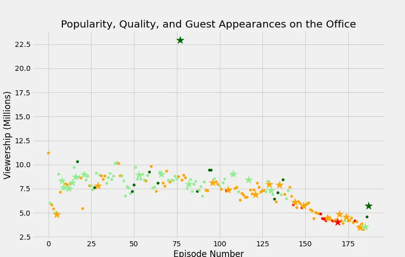
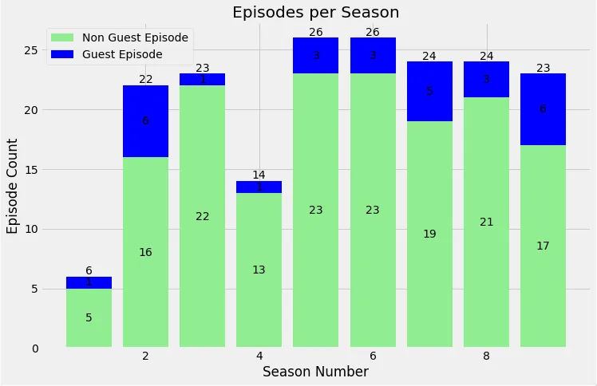
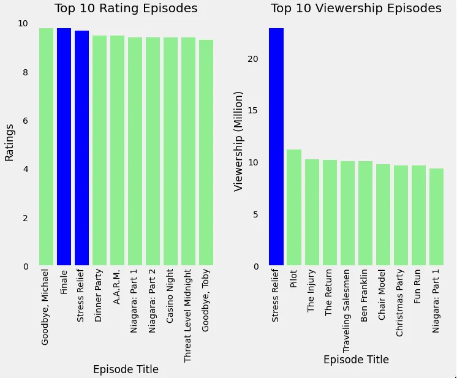
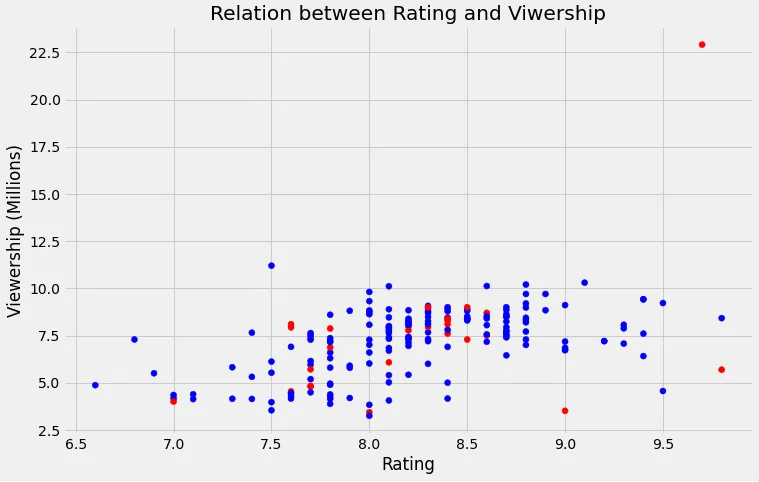
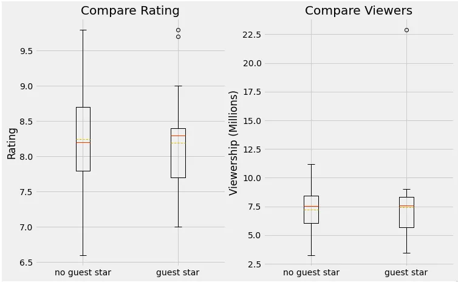

**The Office!** What started as a British mockumentary series about office culture in 2001 has since spawned ten other variants across the world, including an Israeli version (2010-13), a Hindi version (2019-), and even a French Canadian variant (2006-2007). Of all these iterations (including the original), the American series has been the longest-running, spanning 201 episodes over nine seasons.

## 1. Import Data
In this notebook, we will take a look at a datasets of The Office episodes, and try to understand how the popularity and quality of the series varied over time. To do so, we will use the following datasets: "datasets/office_episodes.csv"

This datasets contains information on a variety of characteristics of each episode. In detail, these are:

**datasets/the_office_series.csv**

- **Unnamed: 0:** Unnamed index values
- **Season:** Season in which the episode appeared.
- **EpisodeTitle:** Title of the episode.
- **About:** Description of the episode.
- **Ratings:** Average IMDB rating.
- **Votes:** Number of votes.
- **Viewership:** Number of US viewers in millions.
- **Duration:** Duration in number of minutes.
- **Date:** Airdate.
- **GuestStars:** Guest stars in the episode (if any).
- **Director:** Director of the episode.
- **Writers:** Writers of the episode.

## **2. Data Preprocessing and Modify the data-frame** The column **Date** is **object** datatype. It should be **date** type, so we change type of **Date** column to 'date' datatype.

One column is missing called **EpisodeNumbers** and the column index one is 'Unnamed: 0'. So we change the column index one from 'Unnamed: 0' to 'EpisodeNumbers'

#### Add New Columns

As we want to investigate difference between the episodes with Guest Stars and without Guest Stars, we add a new column **HasGuestStars** by checking **GuestStars** name column. If there has a guest star, we add 'True', otherwise, we add 'False'.

When we check the **Ratings** column, it contains the rating scores of each episodes which are range form 0 to 10.

The rating values of each episodes in The Office Series are range from 6.6 to 9.8. We want to check the data easily, so we change rating values to normalized rating values which is range from 0 to 1 and add them into **ScaledRating** column.

### 3. Exploratory data analysis

##### Analysis Rating & Viewerships in Appearance of Guest Stars

We want to analysis Rating and Viwerships between Guest Stars appearance and non Guest Stars appearance of entire series. So, we need to investigate and visualize data by choosing correct chart with colors, size, shape, etc.
We separate the **Rating** values to four categories with colors.
If ScaleRating is less than 0.25, the color will be **RED**.

If ScaleRating is between 0.25 and 0.5, the color will be **ORANGE**.

If ScaleRating is between 0.5 and 0.75, the color will be **LIGHTGREEN**.

If ScaleRating is above 0.75, the color will be **DARKGREEN**.

If the episode contain Guest Stars, we make the appearance size to 250, and otherwise, the size will be 25.

We create two new column called **colors** and **sizes** in office_df and then we add columns and sizes list values.

After that we divide two Data-Frames from **office_df** called **non_guest_df** which contains without Gust Stars Episodes and **guest_df** which is Guest Star appearance Episodes.

**Let's Investigate the Office Series In appearance of guest stars**
We visualize two data of non guest star and guest star in one **Scatter** plot. The horizontal line is 'Episode Numbers' and vertical line is 'Viewership' in Millions of each episode. Non Guest Star data is **'circle'** shape and Guest Star data is **'star'** shape.

In above 'scatter' plot, the viewer is average between 7.5 millions and 10 millions before episode number 125. And then the viewers are decrease. The rating are worst between episode number 150 and 175. The appearance of Guest stars in each episodes is not definitely shown in scatter, so we need to farther investigating.

There is one outlier in scatter plot. So, we check this episode which contains two Guest Stars, rating is in highest category (9.7) and the viewer is above 22.97 millions.

#### Numbers of Episodes in each Seasons with Appearance of Guest Stars
We analysis number of episode in each season with bar char.
 Horizontal line is "Season Number" and Vertical line is episode count in each season.
 Non Guest Star Episodes are in **LightGreen** color and Guest Stars Episodes are in **Blue** color.

From 'Episode per Season' bar chart,

- Season 1 has minimum number of Episodes (6 Episode) and season 5 & 6 have maximum Episodes (26 Episodes).
- Appearance of Guest Stars Episode is less than non Guest Stars in every seasons
- Guest Star participate episode is minimum in season 1, 2, 4 and maximum episodes are season 2, 6

#### Top rating and Top Viewership Episodes
We analysis the top 10 episodes based on rating and viewership by visualizing two bar charts.

We pull out top rating episodes by sorting **Rating** column. If the rating values are equal, we order by **Viewership**.
 We pull out top viewers episodes by sorting **Viewership** column. If the Viewership values are equal, we order by **Rating**.

Left side is **Top 10 Rating Episode** Bar chart and Right side is **Top 10 Viewership Episode** Bar chart.
Guest Stars Appearance Episode is in **BLUE** and Non Guest Star Episodes **LIGHTGREEN****.**

#### Relationship Between 'Rating' and 'Viewership'
We analysis relationship between 'Rating' and 'Vewership' of each episode.
 Horizontal axis is 'Rating' and Vertical axis is 'Viewership (mills)'.
 Guest Stars Appearance Episode is in **RED** and Non Guest Star Episodes **BLUE .**

According to above scatter plot, 'rating' and 'viewerships' with Guest Star Appearance is not related each others.

#### Comparison in Appearance of Guest Star in Rating and Viewership

After we investigating the appearance of Guest stars, we compare the difference of non guest stars and guest stars episodes
 We compare two data frames (guest and no-guest) with **Box plot** in Rating and Viewers.
 Left Figure is 'Compare Rating' and Right Figure is 'Compare Viewership'.
 Median Value is red solid line **____** and Mean value is dotted red line **_ _ _ _**

Compare Rating,

- Mean Values are absolutely equal.
- Mean value of Guest Star is a little higher than non Guest Star
  Episodes.

Compare Viewer,

- Although Guest Star containing outlier in viewership, both mean and median vales in appearance of Guest Star are absolutely equal. So there is no difference in Viewership of each Episode

Due to the above two comparison, we can conclude that the Appearance of Guest Stars is not quietly effected the values Rating and Viewership in Each Episode.

#### References,

1. 'The Office' series datasets was downloaded from Kaggle [**here**](https://www.kaggle.com/nehaprabhavalkar/the-office-dataset)**.**
2. The ipython source code can be found in GitHub [**here**](https://github.com/DoublePK/DataScientistProgramAssignments/blob/master/Project%20-%20%20Investigating%20Guest%20Stars%20in%20The%20Office.ipynb)**.**
3. DataCamp's Unguided Project: "Investigating Netflix Movies and Guest Stars in The Office" [**here**](https://projects.datacamp.com/projects/1170)**.**
4. "Investigating Guest Stars in the Office" written by Thiha Naung in Data Insight [**here**](https://www.datainsightonline.com/post/investigating-guest-stars-in-the-office-1)**.**
