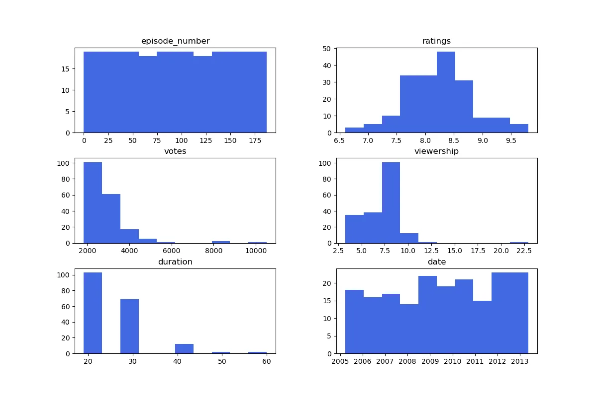
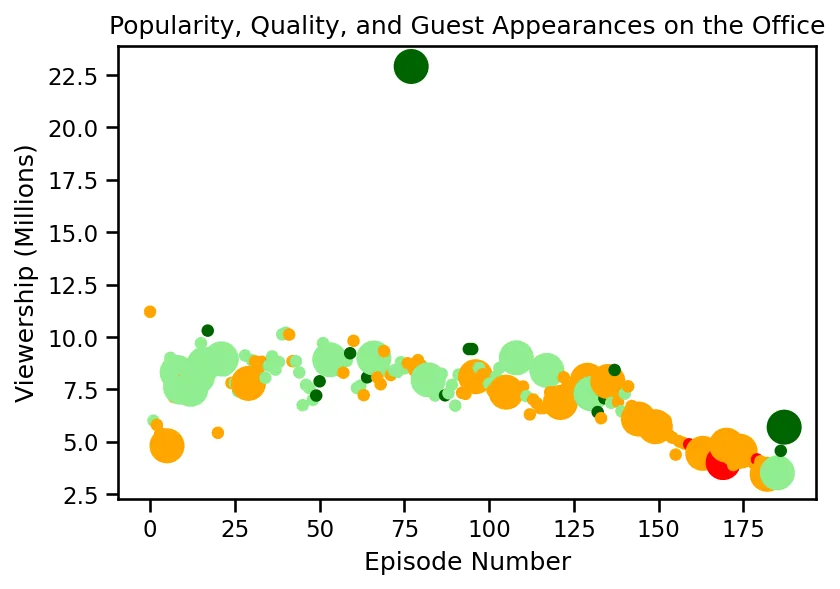
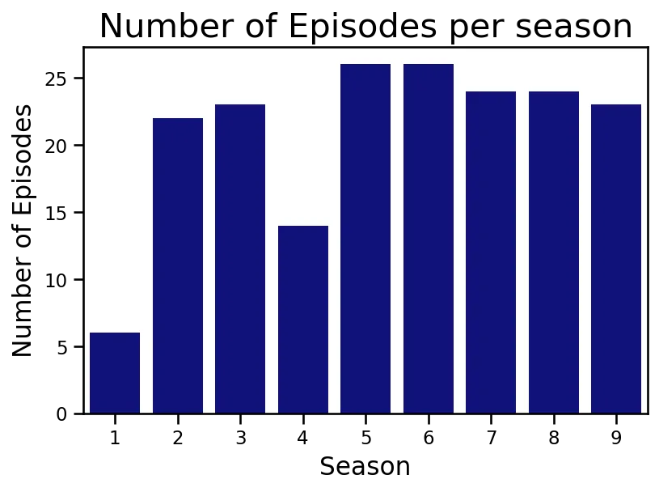
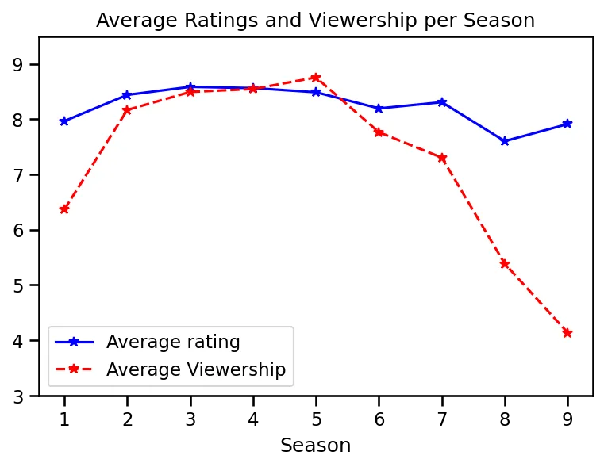
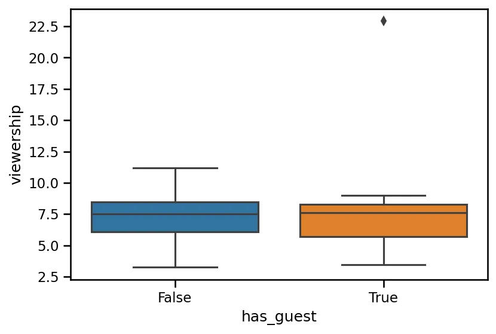

The IMDB website has a description of the Office (US) as

"**A mockumentary on a group of typical office workers, where the workday consists of ego clashes, inappropriate behavior, and tedium**." It is about the 'Office' movie series.

The data set was downloaded from [Kaggle](https://www.kaggle.com/nehaprabhavalkar/the-office-dataset) .

The dataset contains information on a variety of characteristics of each episode. In detail, these are:

- **episode_number:** Canonical episode number.
- **season:** Season in which the episode appeared.
- **episode_title:** Title of the episode.
- **description:** Description of the episode.
- **ratings:** Average IMDB rating.
- **votes:** Number of votes.
- **viewership:** Number of US viewers in millions.
- **duration:** Duration in the number of minutes.
- **release_date:** Airdate.
- **guest_stars:** Guest stars in the episode (if any).
- **director:** Director of the episode.
- **writers:** Writers of the episode.

## First import the data and required libraries.
```python
import numpy as np
import pandas as pd
import matplotlib.pyplot as plt
import seaborn as sns
df = pd.read_csv('datasets/the_office_series.csv')
```

## Glimpse the dataset and data preprocessing
```python
In [5]: df.info()
```

```python
<class 'pandas.core.frame.DataFrame'>
RangeIndex: 188 entries, 0 to 187
Data columns (total 12 columns):
 #   Column        Non-Null Count  Dtype
---  ------        --------------  -----
 0   Unnamed: 0    188 non-null    int64
 1   Season        188 non-null    int64
 2   EpisodeTitle  188 non-null    object
 3   About         188 non-null    object
 4   Ratings       188 non-null    float64
 5   Votes         188 non-null    int64
 6   Viewership    188 non-null    float64
 7   Duration      188 non-null    int64
 8   Date          188 non-null    object
 9   GuestStars    29 non-null     object
 10  Director      188 non-null    object
 11  Writers       188 non-null    object
dtypes: float64(2), int64(4), object(6)
memory usage: 17.8+ KB
```

Only the GuestStars column has missing values, missing means there is no guest stars in these episodes. Actually, the **Unnamed: 0** column is the episode number column. The **Date** should be date type and the **Season** column should be a category.

```python
# change the name of first column to 'episode_number'
df = df.rename(columns={'Unnamed: 0':'episode_number'})

# change all the column names to lower
df = df.rename(columns = str.lower)

# change the type of date column
df['date'] = pd.to_datetime(df['date'])

# change the type of season column to category
df['season'] = df['season'].astype('category')
```

Look at the data distributions.

```python
df.hist(grid = False, color='royalblue', figsize=(12,8))
```



The `ratings` column has a normal distribution and the `duration`, `viewership` and `votes` columns are right-skewed. Data seems to be in the correct range. The original dataset does not contain `scaled_ratings` and `has_guests` columns. Let's create.

`scaled_ratings` column is the normalized data from the `ratings` column. To normalize data between range 0 and 1, subtract the data with minimum value and divided it by the range of the data.

```python
df['scaled_ratings'] = df['ratings'].apply(lambda x: (x - min(df['ratings']))/(max(df['ratings']) - min(df['ratings'])))
df['scaled_ratings'].describe()
```

```python
count    188.000000
mean       0.511636
std        0.184353
min        0.000000
25%        0.375000
50%        0.500000
75%        0.625000
max        1.000000
Name: scaled_ratings, dtype: float64
```

`has_guest` column contains True or False whether the episode contained guest stars.

```python
df['has_guest'] = [False if guest else True for guest in df['gueststars'].isna()]
```

It is enough for data processing.

## Exploratory data analysis
### 1. Viewership Vs Ratings and Guest Appearance

To see the relationship between viewership and ratings and guest appearance along with the series, we need to separate the data with colors and size as there are at most 3 dimensions we can draw.

Create colors of red if the scaled rating is less than 0.25, orange if less than 0.5, light green if less than 0.75, and dark green if more than 0.75.

Create different sizes of dots; the size of 250 if the episode contains guest star and 25 if does not.

```python
col = []
for rating in df['scaled_ratings']:
    if rating < 0.25:
        col.append('red')
    elif rating < 0.5:
        col.append('orange')
    elif rating < 0.75:
        col.append('lightgreen')
    else:
        col.append('darkgreen')

size = [250 if guest else 25 for guest in df['has_guest']]
```

Plot the figure `viewership` vs `episdoe_number`.

```python
fig = plt.figure()
plt.scatter(x = df['episode_number'], y = df['viewership'], color=col,s = size)
plt.title('Popularity, Quality, and Guest Appearances on the Office')
plt.xlabel('Episode Number')
plt.ylabel('Viewership (Millions)');
```



One outlier (episode) with the scaled rating of more than 7.5 and that contains guest stars has 22.5 million viewers. What is that episode?

```python
df[df['viewership'] == max(df['viewership'])]
```

```python
episode_number           77
season                    5
episodetitle  Stress Relief
ratings                 9.7
votes                  8170
viewership            22.91
duration                 60
date          2009-02-01 00:00:00
gueststars    Cloris Leachman, Jack Black, Jessica Alba
director      Jeffrey Blitz
writers       Paul Lieberstein
scaled_ratings       0.96875
has_guest               True
```

### 2. **How many episodes are there in each season?**

```python
sns.countplot(x = 'season',data = df, color='darkblue')
plt.xlabel('Season', fontsize = 15)
plt.ylabel('Number of Episodes', fontsize=15)
plt.title('Number of Episodes per season', fontsize = 20);
```



There are only 6 episodes in Season 1 and 14 in Season 2.

### 3. Top 10 episodes with highest ratings
```python
highest_rating = df.sort_values(by='ratings', ascending=False)[['episodetitle','ratings']].iloc[:10,]
sns.barplot(x = 'episodetitle', y = 'ratings', data = highest_rating, color='royalblue')
plt.title('Top 10 Episodes with Highest Ratings', fontsize=20)
plt.xlabel('')
plt.ylabel('Rating')
plt.ylim(9,10)
plt.xticks(rotation = 'vertical');
```


I scaled the y limit as the differences between ratings are small.

### 4. Viewership in Millions per Season
```python
r_v = df.groupby('season')[['ratings','viewership']].mean()
plt.plot(r_v.index, r_v.ratings,'b*-', label='Average rating')
plt.plot(r_v.index, r_v.viewership,'r*--', label='Average Viewership')
plt.legend(loc=3)
plt.xlabel('Season')
plt.title('Average Ratings and Viewership per Season')
plt.ylim(3,9.5);
```



I used the mean value as the numbers of episodes are different in each season. The average ratings are almost the same across the seasons but average viewers decrease from season 7 to end and season 9 has the least viewers among all seasons.

### 5. Does viewership increase if guest stars are present?
```python
sns.boxplot(y = 'viewership', x = 'has_guest', data = df);
```



As we know there is an outlier in the `viewership` column that has guest stars. Even an outlier contains, the mean values are almost the same and viewership does not seem to increase if guest stars are present.
