Some times View an image is enough for solve problems.

so Data Visualization will help you to explore your Data but before draw let's see our data and know what data consist of:

```python
#import needed libraries
import pandas as pd
import numpy as np
import matplotlib.pyplot as plt
```

First we read our data as csv file and call it office_df

and display columns

```python
office_df = pd.read_csv('office_episodes.csv')
office_df.columns

Out[67]:
Index(['episode_number', 'season', 'episode_title', 'description', 'ratings','votes', 'viewership_mil', 'duration', 'release_date', 'guest_stars', 'director', 'writers', 'has_guests', 'scaled_ratings'],       dtype='object')
```

let's see our five rows of our data using head() function

```python
office_df.head()
```

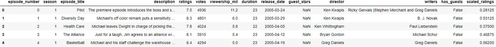

let's see information about every column in our Data

We have 14 columns there is no empty data except column **guest_stars**

which has only 29 number of data.

```python
office_df.info(
```

```python
<class 'pandas.core.frame.DataFrame'>
RangeIndex: 188 entries, 0 to 187
Data columns (total 14 columns):
 #   Column          Non-Null Count  Dtype
---  ------          --------------  -----
 0   episode_number  188 non-null    int64
 1   season          188 non-null    int64
 2   episode_title   188 non-null    object
 3   description     188 non-null    object
 4   ratings         188 non-null    float64
 5   votes           188 non-null    int64
 6   viewership_mil  188 non-null    float64
 7   duration        188 non-null    int64
 8   release_date    188 non-null    object
 9   guest_stars     29 non-null     object
 10  director        188 non-null    object
 11  writers         188 non-null    object
 12  has_guests      188 non-null    bool
 13  scaled_ratings  188 non-null    float64
dtypes: bool(1), float64(3), int64(4), object(6)
memory usage: 19.4+ KB
```

```python
office_df.shape
(188, 14)
```

Data consist of 188 row and 14 column

```python
office_df.describe()
```

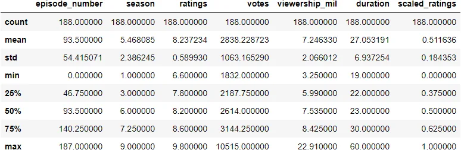

```python
office_df.sort_values(["episode_number","ratings"],ascending= [True,True])
```

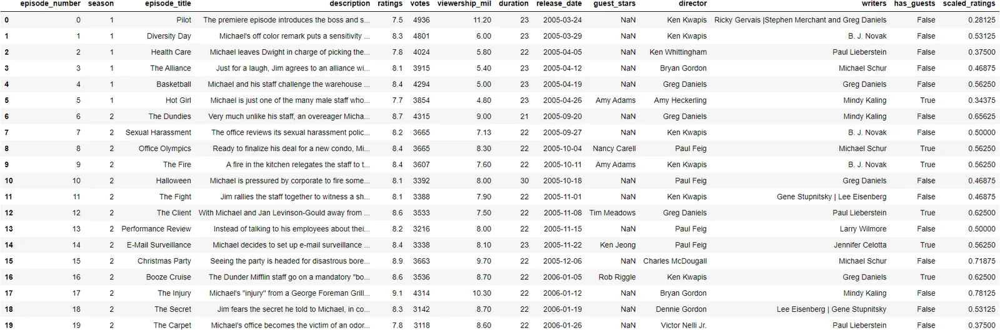

```python
office_df[office_df['scaled_ratings'] >= 1]
```

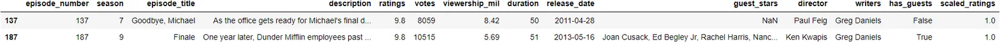

we have Two episode have scaled rating = 1 to the writer **Greg Daniels**

and director **Paul Feig** and **Ken Kwapis**

**Let's see who get the max number of view**

```python
maxView = office_df['viewership_mil'].max()
office_df[office_df['viewership_mil'] == maxView]
```

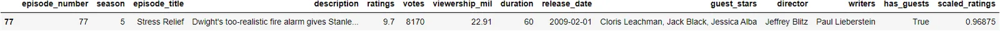

here we found that episode number **77** which called **Stress Relief** getthe maximum number of view equal **22.91**

Start Date and End Date Of release

```python
print(office_df['release_date'].min())
print(office_df['release_date'].max())
```

```python
2005-03-24
2013-05-16
```

```python
 mean = office_df['votes'].mean()
median = office_df['votes'].median()
print(mean)
print(median)
```

```python
2838.228723404255
2614.0
```

```python
office_df.isna().sum().plot(kind="bar")
plt.show()
```

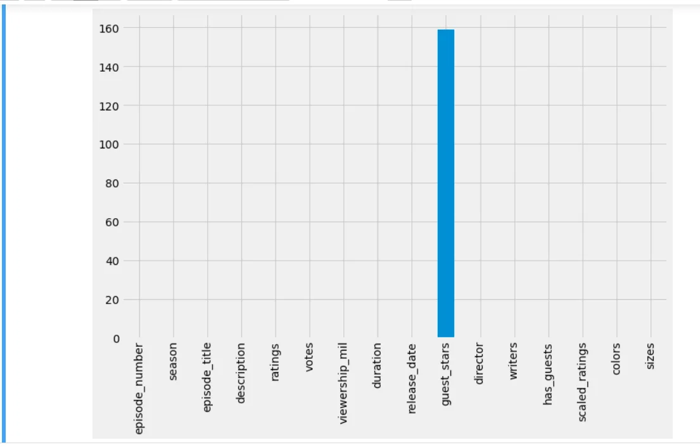

As we say before column **guest stars** has29 row only with data.

Let's see with colors the most view.

```python
office_df = pd.read_csv('office_episodes.csv')
colorsList = []
for ind, row in office_df.iterrows():
    if row['scaled_ratings'] < 0.25:
        colorsList.append('red')
    elif row['scaled_ratings'] < 0.50:
        colorsList.append('orange')
    elif row['scaled_ratings'] < 0.75:
        colorsList.append('lightgreen')
    else:
        colorsList.append('darkgreen')

sizes = []
for ind, row in office_df.iterrows():
    if row['has_guests'] == False:
        sizes.append(25)
    else:
        sizes.append(250)

office_df['colors'] = colorsList
office_df['sizes'] = sizes

non_guest_df = office_df[office_df['has_guests'] == False]
guest_df = office_df[office_df['has_guests'] == True]

plt.rcParams['figure.figsize'] = [11, 7]
plt.style.use('fivethirtyeight')

plt.scatter(x = non_guest_df.episode_number, y = non_guest_df.viewership_mil, \
c = non_guest_df['colors'],marker = "v", s = 25)

# Create a starred scatterplot for guest star episodes
plt.scatter(x = guest_df.episode_number, y = guest_df.viewership_mil, \
 c = guest_df['colors'], marker = '*', s = 250)

plt.title("Popularity, Quality, and Guest Appearances on the Office", fontsize = 28)
plt.xlabel("Episode Number", fontsize = 30)
plt.ylabel("Viewership (Millions)", fontsize = 30)

plt.show()

the most popular guest star
print(office_df[office_df['viewership_mil'] > 20]['guest_stars'])
```

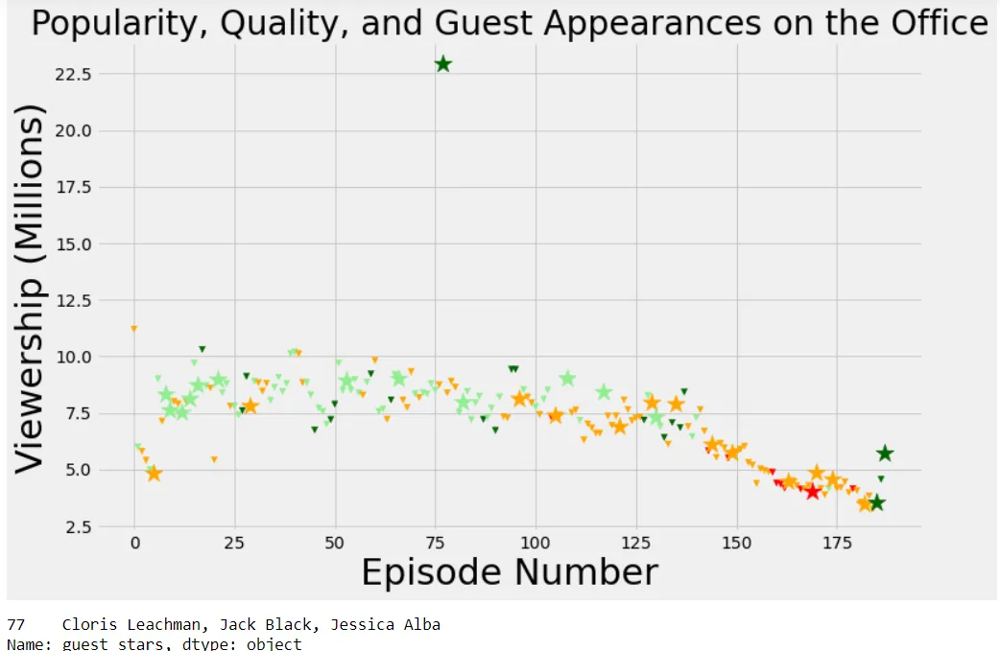

There have been 9 seasons

```python
office_df['season'].max()
9
```

```python
office_df.plot(x = "duration", y = "ratings", kind = "scatter",marker ="*",color = "green")
plt.show()
```

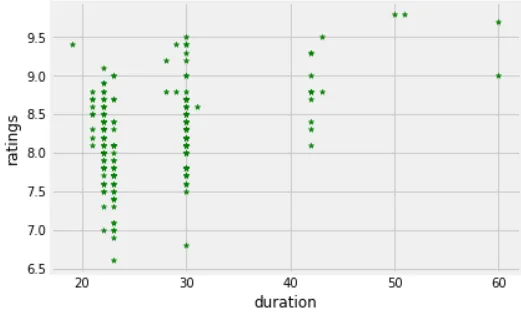

long duration has high rate and small duration its rate is between (7.5,9)

```python
office_df.plot(x = "duration", y = "viewership_mil", kind = "scatter", marker = "s",color ="green")
plt.show()
```

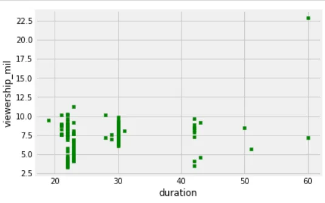

Less duration of Episode more view.

```python
office_df.plot(x = "release_date", y = "duration")
plt.xticks(rotation=90)
plt.show()
```

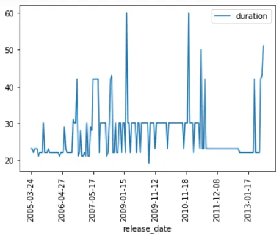

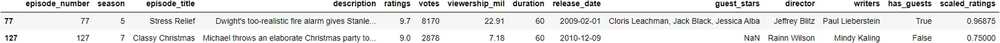

Duration change over years and max duration is **60** and Two episode has it **Stress Relief and Classy Christmas**

**see all code here**

https://github.com/AyaMohammedAli/Investigating-Guest-Stars-in-TheOffice-
