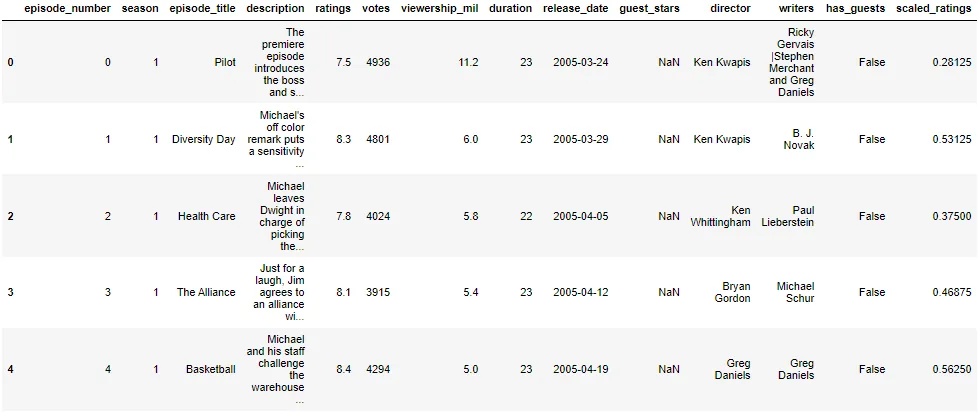
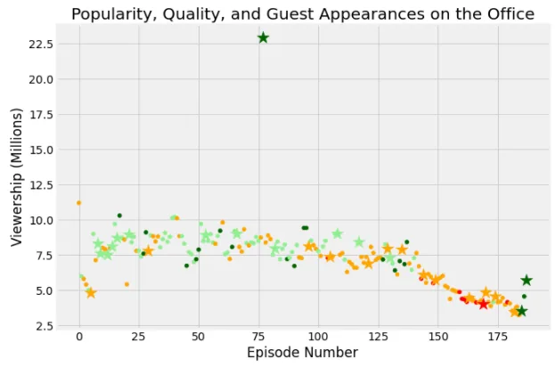
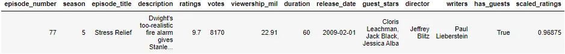
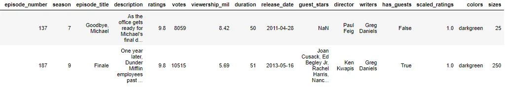
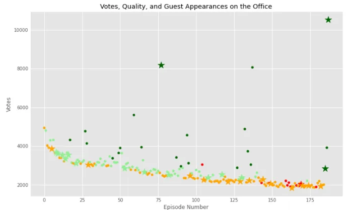

**The Office!** What started as a British mockumentary series about office culture in 2001 has since spawned ten other variants across the world, the American series has been the longest-running, spanning 201 episodes over nine seasons.

In this notebook, we will take a look at a dataset of The Office episodes, and try to understand how the popularity and quality of the series varied over time. To do so, we will use the following dataset: datasets/office_episodes.csv.

This dataset contains information on a variety of characteristics of each episode. In detail, these are:

**datasets/office_episodes.csv**

- **episode_number:** Canonical episode number.
- **season:** Season in which the episode appeared.
- **episode_title:** Title of the episode.
- **description:** Description of the episode.
- **ratings:** Average IMDB rating.
- **votes:** Number of votes.
- **viewership_mil:** Number of US viewers in millions.
- **duration:** Duration in number of minutes.
- **release_date:** Airdate.
- **guest_stars:** Guest stars in the episode (if any).
- **director:** Director of the episode.
- **writers:** Writers of the episode.
- **has_guests:** True/False column for whether the episode contained guest stars.
- **scaled_ratings:** The ratings scaled from 0 (worst-reviewed) to 1 (best-reviewed).

Data visualization is often a great way to start exploring our data and uncovering insights. In this notebook, we will initiate this process by creating an informative plot of the episode data provided to us. In doing so, we're going to work on several different variables, including the episode number, the viewership, the fan rating, and guest appearances.

First, Import pandas and mapplotlib.pyplot under their usual aliases:

```python
import pandas as pd
import matplotlib.pyplot as plt
```

Then, We read the data and explore it:

```python
office_df=pd.read_csv('datasets/office_episodes.csv')
print(office_df.shape)
print(office_df.info())
office_df.head()
```

```python
(188, 14)
<class 'pandas.core.frame.DataFrame'>
RangeIndex: 188 entries, 0 to 187
Data columns (total 14 columns):
 #   Column          Non-Null Count  Dtype
---  ------          --------------  -----
 0   episode_number  188 non-null    int64
 1   season          188 non-null    int64
 2   episode_title   188 non-null    object
 3   description     188 non-null    object
 4   ratings         188 non-null    float64
 5   votes           188 non-null    int64
 6   viewership_mil  188 non-null    float64
 7   duration        188 non-null    int64
 8   release_date    188 non-null    object
 9   guest_stars     29 non-null     object
 10  director        188 non-null    object
 11  writers         188 non-null    object
 12  has_guests      188 non-null    bool
 13  scaled_ratings  188 non-null    float64
dtypes: bool(1), float64(3), int64(4), object(6)
memory usage: 19.4+ KB
None
```



We want to Create a matplotlib **scatter plot** of the data that contains the following attributes:

- Each episode's **episode number plotted along the x-axis**
- Each episode's **viewership (in millions) plotted along the y-axis**
- A **color scheme** reflecting the **scaled ratings** (not the regular ratings) of each episode, such that:

  - Ratings < 0.25 are colored "red"
  - Ratings >= 0.25 and < 0.50 are colored "orange"
  - Ratings >= 0.50 and < 0.75 are colored "lightgreen"
  - Ratings >= 0.75 are colored "darkgreen"

- A **sizing system**, such that episodes with guest appearances have a marker size of 250 and episodes without are sized 25
- A **title**, reading "Popularity, Quality, and Guest Appearances on the Office"
- An **x-axis label** reading "Episode Number"
- A **y-axis label** reading "Viewership (Millions)"

To do that,

First, we prepare a color scheme:

```python
# Color scheme
# Define an empty list
colors = []

# Iterate over rows of netflix_movies_col_subset
for lab, row in office_df.iterrows() :
    if row['scaled_ratings'] < 0.25:
        colors.append("red")
    elif row['scaled_ratings'] < 0.50:
        colors.append("orange")
    elif row['scaled_ratings'] < 0.75:
        colors.append("lightgreen")
    else:
        colors.append("darkgreen")
```

Then, we prepare a sizing system:

```python
# Sizing system
# Define an empty list
sizes = []

# Iterate over rows of netflix_movies_col_subset
for lab, row in office_df.iterrows() :
    if row['has_guests']:
        sizes.append(250)
    else:
        sizes.append(25)
```

Then, we do a bonus step, we differentiate guest appearances not just with size, but also with a star!

```python
# Add the two series above to the dataframe
office_df['colors'] = colors
office_df['sizes'] = sizes
# Create two dataframes from the original dataframe, one for episods with # guests and the other with no guests
non_guest_df = office_df[office_df['has_guests'] == False]
guest_df = office_df[office_df['has_guests']]
```

Then, It's time to draw our scatter plot

```python
## Initalize a new figure
fig = plt.figure()
plt.style.use('fivethirtyeight')

# Create a scatter plot of epsidoe number versus viewership(in millions)
plt.scatter(x='episode_number',
            y='viewership_mil',
            data=non_guest_df,
            c='colors',
            s='sizes')
plt.scatter(x='episode_number',
            y='viewership_mil',
            data=guest_df,
            c='colors',
            s='sizes',
           marker='*')

# Create a title and axis labels
plt.title("Popularity, Quality, and Guest Appearances on the Office")
plt.xlabel("Episode Number")
plt.ylabel("Viewership (Millions)")

# Show the plot
plt.show()
```



From this plot, we can find that the number of viewers (popularity) decreases with the new episodes, except for one episode, which we can find like this:

```python
df_most_watched=\
    office_df[office_df['viewership_mil'] == office_df['viewership_mil'].max()]
```



Here, we find the details of the most-watched episode.

We can make other explorations. We can show the most rating episodes

```python
most_ratings = office_df[office_df['ratings'] == office_df['ratings'].max()]
most_ratings
```



We find the last episode in season 9 one of the most rated episodes The writer "Greg Daniels" is the writer of the most 2 rated episodes.

We create another plot to see the relation between votes and episodes

```python
## Initalize a new figure
fig = plt.figure()
plt.style.use('ggplot')

# Create a scatter plot of epsidoe number versus votes
plt.scatter(x='episode_number',
            y= 'votes',
            data=non_guest_df,
            c='colors',
            s='sizes')
plt.scatter(x='episode_number',
            y='votes',
            data=guest_df,
            c='colors',
            s='sizes',
           marker='*')

# Create a title and axis labels
plt.title("Votes, Quality, and Guest Appearances on the Office")
plt.xlabel("Episode Number")
plt.ylabel("Votes")

# Show the plot
plt.show()
```



We find that there is a negative correlation between episodes series and votes, but still, high rated episodes have high votes, even if these episodes are not the most popular episodes, but they have the most votes, and that is not related with if the episodes have guest stars or not.
