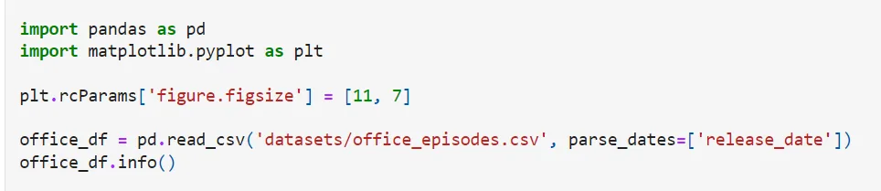
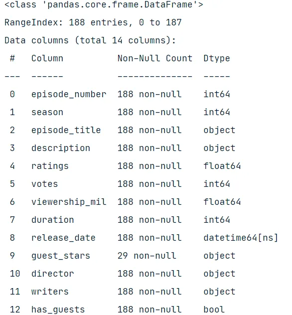
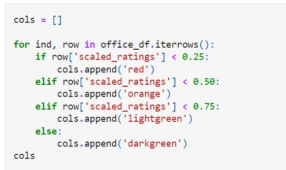
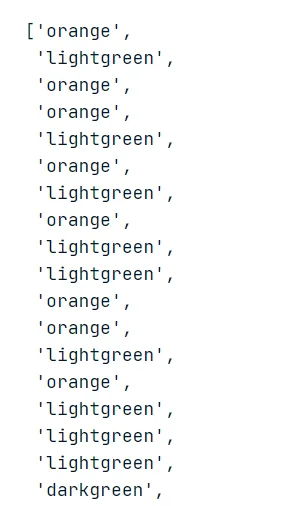
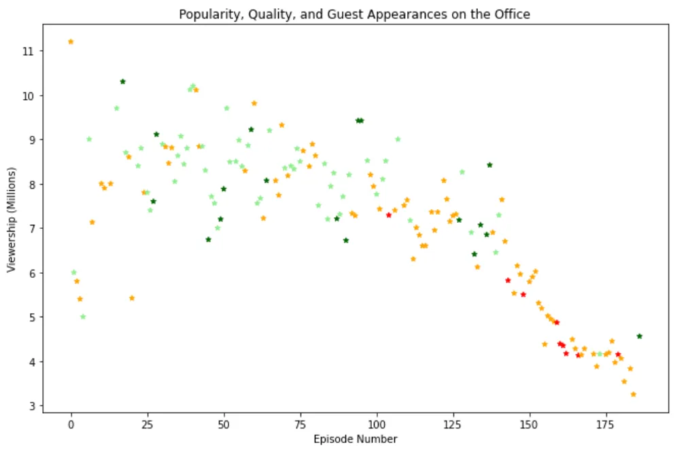
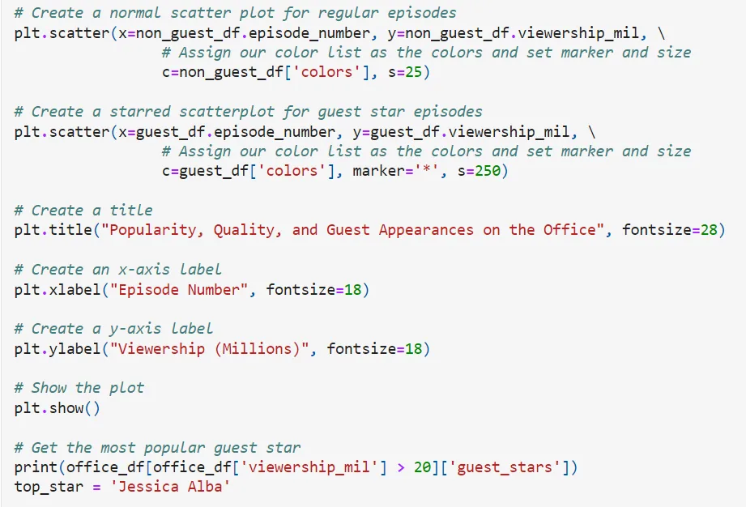
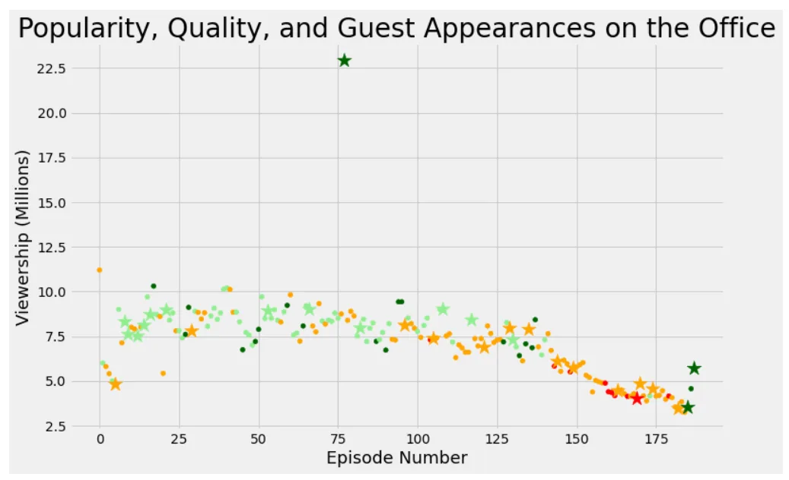

**Dataset**

The name of the dataset is "The Office Dataset". This was obtained from the Kaggle website.

First import the libraries needed and read the CSV file as we manipulate and analyze the office dataset

**Output**

**Data Design**

First, we color each episode based on its rating so we make a list called color, then loop over each episode and check its scaled rating, if it is below 0.25 then we add red to the list, If it is between 0.25 and 0.50, we add orange, if it is between 0.50 and 0.75, we add light green, and finally, dark green for all episodes with a rating above 0.75.

First few rows of output

Then, we calculate the color list as a color parameter in the scatter plot. The output is below.

Now we can easily identify the ratings of different episodes. Looking at the graph, there is more work to be done.

Now we will create a scatter plot to visualize the episode:

Output

In addition to the outlier episode which had a scale of about 9.6 scales and more than 22.5 million views. Most episodes have a rating of 7.5 to 9.0 and 5 to 10 million viewers. It is difficult to say whether any guest presence had a significant impact on quality and popularity.

[Github](https://github.com/AliMourtaza/Investigating-Guest-Stars-in-The-Office/blob/main/Investigating%20Guest%20Stars%20in%20The%20Office.ipynb)
