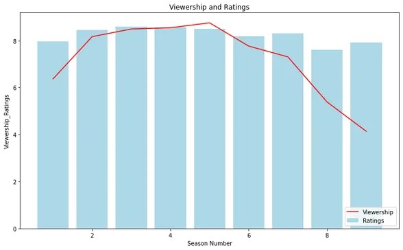
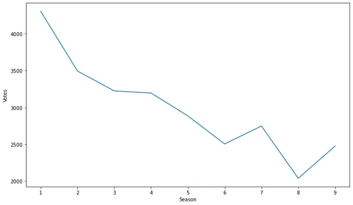
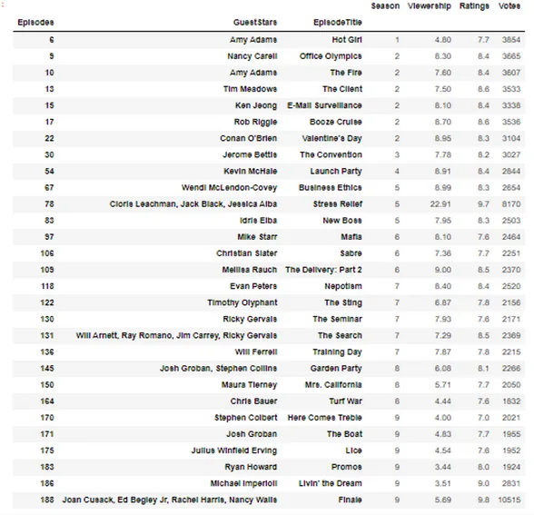
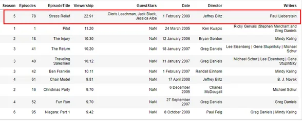
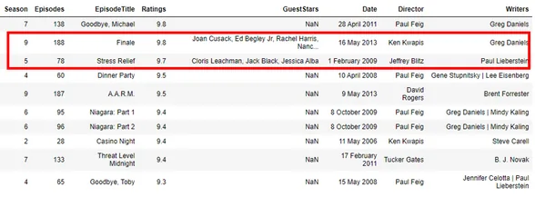
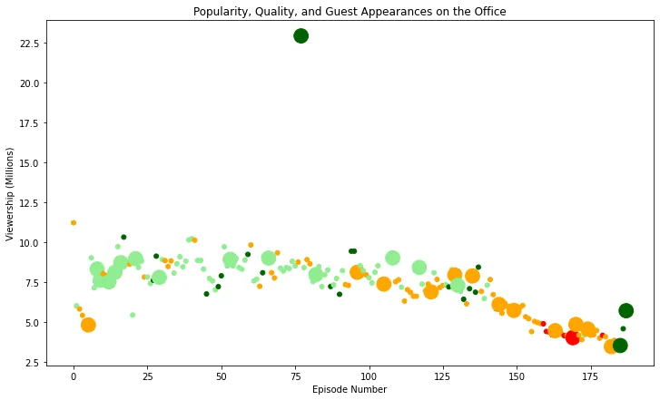
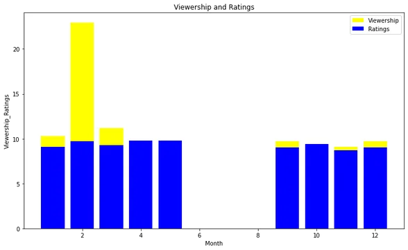

## Introduction
The Office is an American Mockumentary sitcom television series that depicts the everyday lives of office employees in the Scranton, Pennsylvania, branch of the fictional Dunder Mifflin Paper Company. It aired on [NBC](https://en.wikipedia.org/wiki/NBC) from March 24, 2005, to May 16, 2013, spanning a total of nine seasons.

In this project, we will take a look at a dataset of The Office episodes, and try to understand how the popularity and quality of the series varied over time. To do so, we will use the following dataset: datasets/office_episodes.csv, which was downloaded from Kaggle. It is a 12-column table that presents the following information:

It is a 12-column table that presents the information in the following order:

- **Unnamed**: 0: unnamed index values

- **Season** : Season in which the episode appeared.

- **Episode title**: Title of the episode.

- **About**: Description of the episode.

- **Ratings**: Average IMDB rating.

- **Votes**: Number of votes.

- **Audience**: Number of American viewers in millions.

- **Duration**: Duration in minutes.

- **Date** : date of broadcast.

- **GuestStars** : stars invited in the episode (if any).

- **Director** : Director of the episode.

- **Writers** : Writers of the episode.

In this project, several methods are presented to evaluate the popularity and quality of the series over time.

## 1. Import libraries to read and analyze the data
After downloading the_office_series.csv file into Kaggle, it is necessary to import the libraries to analyze and view the data.

import pandas as pd

import numpy as np

import matplotlib.pyplot as plt

## 2. Information about the type of data
To read the file and print a concise summary of a DataFrame, there are the following functions

office = pd .read_csv("Downloads/the_office_series.csv")

office.info()

<class 'pandas.core.frame.DataFrame'>

RangeIndex: 188 entries, 0 to 187

Data columns (total 12 columns):

# Column Non-Null Count Dtype

--- ------ -------------- -----

0 Unnamed: 0 188 non-null int64

1 Season 188 non-null int64

2 EpisodeTitle 188 non-null object

3 About 188 non-null object

4 Ratings 188 non-null float64

5 Votes 188 non-null int64

6 Viewership 188 non-null float64

7 Duration 188 non-null int64

8 Date 188 non-null object

9 GuestStars 29 non-null object

10 Director 188 non-null object

11 Writers 188 non-null object

dtypes: float64(2), int64(4), object(6)

memory usage: 17.8+ KB

Our DataFrame is named 'office'. In the concise summary of 'office', there is no column to indicate the episode numbers, because the unnamed column represents the index values. It is possible to add an 'Episodes' column to number each episode.

## 3. Adding episode numbering to the dataframe
office['Episodes']**=** np.arange(1,189)

office.info()

<class 'pandas.core.frame.DataFrame'>

RangeIndex: 188 entries, 0 to 187

Data columns (total 13 columns):

# Column Non-Null Count Dtype

--- ------ -------------- -----

0 Unnamed: 0 188 non-null int64

1 Season 188 non-null int64

2 EpisodeTitle 188 non-null object

3 About 188 non-null object

4 Ratings 188 non-null float64

5 Votes 188 non-null int64

6 Viewership 188 non-null float64

7 Duration 188 non-null int64

8 Date 188 non-null object

9 GuestStars 29 non-null object

10 Director 188 non-null object

11 Writers 188 non-null object

12 Episodes 188 non-null int32

dtypes: float64(2), int32(1), int64(4), object(6)

memory usage: 18.5+ KB

## 4. Evolution of the popularity and quality of the series
The evolution of viwership, ratings and votes can be observed according to the seasons using the **groupby() function**

```python
office_v=office.groupby('Season')['Viewership'].mean()
office_r=office.groupby('Season')['Ratings'].mean()
fig, ax = plt.subplots()
office_v_plot = ax.plot(office_v.index, office_v, color ='red', label = 'Viewership')
office_r_plot = ax.bar(office_r.index, office_r, color ='lightblue',label = 'Ratings')
ax.set_xlabel('Season Number')
ax.set_ylabel('Viewership_Ratings')
ax.set_title('Viewership and Ratings')
ax.legend(['Viewership', 'Ratings'], loc='lower right')
​
plt.show()
```



Viewership and ratings increased after the first season, but decreased in seasons 8 and 9. Seasons 5 and 4 had the highest viewership respectively. The best ratings are observed in seasons 4 and 3 respectively.

office_n**=**office.groupby('Season')['Votes'].mean()

plt.plot(office_n)

plt.xlabel('Season')

plt.ylabel('Votes')

plt.show()



The votes have decreased over the seasons. Season 8 had the lowest votes. This could explain the low rating for this season.

In order to determine the factors influencing the evolution of viwership and ratings over the seasons, the following methods were used:

office_e**=**office.groupby('Season')[['Episodes','GuestStars']].count()

print(office_e)

Episodes GuestStars

Season

1 6 1

2 22 6

3 23 1

4 14 1

5 26 3

6 26 3

7 24 5

8 24 3

9 23 6

The table below shows the number of episodes per season and the number of guest stars per season. The number of episodes is not proportional to the number of guest starts. There were guest stars in 29 episodes out of the 188 episodes broadcast. To print all the episodes with guest stars, the method is the following :

office.groupby(['Episodes','GuestStars','EpisodeTitle'])[['Season','Viewership','Ratings','Votes']].mean()



The ten best episodes can be known by printing in descending order the episodes according to viewership or ratings. But before that, it is possible to specify the absence of guest stars in the episodes in the column 'GuestStars' of the Dataframe office.

no_gueststars **=** office[office['GuestStars'].isnull()] office.sort_values(['Viewership','Ratings'], ascending **=**[**False**,**False**])[['Season','Episodes','EpisodeTitle','Viewership','GuestStars','Date','Director','Writers']].iloc[:10]



In the first ten episodes that had more viewership, only episode 78 of season 5 had guest stars.

```python
office.sort_values(['Ratings', 'Viewership'], ascending = [False, False])[['Season','Episodes','EpisodeTitle','Ratings', 'GuestStars','Date', 'Director', 'Writers']].iloc[:10]
```



In the first ten episodes which are more rated, only episodes 78 and 188 of season 5 and 9 had guest stars.

To have a more exact visualization of the impact of the guest stars on the viewership and the ratings, it is possible to make a scatter plot. To get a better representation of this graph, it is important to separate the ratings values into categories with colors. If the episode contains Guest Stars, the size of the appearance will be 250, otherwise the size will be 25. Next, we need to add two new columns called colors and sizes in the office that correspond to the conditions defined for the rating values with or without guest stars.

**def**set_color(ratings):

**if** ratings **<**7.4:

**return**'red'

**elif**(ratings **>=**7.4)**&**(ratings **<**8.2):

**return**'orange'

**elif**(ratings **>=**8.2)**&**(ratings **<**9.0):

**return**'lightgreen'

**elif**(ratings **>=**9.0):

**return**'darkgreen'

**def**set_size(GuestStars):

**if** GuestStars **==** GuestStars:

**return**250

**else**:

**return**25

office['Color']**=** office['Ratings'].apply(set_color) office['Size']**=** office['GuestStars'].apply(set_size)

fig, ax **=** plt.subplots()

​ ax.scatter(x**=**office.index,

y**=**office['Viewership'],

c**=**office['Color'],

s**=**office['Size']) ​

ax.set(title**=**'Popularity, Quality, and Guest Appearances on the Office', ylabel**=**'Viewership (Millions)', xlabel**=**'Episode Number') ​

plt.rcParams['figure.figsize']**=**[12,7] ​

plt.show()



In this graph, the episodes that have guest stars do not differ considerably from the episodes that do not have guest stars, except for the episode 78. So, the guest stars in the episodes is not the main factor influencing the popularity and the quality of the series.

The period of broadcasting can also be an important factor. In this case, it is necessary to reformulate the data type of the **'Date'** column of **'office'** using the **datatime() function**. In our case, the dates are converted to months.

```python
office['Date'] = pd.to_datetime(office['Date']).dt.month
print(office['Date'])
```

0 3

1 3

2 4

3 4

4 4

..

183 4

184 4

185 5

186 5

187 5

Name: Date, Length: 188, dtype: int64

office_mV**=**office.groupby('Date')['Viewership'].max() office_mR**=**office.groupby('Date')['Ratings'].max() fig, ax **=** plt.subplots() office_mV_plot **=** ax.bar(office_mV.index, office_mV, color **=**'yellow', label **=**'Viewership') office_mR_plot **=** ax.bar(office_mR.index, office_mR, color **=**'blue',label **=**'Ratings') ax.set_xlabel('Month') ax.set_ylabel('Viewership_Ratings') ax.set_title('Viewership and Ratings') ax.legend(['Viewership','Ratings'])

plt.show()



The diagram showed a very high viewership and rating in the month of February. The period of release of the episodes is a determining factor on the popularity and quality of the series.

## Conclusion
The data analysis showed that the popularity and quality of the series the office increased after the first season, but decreased in the last two seasons (8 and 9). These results did not show an exact relationship with the guest stars in the episodes. However, the date of broadcasting of the episodes was a determining factor on the popularity and quality of the series.
