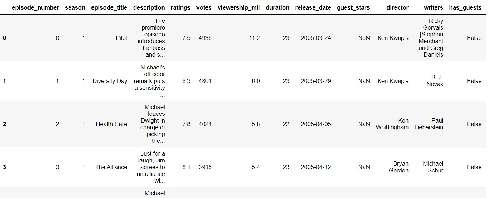
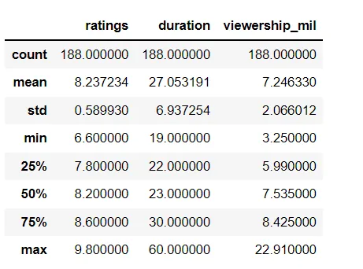
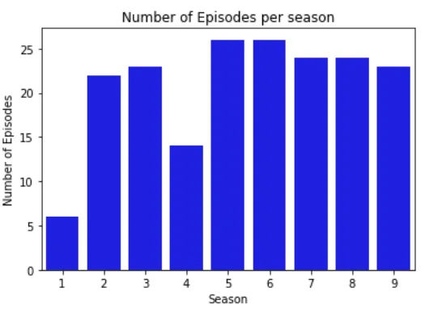
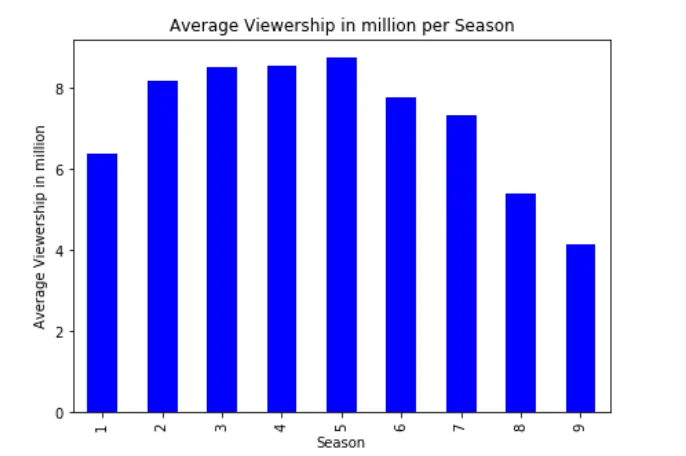
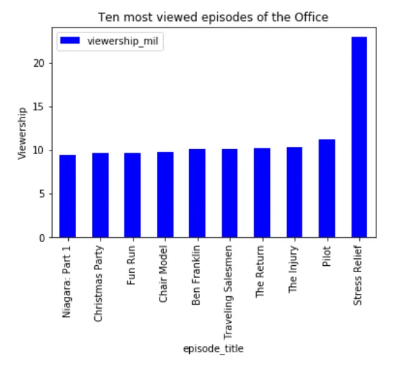
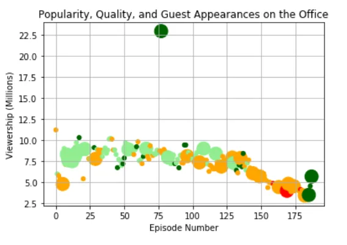

**The Office!** What started as a British mockumentary series about office culture in 2001 has since spawned ten other variants across the world, including an Israeli version (2010-13), a Hindi version (2019-), and even a French Canadian variant (2006-2007). Of all these iterations (including the original), the American series has been the longest-running, spanning 201 episodes over nine seasons.

In this blog, we will take a look at a dataset of The Office episodes, and try to understand how the popularity and quality of the series varied over time. To do so, we will use the following dataset: datasets/office_episodes.csv, which was downloaded from Kaggle [here](https://www.kaggle.com/nehaprabhavalkar/the-office-dataset).

This dataset contains information on a variety of characteristics of each episode. In detail, these are:

**datasets/office_episodes.csv**

- **episode_number:** Canonical episode number.
- **season:** Season in which the episode appeared.
- **episode_title:** Title of the episode.
- **description:** Description of the episode.
- **ratings:** Average IMDB rating.
- **votes:** Number of votes.
- **viewership_mil:** Number of US viewers in millions.
- **duration:** Duration in number of minutes.
- **release_date:** Airdate.
- **guest_stars:** Guest stars in the episode (if any).
- **director:** Director of the episode.
- **writers:** Writers of the episode.
- **has_guests:** True/False column for whether the episode contained guest stars.
- **scaled_ratings:** The ratings scaled from 0 (worst-reviewed) to 1 (best-reviewed)

**Importing required libraries and the data set**

We import three libraries pandas, matplotlib and seaborn and read the 'office_episodes.csv' from datasets folder.

```python
import pandas as pd
import matplotlib.pyplot as plt
import seaborn as sns
data=pd.read_csv('datasets/office_episodes.csv')
```

**Performing Exploratory Data Analysis and Visualization**

```python
data.shape
#Output
(188, 14)
```

There are 118 rows and 14 columns.

Printing the first four rows:

```python
data.head(4)
```



We then use info() function to check data type of each column (feature) also we can confirm no any column has null value

```python
data.info()
```


Columns ratings, duration, viewership_mil look of interest so we further perform statistical analysis on them using the describe() function.

```python
data[['ratings','duration','viewership_mil']].describe()
```



We then check number of episode per season of The Office. This is done by using seaborn's countplot method as shown in the snippet below:

```python
sns.countplot(x = 'season',data = data, color='blue')
plt.xlabel('Season')
plt.ylabel('Number of Episodes')
plt.title('Number of Episodes per season');
```



From this graph we can observe that season one has the least episode's (4), season 4 has second most least episode's (13) while other seasons have 22 -26 episode's

We then check the number of average viewership per season. This is done by grouping as per season and taking the mean value of each group (season) The code snippet and bar plot is as follow:

```python
m=data.groupby('season')['viewership_mil'].mean()
m.plot(kind='bar',color='blue',title='Average Viewership in million per Season', figsize=(7,5))
plt.ylabel('Average Viewership in million')
plt.xlabel('Season')
```



Here we can observe that there is gradual decrease in viewership after season 5.

We then check the top ten episodes with most views. For this we simply sort the dataframe in ascending order as per viewership and select the last 10 columns using tail function. Finally we plot the episode title and viewership count.



Interestingly the episode title ' Stress Relief ' has the most views of about 22 million. While other preceding highest viewed episode's have approximate 10 million views.

Then we plot a scatter plot of Viewership vs Episode. Additionally the color scheme is based on the scaled such that:

- Ratings < 0.25 are colored "red"
- Ratings >= 0.25 and < 0.50 are colored "orange"
- Ratings >= 0.50 and < 0.75 are colored "lightgreen"
- Ratings >= 0.75 are colored "darkgreen"

For this we create an empty list "col" , use else if to check the scaled ratings and based on it assign the color as follow :

```python
col=[]
for index, row in data.iterrows():
    if (row['scaled_ratings']<0.25):
        color='red'
    elif (row['scaled_ratings']<0.5):
        color='orange'
    elif (row['scaled_ratings']<0.75):
        color='lightgreen'
    else:
    color='darkgreen'
    col.append(color)
```

Similarly **sizing system** is such that episodes with guest appearances have a marker size of 250 and episodes without are sized 25. This is done by creating an empty list size and checking each row's 'has_guests' value is True or False using iterrow on the data frame.

```python
size=[]
for index, row in data.iterrows():
    if (row['has_guests']==True):
        sizee=250
    else:
        sizee=35
    size.append(sizee)
```

Finally we plot the desired plot and pass the size and col list as arguments as follow:

```python
fig=plt.figure()
plt.scatter(x=data['episode_number'],y=data['viewership_mil'],s=size,c=col)
plt.grid()
plt.xlabel('Episode Number')
plt.ylabel('Viewership (Millions)')
plt.title('Popularity, Quality, and Guest Appearances on the Office')
```



Here we can observe that there is an episode with about 22.5 millions views and has special guests. So we find the those top stars using loc and finding the maximum viewership episode and selecting the 'guest_star' column as follow

```python
top_stars=data.loc[data.viewership_mil.idxmax()
, 'guest_stars']
#Output
'Cloris Leachman, Jack Black, Jessica Alba'
```

Thank you for reading!

You can find the complete source code [here](https://github.com/rubash9849/data_inisghts/blob/main/Investigating%20Netflix%20Movies%20and%20Guest%20Stars%20in%20The%20Office/office_notebook.ipynb)
