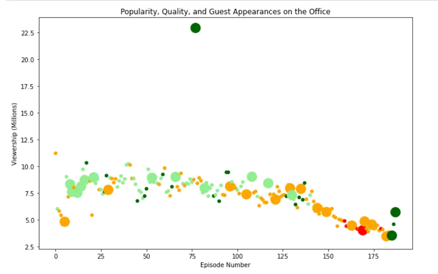

In this notebook, we will take a look at a dataset of The Office episodes, and try to understand how the popularity and quality of the series varied over time.

we will first import the libraries needed and read the csv file.

```python
import pandas as pd
import numpy as np
df = pd.read_csv('E:\jupyter notebooks\office_episodes.csv')
print(df.head())
```

we will make an object figure which contains the graph ,and assign its title,x asix,y axis.

while making a two lists to store the colors and sizes values.

```python
import matplotlib.pyplot as plt
plt.rcParams['figure.figsize'] = [11, 7]
fig = plt.figure()
colors = []
sizes = []
plt.title("Popularity, Quality, and Guest Appearances on the Office")
plt.xlabel("Episode Number")
plt.ylabel("Viewership (Millions)")
```

then we will iterate through scaled_rating to color each range and store it in colors list.

```python
for i in df['scaled_ratings']:
if i < 0.25:
colors.append("red")
elif i>= 0.25 and i < 0.50 :
colors.append("orange")
elif i >= 0.50 and i < 0.75:
colors.append("lightgreen")
elif i >= 0.75 :
colors.append("darkgreen")
```

then we will iterate through has_guests and store it in sizes list

```python
for i in df['has_guests']:
if i == True:
sizes.append(250)
else:
sizes.append(25)
```

here we will plot a scatter plot which has the column named 'episode_number' on x-axis , and 'viewership_mil' on y-axis. while putting in the color argument the colors list , and size argument the sizes list.

```python
plt.scatter(x=df['episode_number'], y=df['viewership_mil'] ,c=colors, s = sizes)
plt.show()
```

the output will be :



from the graph we can conclude that:

- as the number of epsiods increases after 140 ,the the views decreases

- the most watched eposied had a guest_star
