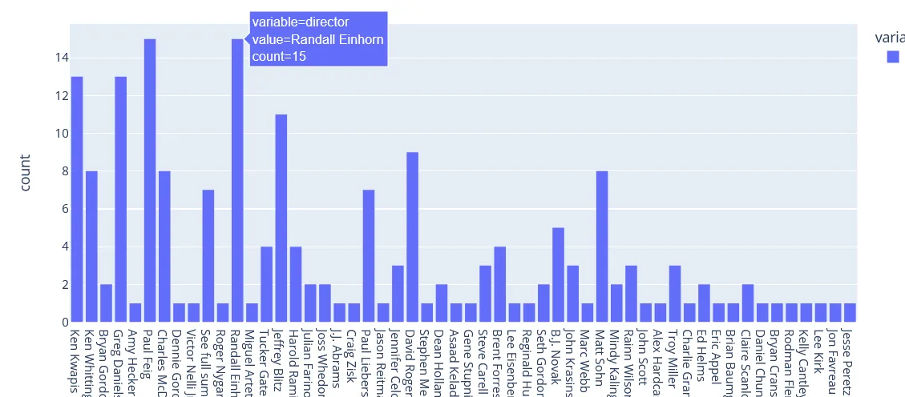
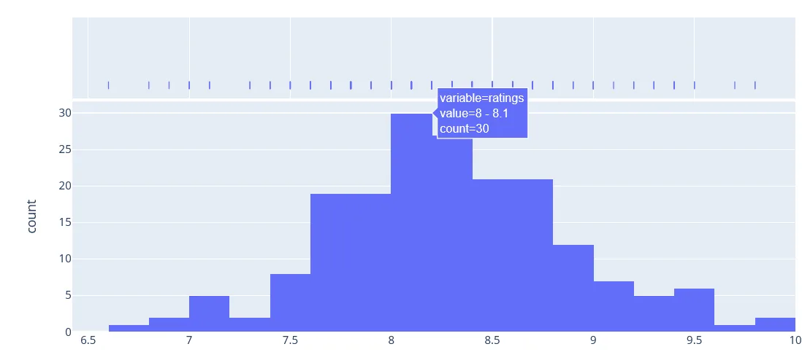
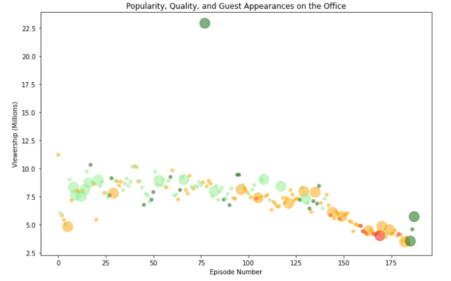
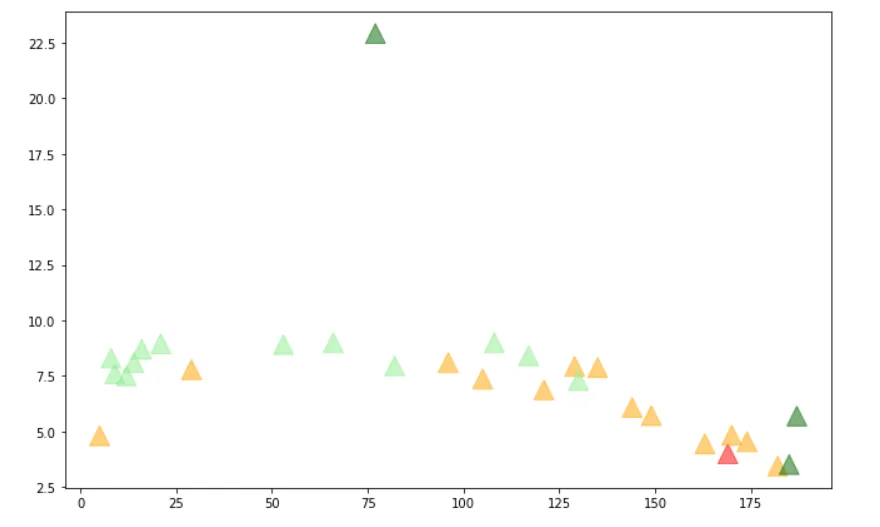
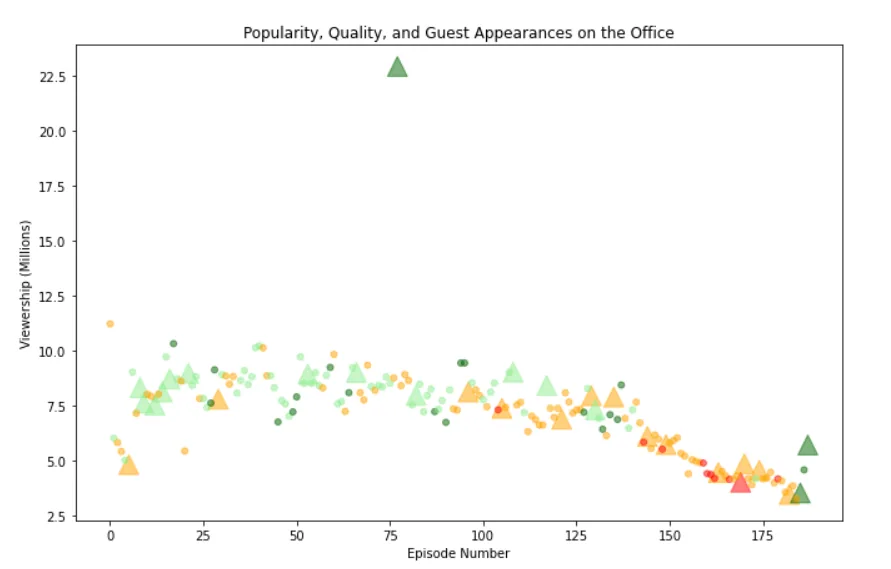
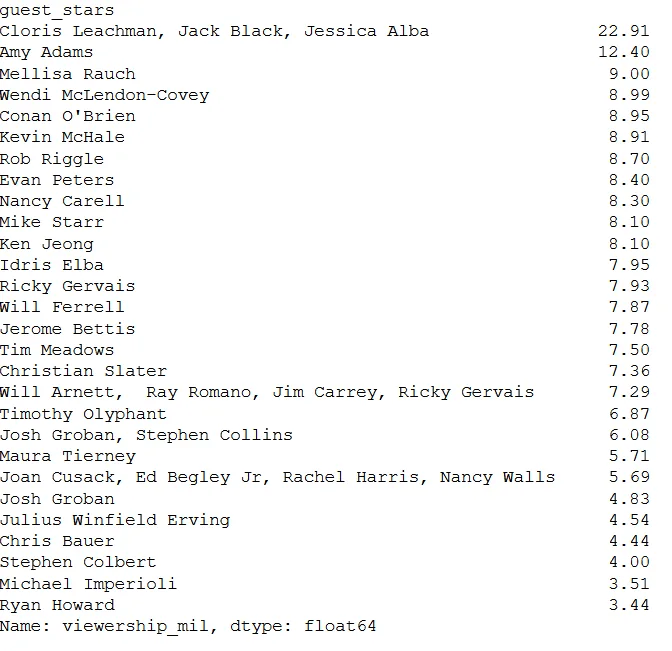

The following analysis is a Data Camp Project that can be accessed [here](https://projects.datacamp.com/projects/1170). This article will walk you through the codes in analyzing the Netflix data and some further codes outside the Data camp project.

The office episode dataset is arranged as follows:

```python
episode_number: Canonical episode number.
season: Season in which the episode appeared.
episode_title: Title of the episode.
description: Description of the episode.
ratings: Average IMDB rating.
votes: Number of votes.
viewership_mil: Number of US viewers in millions.
duration: Duration in number of minutes.
release_date: Airdate.
guest_stars: Guest stars in the episode (if any).
director: Director of the episode.
writers: Writers of the episode.
has_guests: True/False column for whether the episode contained guest stars.
scaled_ratings: The ratings scaled from 0 (worst-reviewed) to 1 (best-reviewed).
```

The project has 2 objectives which are:

1. Create a matplotlib **scatter plot**
2. Provide the name of one of the guest stars with the most views.



Before we dig deeper, wouldn't it be great to know how many movies each Director has directed? To do this we use a plotly plot which allows us to hover each column bar and give insight on the frequency. As can be seen, Paul Feig and Randall Einhorn have the highest frequencies whilst almost the majority have directed only one.

To create the plot we use the following code:

```python
# Director
import plotly.express as px
fig = px.histogram(data["director"])
fig.show()
```

Plotly has tremendous interactive power which is a great visual tool, this powerful plot can be translated to a power point presentation. We further look at a numeric variable, say the ratings column. The code is given by

```python
#  Ratings
fig = px.histogram(data["ratings"], title = "Ratings", marginal="rug")
fig.show()
```

Which produces this chart, with modal class being 8-8.1:



Now let us look at the question at hand. We are asked to make a scatter plot with different color schemes for a certain level of scale rating. We need to first create color codes for each specified scale rating. We make use of an if statement as follows which appends:

```python
# Iterate through the DataFrame, and assign colors based on the rating
# Initiatlize two empty lists
colour = []
size_s = []

for ind, row in data.iterrows():
    if row['scaled_ratings'] < 0.25:
        colour.append('red')
    elif row['scaled_ratings'] < 0.50:
        colour.append('orange')
    elif row['scaled_ratings'] < 0.75:
        colour.append('lightgreen')
    else:
        colour.append('darkgreen')

# Iterate through the DataFrame, and assign a size based on whether it has guests
for ind, row in data.iterrows():
    if row['has_guests'] == True:
        size_s.append(250)
    else:
        size_s.append(25)

data["Colours"] = colour
data["Size"] = size_s
```

The color schemes are given and the sizes are also obtained. Our first plot given the above will be this



However, this plot answers the question in part as we would like to have markers for episodes with guest stars. to do so we need to split the data as follows:

```python
#Splitting data
with_guest = data[data['has_guests'] == True]
without_guest = data[data['has_guests'] == False]

# Plot fot with_guest
plt.scatter(with_guest["episode_number"], with_guest["viewership_mil"],
            s= with_guest["Size"], c = with_guest["Colours"], marker = '^', alpha= 0.5)
```

This code plots only data for those episodes with guest stars



We can then add the other code for without guests to add on this graph as follows:

```python
#Splitting data
with_guest = data[data['has_guests'] == True]
without_guest = data[data['has_guests'] == False]

# Plot fot with_guest
plt.scatter(with_guest["episode_number"], with_guest["viewership_mil"],
            s= with_guest["Size"], c = with_guest["Colours"], marker = '^', alpha= 0.5)
plt.scatter(without_guest["episode_number"], without_guest["viewership_mil"],
            s= without_guest["Size"], c = without_guest["Colours"], alpha= 0.5)
plt.title("Popularity, Quality, and Guest Appearances on the Office")
plt.xlabel("Episode Number")
plt.ylabel("Viewership (Millions)")
```

This outputs the following graph with what we seek:



Now the second question, which guest star has the highest viewership. We can group the data, in descending order as follows:

```python
# Grouping
data.groupby("guest_stars")["viewership_mil"].sum().sort_values(ascending= False)
```

We then get our answer as:



You could check the Github code [here](https://github.com/Matshisela/Netflix-Data-Camp-Project).
