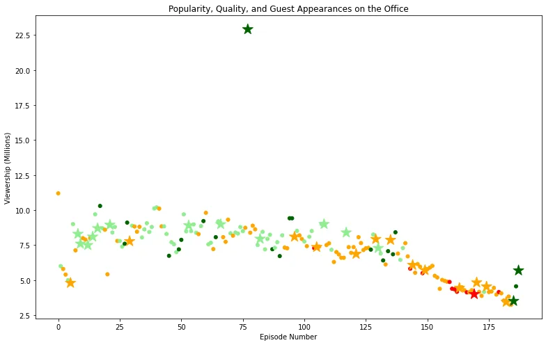

**The Office!** What started as a British mockumentary series about office culture in 2001 has since spawned ten other variants across the world, including an Israeli version (2010-13), a Hindi version (2019-), and even a French Canadian variant (2006-2007). Of all these iterations (including the original), the American series has been the longest-running, spanning 201 episodes over nine seasons.

In this project, we will take a look at a dataset of The Office episodes, and try to understand how the popularity and quality of the series varied over time. To do so, we will use the following dataset: datasets/office_episodes.csv, which was downloaded from Kaggle [here](https://www.kaggle.com/nehaprabhavalkar/the-office-dataset).

This dataset contains information on a variety of characteristics of each episode. In detail, these are:

**datasets/office_episodes.csv**

- **episode_number:** Canonical episode number.
- **season:** Season in which the episode appeared.
- **episode_title:** Title of the episode.
- **description:** Description of the episode.
- **ratings:** Average IMDB rating.
- **votes:** Number of votes.
- **viewership_mil:** Number of US viewers in millions.
- **duration:** Duration in number of minutes.
- **release_date:** Airdate.
- **guest_stars:** Guest stars in the episode (if any).
- **director:** Director of the episode.
- **writers:** Writers of the episode.
- **has_guests:** True/False column for whether the episode contained guest stars.
- **scaled_ratings:** The ratings scaled from 0 (worst-reviewed) to 1 (best-reviewed).

```python
import pandas as pd
import matplotlib.pyplot as plt
plt.rcParams['figure.figsize']=[11,7]
df=pd.read_csv('datasets/office_episodes.csv')
df.info()
```

Here we import the necessary libraries for the analysis such as *pandas* and *matplotlib.pyplot*. Then we set the figure size to make the plot a little bit larger. Next, we use the *read_csv* function of pandas library to read the dataset, and finally, we use the *info* method in order to see the summary of the dataframe. Here is the output of the above code:

```python
<class 'pandas.core.frame.DataFrame'>
RangeIndex: 188 entries, 0 to 187
Data columns (total 14 columns):
 #   Column          Non-Null Count  Dtype
---  ------          --------------  -----
 0   episode_number  188 non-null    int64
 1   season          188 non-null    int64
 2   episode_title   188 non-null    object
 3   description     188 non-null    object
 4   ratings         188 non-null    float64
 5   votes           188 non-null    int64
 6   viewership_mil  188 non-null    float64
 7   duration        188 non-null    int64
 8   release_date    188 non-null    object
 9   guest_stars     29 non-null     object
 10  director        188 non-null    object
 11  writers         188 non-null    object
 12  has_guests      188 non-null    bool
 13  scaled_ratings  188 non-null    float64
dtypes: bool(1), float64(3), int64(4), object(6)
memory usage: 19.4+ KB
```

We are going to create a scatter plot that describes the popularity, quality, and guest appearance on The Office.

```python
colors=[]
for index,row in df.iterrows():
    if row['scaled_ratings']<0.25:
        colors.append("red")
    elif row['scaled_ratings']<0.50:
        colors.append('orange')
    elif row['scaled_ratings']<0.75:
        colors.append('lightgreen')
    else:
        colors.append('darkgreen')
```

But before we create an empty list of *colors.* Then we iterate through the rows and checking for the *scaled_ratings:*

- Ratings < 0.25 are colored "red"
- Ratings >= 0.25 and < 0.50 are colored "orange"
- Ratings >= 0.50 and < 0.75 are colored "lightgreen"
- Ratings >= 0.75 are colored "darkgreen"

We append each color name to the colors list.

```python
sizes=[]
for index,row in df.iterrows():
    if row['has_guests'] == True:
        sizes.append(250)
    else:
        sizes.append(25)
```

Here we have a **sizing system**, such that episodes with guest appearances have a marker size of 250 and episodes without are sized 25.

```python
df['colors']=colors
df['sizes']=sizes
```

Now we are adding those lists to the dataframe as new columns.

```python
non_guest_df = df[df['has_guests']==False]
guest_df = df[df['has_guests']==True]
```

Here we split the dataframe into 2. First, without guests, second, having guests.

```python
fig=plt.figure()
plt.scatter(x=non_guest_df['episode_number'],
            y=non_guest_df['viewership_mil'],
            c=non_guest_df['colors'],
            s=non_guest_df['sizes'])
plt.scatter(x=guest_df['episode_number'],
            y=guest_df['viewership_mil'],
            c=guest_df['colors'],
            s=guest_df['sizes'],
            marker='*')
plt.title("Popularity, Quality, and Guest Appearances on the Office")
plt.xlabel("Episode Number")
plt.ylabel("Viewership (Millions)")
plt.show()
```



The above code creates a matplotlib **scatter plot** of the data that contains the following attributes:

- Each episode's **episode number plotted along the x-axis**
- Each episode's **viewership (in millions) plotted along the y-axis**
- A **color scheme** reflecting the **scaled ratings**
- A **title**, reading "Popularity, Quality, and Guest Appearances on the Office"
- An **x-axis label** reading "Episode Number"
- A **y-axis label** reading "Viewership (Millions)"
- A **sizing system**.

```python
df[df['viewership_mil']==df['viewership_mil'].max()]['guest_stars']
```

Provides the names of the guest stars who were in the most-watched Office episode.

```python
Cloris Leachman, Jack Black, Jessica Alba
Name: guest_stars, dtype: object
```

You can find this DataCamp project's notebook at this [link](https://github.com/iamNargiz/DataCamp_The_Office)
