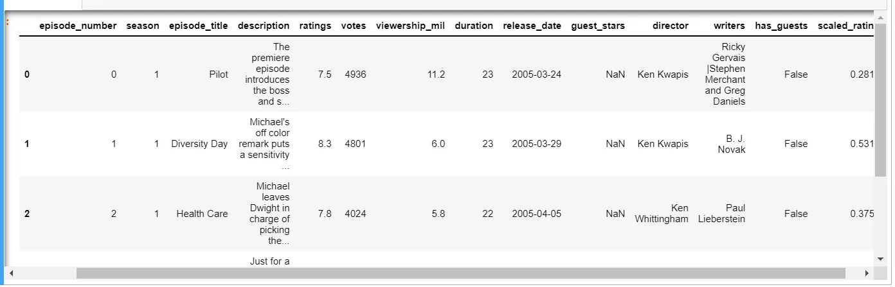
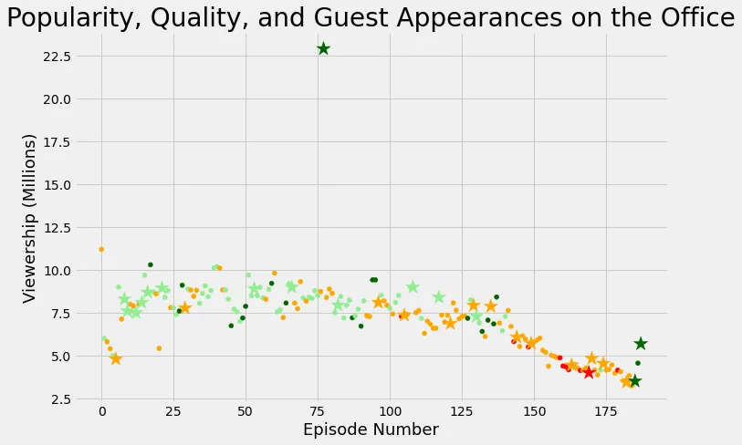

**The Office** is an American Mockumentary sitcom television series that depicts the everyday lives of office employees in the Scranton, Pennsylvania, branch of the fictional Dunder Mifflin Paper Company.

This sitcom series broadcasted from March 2005 to May 2013, with nine seasons.

Here, we will take a look at a dataset of The Office episodes, and try to

understand how the popularity and quality of the series varied over time.

Before we get started, just want to say that this is part of Data Insight's Data Science Program on Data Camp.

Now let's get right into it.

To do so, we will use the following dataset: datasets/office_episodes.csv, which was downloaded from [Kaggle](https://www.kaggle.com/nehaprabhavalkar/the-office-dataset) .

This dataset contains information on a variety of characteristics of each episode. In detail, these are: **datasets/office_episodes.csv**

- **episode_number:** Canonical episode number.
- **season:** Season in which the episode appeared.
- **episode_title:** Title of the episode.
- **description:** Description of the episode.
- **ratings:** Average IMDB rating.
- **votes:** Number of votes.
- **viewership_mil:** Number of US viewers in millions.
- **duration:** Duration in number of minutes.
- **release_date:** Airdate.
- **guest_stars:** Guest stars in the episode (if any).
- **director:** Director of the episode.
- **writers:** Writers of the episode.
- **has_guests:** True/False column for whether the episode contained guest stars.
- **scaled_ratings:** The ratings scaled from 0 (worst-reviewed) to 1 (best-reviewed).

To begin we need to import this two libraries **pandas and matplotlib**

```python
import pandas as pd
import matplotlib.pyplot as plt
```

```python
Then after we read in the CSV as a Data Frame. Pulling out just the first five rows.
office_df = pd.read_csv('datasets/office_episodes.csv', parse_dates=['release_date'])

office_df.head()
```

**Output:**



We want to create a color scheme list , Iterate over rows of office_df to input color name to the colors list and then again Inspect the first 10 values in the list.

Here you go,

- A color scheme reflecting the scaled ratings (not the regular ratings) of each episode, such that:

  - Ratings < 0.25 are colored "red"
  - Ratings >= 0.25 and < 0.50 are colored "orange"
  - Ratings >= 0.50 and < 0.75 are colored "lightgreen"
  - Ratings >= 0.75 are colored "darkgreen"

```python
colors = []

for lab, row in office_df.iterrows():if row['scaled_ratings'] < 0.25:colors.append("red")
elif 0.25 <= row['scaled_ratings'] < 0.50:colors.append("orange")
elif 0.50 <= row['scaled_ratings'] < 0.75:colors.append("lightgreen")
else:colors.append("darkgreen")

colors[:10]
```

**Output:**

```python
['orange',
 'lightgreen',
 'orange',
 'orange',
 'lightgreen',
 'orange',
 'lightgreen',
 'orange',
 'lightgreen',
 'lightgreen']
```

Creating a sizing system;

episodes with guest appearances have a marker size of 250

episodes without are sized 25

```python
for ind, row in office_df.iterrows():
if row['has_guests'] == False:
    sizes.append(25)
else:
    sizes.append(250)
```

Inspecting the first 10 values in the list

```python
sizes[:10]
```

**Output:**

```python
[25, 25, 25, 25, 25, 250, 25, 25, 250, 250]
```

Importing matplotlib.pyplot under its usual alias and to create a figure;

```python
import matplotlib.pyplot as plt
```

For ease of plotting, adding our lists as columns to the Data Frame

```python
office_df['colors'] = cols
office_df['sizes'] = sizes
```

Here we can split data into guest and non_guest DataFrames and aslo set the figure size and plot the style.

```python
non_guest_df = office_df[office_df['has_guests'] == False]guest_df = office_df[office_df['has_guests'] == True]

plt.rcParams['figure.figsize'] = [11, 7]
plt.style.use('fivethirtyeight')
```

Creating two scatter plots with the episode number on the x axis, and the viewership on the y axis

```python
plt.scatter(x=non_guest_df.episode_number,y=non_guest_df.viewership_mil, \
  c=non_guest_df['colors'], s=25)

plt.scatter(x=guest_df.episode_number,y=guest_df.viewership_mil, \
   c=guest_df['colors'], marker='*', s=250)
```

Now we will plot the figure as below with

- A **title**, "Popularity, Quality, and Guest Appearances on the Office"
- An **x-axis label** "Episode Number"
- A **y-axis label** "Viewership (Millions)"

```python
plt.title("Popularity, Quality, and Guest Appearances on the Office", fontsize=28)

plt.xlabel("Episode Number", fontsize=18)

plt.ylabel("Viewership (Millions)", fontsize=18)
```

Showing the plot;

```python
plt.show()
```

**Ouput:**



Finally, as we want to show the most-watched Office episode,

```python
# The highest view
highest_view = max(office_df["viewership_mil"])

# Filter the Dataframe row that has the most watched episode
most_watched_dataframe = office_df.loc[office_df["viewership_mil"] == highest_view]

# Top guest stars that were in that episode
top_stars = most_watched_dataframe[["guest_stars"]]top_stars
```

**Output:**


***Thank you for reading!!***

You can find the source code [here](https://github.com/Johnson-a-hash/Investigating-Guest-Stars-in-The-Office.git)
