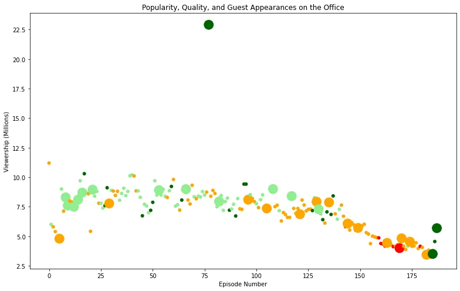

***The Office*** is an American mockumentary sitcom television series that depicts the everyday work lives of office employees in the Scranton, Pennsylvania, branch of the fictional Dunder Mifflin Paper Company.

In this blog, we will take a look at a dataset of The Office episodes, and try to understand how the popularity and quality of the series varied over time. To do so, we will use the following dataset: datasets/office_episodes.csv, which was downloaded from Kaggle [here](https://www.kaggle.com/nehaprabhavalkar/the-office-dataset).

This project involves generating summary statistics for numerical data in the dataset and creating graphical representation to understand the data better. This dataset contains information on a variety of characteristics of each episode. In detail, these are:

**datasets/office_episodes.csv**

- **episode_number:** Canonical episode number.
- **season:** Season in which the episode appeared.
- **episode_title:** Title of the episode.
- **description:** Description of the episode.
- **ratings:** Average IMDB rating.
- **votes:** Number of votes.
- **viewership_mil:** Number of US viewers in millions.
- **duration:** Duration in number of minutes.
- **release_date:** Airdate.
- **guest_stars:** Guest stars in the episode (if any).
- **director:** Director of the episode.
- **writers:** Writers of the episode.
- **has_guests:** True/False column for whether the episode contained guest stars.
- **scaled_ratings:** The ratings scaled from 0 (worst-reviewed) to 1 (best-reviewed).

## Importing libraries

We will start by importing the libraries we will require for performing analysis. These include Pandas and Matplotlib. In addition, if you want to be able to see a larger version of your plot, you can set the figure size parameters .

```python
#importing liberaries
import pandas as pd
import matplotlib.pyplot as plt
plt.rcParams['figure.figsize'] = [11, 7]
```

## Reading data

We will now read the data from a CSV file into a Pandas DataFrame.

```python
office_data = pd.read_csv('datasets/office_episodes.csv')
office_data.head()
```

Let us have a look at how our dataset looks like using office_data.head().

The output should look like this:


## Plot Customization
We want to create a **color scheme** reflecting the **scaled ratings** (not the regular ratings) of each episode, such that:

- Ratings < 0.25 are colored "red".
- Ratings >= 0.25 and < 0.50 are colored "orange".
- Ratings >= 0.50 and < 0.75 are colored "lightgreen".
- Ratings >= 0.75 are colored "darkgreen".

```python
colors=[]

for ind, row in office_data.iterrows():
    if row["scaled_ratings"] < 0.25:
        colors.append("red")
    elif row["scaled_ratings"] < 0.50:
        colors.append("orange")
    elif row["scaled_ratings"] < 0.75:
         colors.append("lightgreen")
    else:
        colors.append("darkgreen")

colors[1:15]
```

## Output:

```python
['orange',
 'lightgreen',
 'orange',
 'orange',
 'lightgreen',
 'orange',
 'lightgreen',
 'orange',
 'lightgreen',
 'lightgreen',
 'orange',
 'orange',
 'lightgreen',
 'orange',
 'lightgreen']
```

In addition to a **sizing system**, such that episodes with guest appearances have a marker size of 250 and episodes without are sized 25.

```python
sizes=[]

for ind, row in office_data.iterrows():
    if row["has_guests"] == False:
        sizes.append(25)

    else:
        sizes.append(250)

sizes[1:10]
```

## Output:

```python
[25, 25, 25, 25, 250, 25, 25, 250, 250]
```

## Creating Scatter Plots
Now it's time to create a scatter plot to explore the relationship between  **e**ach episode's **episode number plotted along the x-axis** and each episode's **viewership (in millions) plotted along the y-axis.**

```python
plt.scatter(x=office_data['episode_number'],
            y=office_data['viewership_mil'],
            c=colors,
            s=sizes
           )
```

It's time to customize the plot again . we will see the plot come to life as follows:

- A **title**, reading "Popularity, Quality, and Guest Appearances on the Office"
- An **x-axis label** reading "Episode Number"
- A **y-axis label** reading "Viewership (Millions)"

```python
plt.title("Popularity, Quality, and Guest Appearances on the Office")
plt.xlabel("Episode Number")
plt.ylabel("Viewership (Millions)")
# Show the plot
plt.show()
```

Output:



## Get the most popular guest star
**Finally ,** one solution would be to use subsetting to filter the DataFrame above a certain viewership threshold. *From the plot it should be obvious at what point you should filter to get the most popular episode!*

In addition to filtering the Dataframe row that has the top guest stars who were in that episode.

```python
office_data[office_data["viewership_mil"] == office_data["viewership_mil"].max()]["guest_stars"]
```

Output:


You can check the source code [here](https://github.com/fatmtly892/Investigating-Guest-Stars-in-The-Office).

References :

<https://www.wikipedia.org/>

<https://projects.datacamp.com/projects/1170>
