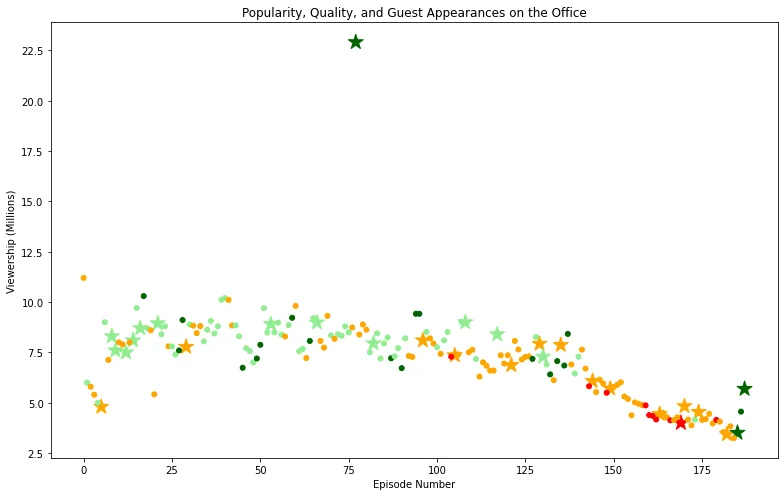

The Office is a mockumentary that depicts life in the office as a parody. It was recreated in many countries but the most famous one is probably the US version. In this article, I will be using some data on the show to plot a visual that relates viewership of each episode with the ratings and whether or not a guest star has appeared in the episode. The goal is to create a simple scatter plot that encompasses all of this information.

I will be using data that was imported from [Kaggle](https://www.kaggle.com/nehaprabhavalkar/the-office-dataset). his dataset contains information on a variety of characteristics of each episode. In detail, these are:

- **episode_number:** Canonical episode number.
- **season:** Season in which the episode appeared.
- **episode_title:** Title of the episode.
- **description:** Description of the episode.
- **ratings:** Average IMDB rating.
- **votes:** Number of votes.
- **viewership_mil:** Number of US viewers in millions.
- **duration:** Duration in number of minutes.
- **release_date:** Airdate.
- **guest_stars:** Guest stars in the episode (if any).
- **director:** Director of the episode.
- **writers:** Writers of the episode.
- **has_guests:** True/False column for whether the episode contained guest stars.
- **scaled_ratings:** The ratings scaled from 0 (worst-reviewed) to 1 (best-reviewed).

Here are the steps:

First, let's import pandas and matplotlib and load our data. You can also use seaborn to create visually stunning plots as well.

```python
# imports
import pandas as pd
import matplotlib.pyplot as plt
df = pd.read_csv('datasets/office_episodes.csv')
```

If we were to inspect our data using df.info() we will find that out of 188 episodes, only 29 episodes have guest stars in them.

We can try to find first a list of guests for the episode with the highest viewership.

```python
outlier_views = df.viewership_mil.max()
max_viewership_df = df.query('viewership_mil == outlier_views')
```

If we print the value outlier_views, we'll find that episode 77, title Stress Relief, was the one with the highest viewership. Let's assign one of the guests for the episode to a variable.

```python
top_star = max_viewership_df.guest_stars.str.split(',').get(77)[0]
# 'Cloris Leachman'
```

Let's start working on the plot. First, we want to create new columns denoting the color and size of each point of our scatter plot. Here are the steps:

1. We will create a color scheme that reflects the scaled ratings (not the regular ratings) of each episode, such that: Ratings < 0.25 are colored "red"; Ratings >= 0.25 and < 0.50 are colored "orange"; Ratings >= 0.50 and < 0.75 are colored "lightgreen"; Ratings >= 0.75 are colored "darkgreen"
2. Then we will create a sizing system, such that episodes with guest appearances have a marker size of 250 and episodes without are sized 25
3. Finally, we will separate the dataframe into 2 dataframes, one for the episodes that had no guest appearances, and the other for the episodes that did. This is to allow us to indicate the episodes thaty had guest stars using a star marker instead of a regular circular one.

```python
Here is the remainder of the code:
# Creating color scheme and a list for the sizes.
color_scheme = []
sizes = []
for index, row in df.iterrows():
    if row.scaled_ratings < 0.25:
        color_scheme.append('red')
    elif row.scaled_ratings < 0.50:
        color_scheme.append('orange')
    elif row.scaled_ratings < 0.75:
        color_scheme.append('lightgreen')
    else:
        color_scheme.append('darkgreen')

    if row.has_guests:
        sizes.append(250)
    else:
        sizes.append(25)

# adding the columns
df['colors'] = color_scheme
df['sizes'] = sizes

# creating the two sub dataframes
df_has_guests = df.query('has_guests == True').drop('has_guests', axis=1)
df_no_guests = df.query('has_guests == False').drop('has_guests', axis=1)

# plotting
plt.rcParams['figure.figsize'] = [11, 7]  # This increases the figure size
fig = plt.figure()
plt.scatter(x=df_has_guests.episode_number,
            y=df_has_guests.viewership_mil,
            c=df_has_guests.colors,
            s=df_has_guests.sizes,
            marker='*')
plt.scatter(x=df_no_guests.episode_number,
            y=df_no_guests.viewership_mil,
            c=df_no_guests.colors,
            s=df_no_guests.sizes)
# Adding title, x-axis label, and y-axis label
plt.title("Popularity, Quality, and Guest Appearances on the Office")
plt.ylabel("Viewership (Millions)")
plt.xlabel("Episode Number")
plt.show()
```

Here is the output.



As you can see, the episodes are color coded, and any episodes with guest stars were indicated by a large star. Episode 77 should be considered an outlier at this point and get removed from our cleaned dataset, so that our plot would be zoomed in on the bulk of our data.
