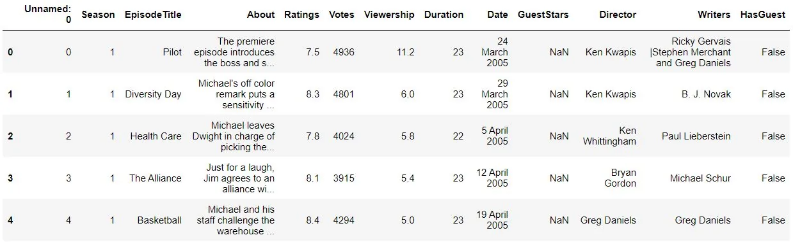
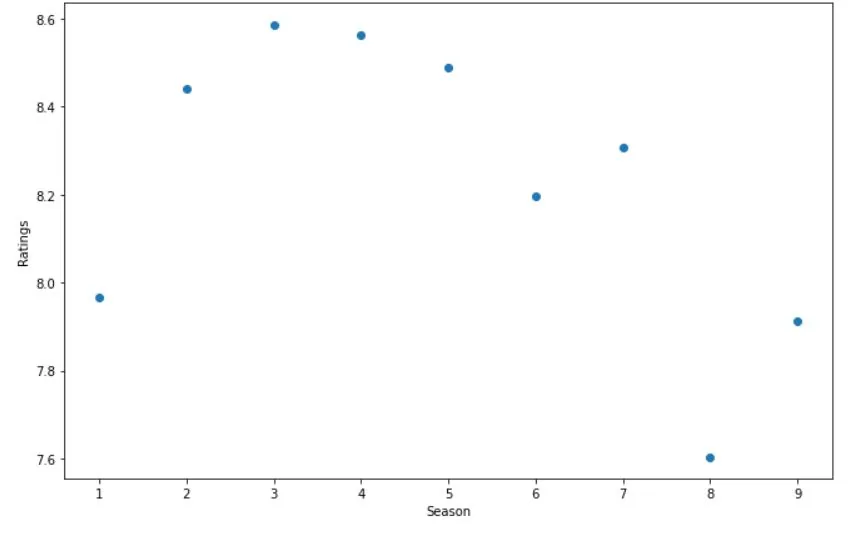
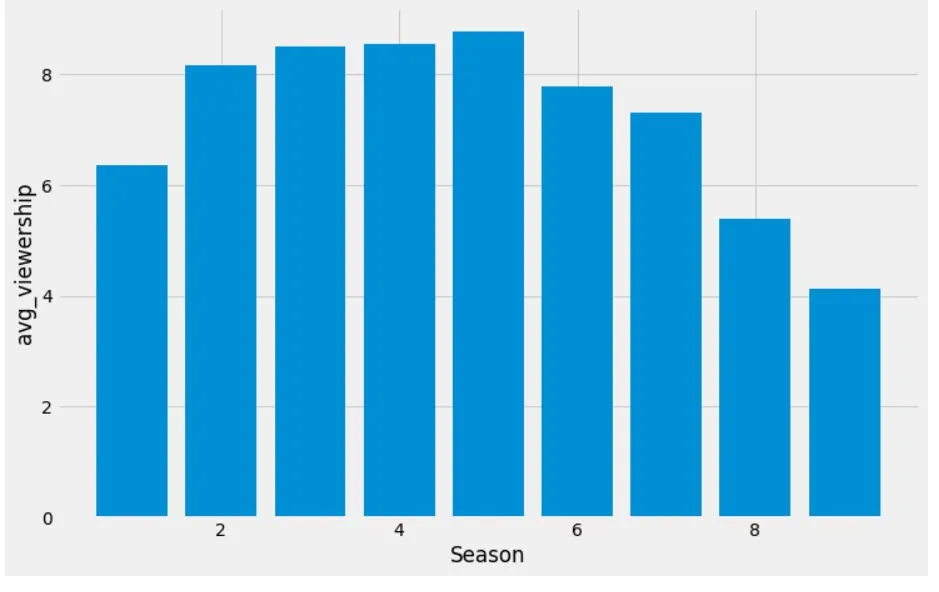
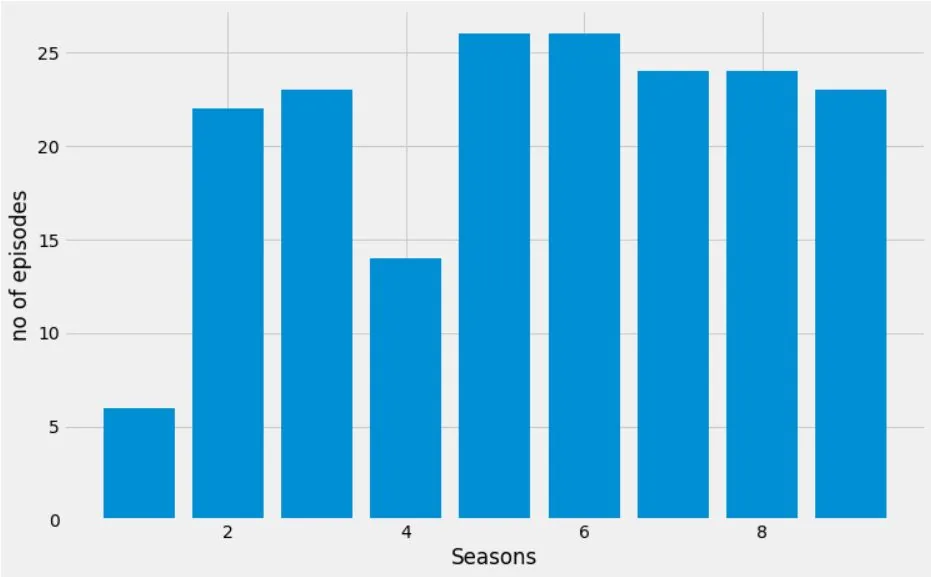
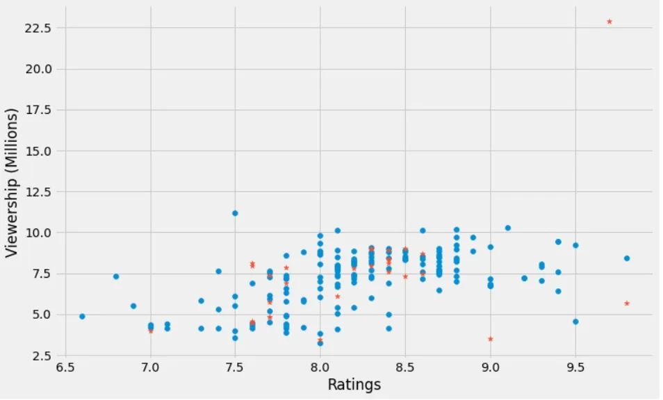
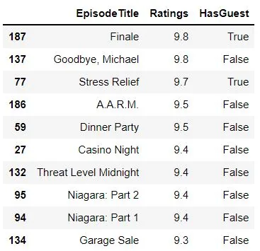
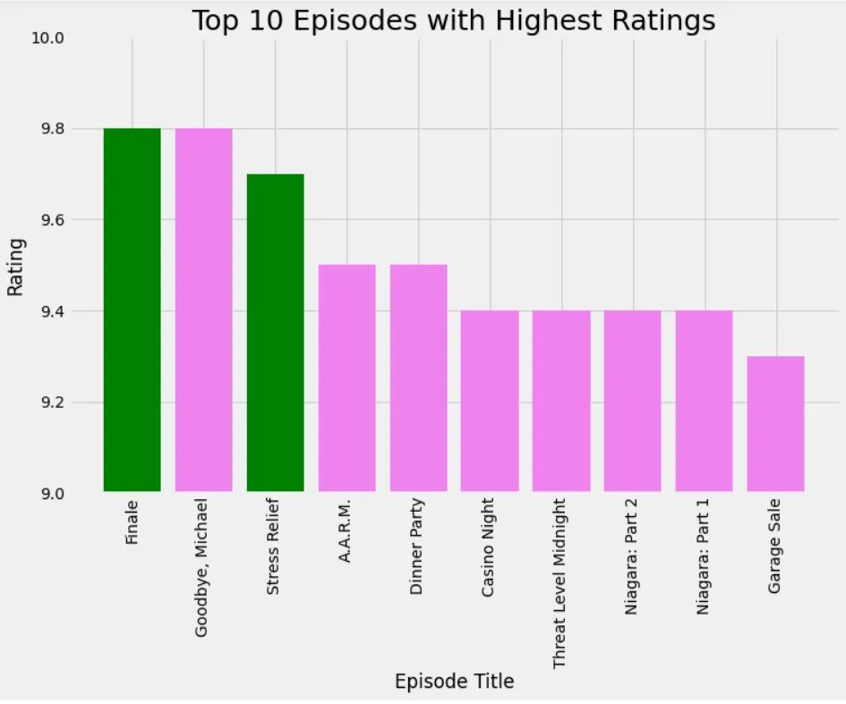
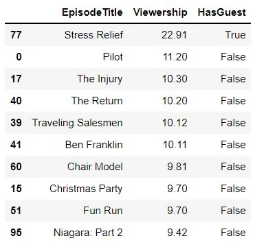
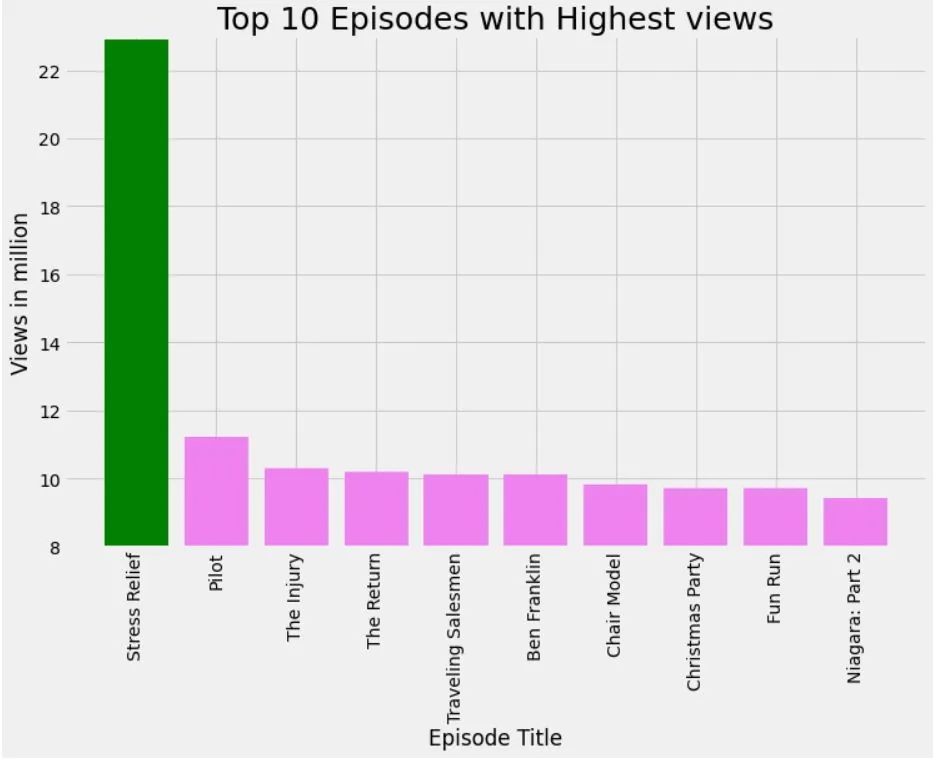

***The Office*** is an American mockumentarysitcom television series that depicts the everyday work lives of office employees in the Scranton, Pennsylvania, branch of the fictional Dunder Mifflin Paper Company. It aired on NBC from March 24, 2005, to May 16, 2013, spanning a total of nine seasons.
***In this notebook, we will take a look at a dataset of The Office episodes, and try to understand how the popularity and quality of the series varied over time. To do so, we will use the following dataset: datasets/office_episodes.csv, which was downloaded from Kaggle .***
***This dataset contains information on a variety of characteristics of each episode. In detail, these are:***
***datasets/office_episodes.csv***

**datasets/office_episodes.csv**

- **Unnamed:**integers starting from 0
- **Season:** Season in which the episode appeared.
- **EpisodeTitle:** Title of the episode.
- **About:** Description of the episode.
- **Ratings:** Average IMDB rating.
- **Votes:** Number of votes.
- **Viewership:** Number of US viewers in millions.
- **Duration:** Duration in number of minutes.
- **Date:** Airdate.
- **GuestStars:** Guest stars in the episode (if any).
- **Director:** Director of the episode.
- **Writers:** Writers of the episode.

## Importing data:
In the notebook we import the dataset **datasets/office_episodes.csv**, downloaded from Kaggle [here](https://www.kaggle.com/nehaprabhavalkar/the-office-dataset).We named a new dataframe as office_df

and read the .csv file.

```python
import pandas as pd
import matplotlib.pyplot as plt

plt.rcParams['figure.figsize'] = [11, 7]
office_df=pd.read_csv("C:\\Users\\DELL\\Desktop\\the_office_series.csv")
```

### Inspecting the dataframe:

Here, we look through the dataframe and identify whether the dataframe needs a change.

```python
office_df.info()
```

```python
<class 'pandas.core.frame.DataFrame'>
RangeIndex: 188 entries, 0 to 187
Data columns (total 13 columns):
 #   Column        Non-Null Count  Dtype
---  ------        --------------  -----
 0   Unnamed: 0    188 non-null    int64
 1   Season        188 non-null    int64
 2   EpisodeTitle  188 non-null    object
 3   About         188 non-null    object
 4   Ratings       188 non-null    float64
 5   Votes         188 non-null    int64
 6   Viewership    188 non-null    float64
 7   Duration      188 non-null    int64
 8   Date          188 non-null    object
 9   GuestStars    29 non-null     object
 10  Director      188 non-null    object
 11  Writers       188 non-null    object
 12  HasGuest      188 non-null    bool
dtypes: bool(1), float64(2), int64(4), object(6)
```

### Adding a new column that contains Boolean values:

we added a new column HasGuest that contains boolean values .Its value is True if the episode contains Guest stars and false if not.

```python
office_df['HasGuest'] = office_df['GuestStars'].notna()
office_df.head()
```



### Investigating Rating,viewership over seasons:

#### Grouping the 'Season' column and taking the averages of 'Ratings' and 'Viewership' for respective seasons:
```python
rate_view = office_df.groupby('Season')[['Ratings','Viewership']].mean().reset_index()
```

here , we group office_df dataframe by season column and take the mean of Ratings and Viewership columns and assign it to the rate_view dataframe.

#### Plotting Ratings over seasons:
```python
x = rate_view['Season']
y= rate_view['Ratings']

plt.scatter(x,y)
plt.style.use('fivethirtyeight')
plt.xlabel('Season')
plt.ylabel('Ratings')

plt.show()
```



From the above scatter chart we see that the ratings gradually increases from season 1 becomes maximum in season 3 ,slightly declines till season 5.Ratings drops further and attends minimum value in season 8.

### Plotting Viewership ,No of episodes over seasons and investigating the graphs:

#### Plotting Viewership over seasons:
```python
plt.bar(x,rate_view['Viewership'])
plt.style.use('fivethirtyeight')
plt.xlabel('Season')
plt.ylabel('avg_viewership')
plt.show()
```



### Bar graph showing no of episodes per season:
```python
totalep = office_df.groupby('Season')[['EpisodeTitle']].count().reset_index()
a= totalep['Season']
b= totalep['EpisodeTitle']

plt.bar(a,b)
plt.xlabel('Seasons')
plt.ylabel('no of episodes')
plt.show()
```



## Is No of episodes per season related with no of views??
In a simple sense ,season with higher no of episodes should have higher

average viewership. From above plots we cxan see that season 5 and 6 have highest no of episodes.Also season 5 has highest viewership .But this is not in all cases.Here, season 1 has least episodes and season 8 has second highest no of episodes but the views is grater for season 1 that that for season 8.

### Creating two different dataframes on the basis of the HasGuest column value:
```python
non_guest_df = office_df[office_df['HasGuest'] == False]
guest_df = office_df[office_df['HasGuest'] == True]
```

#### Scatter chart Rating against Viewership:

**Here we plot a scatter chart of rating and viewership .Here the marker '\*' is appended for the episodes having guest stars .**

```python
fig = plt.figure()
plt.style.use('fivethirtyeight')
plt.scatter(x= non_guest_df['Ratings'],
            y= non_guest_df['Viewership']
      )
plt.scatter(x= guest_df['Ratings'],
            y= guest_df['Viewership'],
          marker ="*"
           )
plt.xlabel("Ratings")
plt.ylabel("Viewership (Millions)")
plt.show( )
```



from the chart we can estimate that views of an episode does not affect the Rating of episode. here at the top rigth corner of the chart we see a \* marker which shows increase in views increases the ratings which is contrary to the average analysis of the chart .This can be due to presence of particular Guest star or just due to audience preference.

### Finding top 10 highest rated and viewed episodes and Investigating them on the basis of presence or absence of guest stars:

### Creating a dataframe of top 10 highest rated episodes .

```python
highest_rating = office_df.sort_values(by='Ratings', ascending=False)[['EpisodeTitle','Ratings','HasGuest']].iloc[:10,]

highest_rating.head(10)
```



### appending different colors to the bars for episode names on the basis of presence or absence of Guest stars:

###### green for episodes with the guest

###### Violet for non guest episodes.

```python
cols = []

for ind, row in highest_rating.iterrows():
    if row['HasGuest'] == False:
        cols.append('violet')
    else:
        cols.append('green')

plt.bar(highest_rating['EpisodeTitle'],highest_rating['Ratings'],color=cols)
plt.title('Top 10 Episodes with Highest Ratings', fontsize=25)
plt.xlabel('Episode Title')
plt.ylabel('Rating')
plt.ylim(9,10)
plt.xticks(rotation = 'vertical');
```



The plot shows top 10 episodes having highest ratings.Green Bars show the episodes having Guest Stars while Violet Bars show episodes without Guest stars.

From inspecting above graph.We can see from the two top rated episodes that one has guest stars while other dont.this indicates that the presence or absence of guest stars hasnot affected the ratings.

### Creating a dataframe of top 10 highest viewed episodes .

```python
highest_viewership = office_df.sort_values(by='Viewership', ascending=False)[['EpisodeTitle','Viewership','HasGuest']].iloc[:10,]

highest_viewership.head(10)
```



### appending different colors to the bars for episode names on the basis of presence or absence of Guest stars:

###### green for episodes with the guest

###### Violet for non guest episodes.

```python
col = []

for ind, row in highest_viewership.iterrows():
    if row['HasGuest'] == False:
        col.append('violet')
    else:
        col.append('green')


plt.bar(highest_viewership['EpisodeTitle'],highest_viewership['Viewership'],color = col)
plt.title('Top 10 Episodes with Highest views', fontsize=25)
plt.xlabel('Episode Title')
plt.ylabel('Views in million')
plt.ylim(8,23)
plt.xticks(rotation = 'vertical');
```



The above graph shows the top 10 most viewed episodes.Green bars show the episodes with guest stars and violet bars shows the episodes without guest stars.

From the top 10 observation we can see that the episodes with guest stars has the highest views in millions while the episodes without Guest stars has usally low viewership .So the viewership might depend in the presence of Guest stars.

This report is based on the Data Camp project .

The link to the notebook in the Github repository is [here](https://github.com/Techy-Ishan/Investigating-Guest-stars-in-The-Office-Series.-A-report-/blob/master/_investigating%20guest%20stars%20in%20THE%20OFFICE%20report.ipynb).
