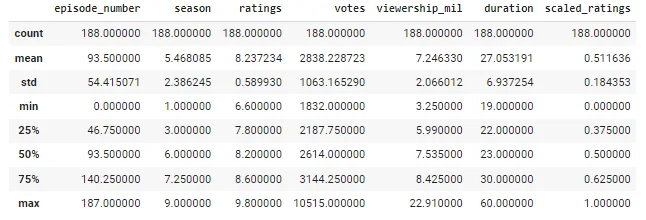
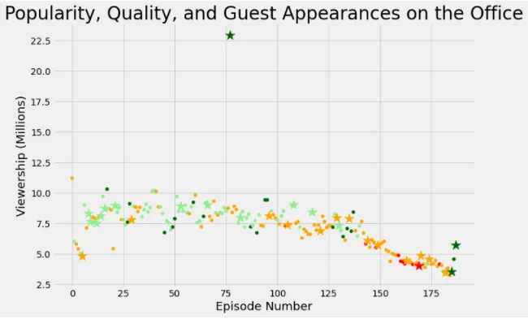

## Introduction :

**The Office!** What started as a British mockumentary series about office culture in 2001 has since spawned ten other variants across the world, including an Israeli version (2010-13), a Hindi version (2019-), and even a French Canadian variant (2006-2007). Of all these iterations (including the original), the American series has been the longest-running, spanning 201 episodes over nine seasons.

In this notebook, we will take a look at a dataset of The Office episodes, and try to understand how the popularity and quality of the series varied over time. To do so, we will use the following dataset: datasets/office_episodes.csv, which was downloaded from Kaggle [here](https://www.kaggle.com/nehaprabhavalkar/the-office-dataset).

This dataset contains information on a variety of characteristics of each episode. In detail, these are:

**datasets/office_episodes.csv**

- **episode_number:** Canonical episode number.
- **season:** Season in which the episode appeared.
- **episode_title:** Title of the episode.
- **description:** Description of the episode.
- **ratings:** Average IMDB rating.
- **votes:** Number of votes.
- **viewership_mil:** Number of US viewers in millions.
- **duration:** Duration in number of minutes.
- **release_date:** Airdate.
- **guest_stars:** Guest stars in the episode (if any).
- **director:** Director of the episode.
- **writers:** Writers of the episode.
- **has_guests:** True/False column for whether the episode contained guest stars.
- **scaled_ratings:** The ratings scaled from 0 (worst-reviewed) to 1 (best-reviewed).

## Importing Dataset :
```python
# import the essential libraries
import matplotlib.pyplot as plt
import pandas as pd
plt.rcParams['figure.figsize'] = [11, 7]
```

```python
# read the data office_episodes.csv and display first five rows
df = pd.read_csv('datasets/office_episodes.csv')
df.head()
```


## Analyzing the Dataset :

we have already parsed the (release_date) but we can see that there are a lot of null values for the column(guest_stars). However, this is not due to the data being incomplete the reason is that not all episodes have a guest_star in them. We are already provided with column (scaled_ratings) which is just rating but scaled for this analysis. Now we will be describing and summarizing the data to see whether all columns have the appropriate data type or if the data needs to be cleaned now all that is left to do is to do the visualizations and draw the conclusions.

```python
# get som information about data using method .info()
df.info()
```


```python
# now we will get some statistical information
df.describe()
```



## Visualizing The Data :

From the (.info()) and (.describe()) method we can see that the data is cleaned and is ready for our analysis as there are no columns that needs to have their data type changed also there are not any other changes required to be made which are necessary for our analysis. Now after writing some code necessary for making the visualizations more appealing and easier to understand we can now finally go on and create the visualizations to complete our analysis.

```python
# now we want to define color for each value based on scaled rating to visualize it
cols=[]

for i,r in df.iterrows():
    if r['scaled_ratings']<.25:
        cols.append('red')
    elif r['scaled_ratings']>=.25 and r['scaled_ratings']<.5:
        cols.append('orange')
    elif r['scaled_ratings']>=.5 and r['scaled_ratings']<.75:
        cols.append('lightgreen')
    else:
        cols.append('darkgreen')
```

Here the output contain of a list of colors depending on ratings

```python
#Specifying a list so the visualisation shows a larger size for episodes in which there were guests
size=[]

for i,r in df.iterrows():
    if r['has_guests']==True:
        size.append(250)
    else:
        size.append(25)
```

```python
# create two new columns based on colors and size
df['colors']=cols
df['size']=size
```

```python
# Creating two DataFrames, one with guests appearances and one without guests appearances
df_has_guests=df[df['has_guests']==True]
df_no_guests=df[df['has_guests']==False]
```

Now , it`s time to visualize the result using list of color and size we created above

```python
# using scatter plot to show our data
#Visualising the data
fig=plt.figure()
plt.style.use('fivethirtyeight')
plot_1=plt.scatter(data=df_no_guests,
                  x="episode_number",
                  y="viewership_mil",
                  c='colors',
                  s='size')
plot_2=plt.scatter(data=df_has_guests,
                  x="episode_number",
                  y="viewership_mil",
                  c='colors',
                  s='size',
                  marker='*')
plt.title("Popularity, Quality, and Guest Appearances on the Office", fontsize=28)
plt.xlabel("Episode Number", fontsize=18)
plt.ylabel("Viewership (Millions)", fontsize=18)
plt.show()
```



## Understanding the Visualization :

The scatter plot shows the following colors for observations:
i) Red- if the scaled ratings are less than 0.25
ii) Orange- if the scaled ratings are more than 0.25 and less than 0.5
iii) Light Green- if the scaled ratings are more than 0.5 and less than 0.75
iv) Dark Green- if the scaled ratings are more than 0.75

Additionally, episodes which had guest appearances have a larger size and are represented with a star mark in the chart

To end our analysis and deliver the conclusion we will now try to obtain a list of the guest stars who brought in the maximum viewership by appearing in an episode

Now , it`s time to get top star name

```python
# to get the top star person
#Obtaining a filtered DataFrame which shows episode with highest viewrship
df_most_watched=df[df['viewership_mil']==df['viewership_mil'].max()]
```

```python
# get the name of the top star person
top_stars=df_most_watched['guest_stars']
top_stars
```


```python
top_star='Jessica Alba'
```

## Conclusion:

From the chart we can analyze that most of the episodes with guest stars had a good rating for most of the episodes, however, some of them had a significantly good rating. Still there are quite a few episodes with just a safe rating even with guest stars appearing in them. An observation which is quite noticeable is the episode with viewership of more than 22.5 million, it might seem like an outlier caused by discrepancies in the data but it is in fact accurate.
