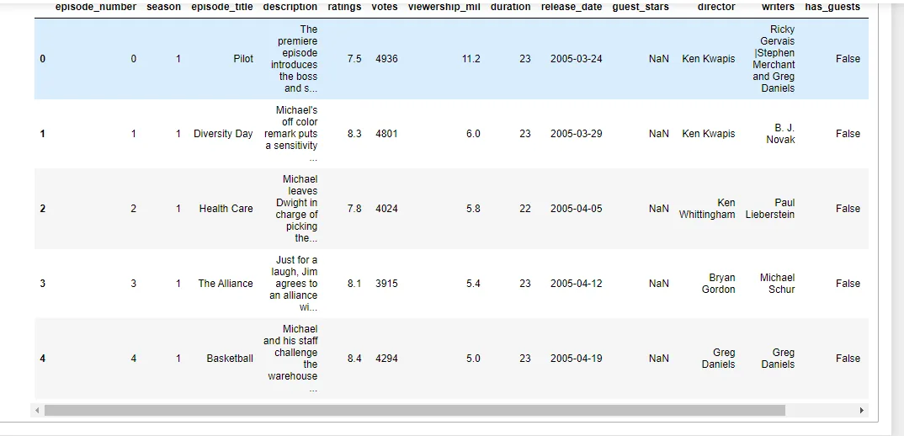

**The Office!** What started as a British mockumentary series about office culture in 2001 has since spawned ten other variants across the world, including an Israeli version (2010-13), a Hindi version (2019-), and even a French Canadian variant (2006-2007). Of all these iterations (including the original), the American series has been the longest-running, spanning 201 episodes over nine seasons.

In this notebook, we will take a look at a dataset of The Office episodes, and try to understand how the popularity and quality of the series varied over time. To do so, we will use the following dataset: datasets/office_episodes.csv, which was downloaded from Kaggle [here](https://www.kaggle.com/nehaprabhavalkar/the-office-dataset).

This dataset contains information on a variety of characteristics of each episode. In detail, these are:

**datasets/office_episodes.csv**

- **episode_number:** Canonical episode number.
- **season:** Season in which the episode appeared.
- **episode_title:** Title of the episode.
- **description:** Description of the episode.
- **ratings:** Average IMDB rating.
- **votes:** Number of votes.
- **viewership_mil:** Number of US viewers in millions.
- **duration:** Duration in number of minutes.
- **release_date:** Airdate.
- **guest_stars:** Guest stars in the episode (if any).
- **director:** Director of the episode.
- **writers:** Writers of the episode.
- **has_guests:** True/False column for whether the episode contained guest stars.
- **scaled_ratings:** The ratings scaled from 0 (worst-reviewed) to 1 (best-reviewed).

```python
# Import pandas and matplotlib.pyplot
%matplotlib inline
import pandas as pd
import matplotlib.pyplot as plt
```

```python
# Read in the csv as a DataFrameoffice_df = pd.read_csv('datasets/office_episodes.csv', parse_dates=['release_date'])
```



```python
# Initiatlize two empty lists
cols = []
sizes = []
# Iterate through the DataFrame, and assign colors based on the rating
for ind, row in office_df.iterrows():
    if row['scaled_ratings'] < 0.25:
        cols.append('red')
    elif row['scaled_ratings'] < 0.50:
        cols.append('orange')
    elif row['scaled_ratings'] < 0.75:
        cols.append('lightgreen')
    else:
        cols.append('darkgreen')
```

Here we just created colors for different portions by the instruction of Datacamp. Four categories.

- Ratings < 0.25 are colored "red"
- Ratings >= 0.25 and < 0.50 are colored "orange"
- Ratings >= 0.50 and < 0.75 are colored "lightgreen"
- Ratings >= 0.75 are colored "darkgreen"

```python
# Iterate through the DataFrame, and assign a size based on whether it has guests
for ind, row in office_df.iterrows():
    if row['has_guests'] == False:
        sizes.append(25)
    else:
        sizes.append(250)
```

From our instruction, A sizing system, such that episodes with guest appearances have a marker size of 250 and episodes without are sized 25

```python
# For ease of plotting, add our lists as columns to the DataFrameo
ffice_df['colors'] = colsoffice_df['sizes'] = sizes
```

```python
# Split data into guest and non_guest DataFrames
non_guest_df = office_df[office_df['has_guests'] == False]
guest_df = office_df[office_df['has_guests'] == True]
```

For plotting, we split the dataset into two parts. One has Guest Stars others have none.

```python
# Set the figure size and plot style        plt.rcParams['figure.figsize'] = [11, 7]
plt.style.use('fivethirtyeight')
```

Fixed the size and style of the plot.

```python
max_index = office_data['Viewership'].idxmax()
most_popular = office_data.loc[max_index]
most_popular
```

Season 5
EpisodeTitle Stress Relief
About Dwight's too-realistic fire alarm gives Stanle...
Ratings 9.7
Votes 8170
Viewership 22.91
Duration 60
Date 1 February 2009
GuestStars Cloris Leachman, Jack Black, Jessica Alba
Director Jeffrey Blitz
Writers Paul Lieberstein
Coloring darkgreen
Episodes 78
Name: 77, dtype: object

The most viewed episode title is Stress Relief. Viewed 22.91M. And the GuestStars are Cloris Leachman, Jack Black, Jessica Alba.

```python
# Create the figure
fig = plt.figure()

# Create two scatter plots with the episode number on the x axis, and the viewership on the y axis
# Create a normal scatter plot for regular episodes
plt.scatter(x=non_guest_df.episode_number,y=non_guest_df.viewership_mil, \ c=non_guest_df['colors'], s=25)

# Create a starred scatterplot for guest star episodes
plt.scatter(x=guest_df.episode_number,y=guest_df.viewership_mil, \ c=guest_df['colors'], marker='*', s=250)

# Create a title
plt.title("Popularity, Quality, and Guest Appearances on the Office", fontsize=28)

# Create an x-axis label
plt.xlabel("Episode Number", fontsize=18)

# Create a y-axis label
plt.ylabel("Viewership (Millions)", fontsize=18)

# Show the plot
plt.show()
```

Draw the plot with the title, label and axis name.


```python
# Get the most popular guest star
print(office_df[office_df['viewership_mil'] > 20]['guest_stars'])
#Output
'Cloris Leachman, Jack Black, Jessica Alba'
```

### Conclusion

In these data, we found that the most popular episode was in Season 5 (episode 78). Viewed 22.91M. The GuestStars are Cloris Leachman, Jack Black, Jessica Alba. Ratings 9.7.

[GitHub](https://github.com/abubinfahd/Data-Insight/blob/main/Projects/Investigating%20Guest%20Stars%20in%20The%20Office/Investigating%20Netflix%20Movies%20and%20Guest%20Stars%20in%20The%20Office%20Datacamp.ipynb)
