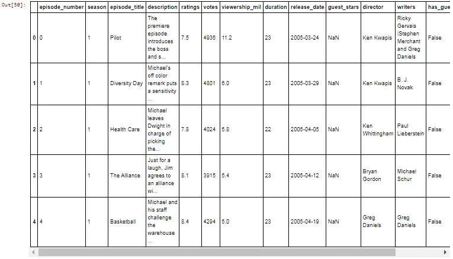
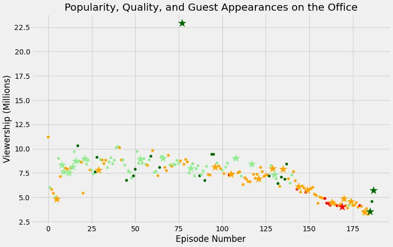

## 1. Welcome!


**The Office!** What started as a British mockumentary series about office culture in 2001 has since spawned ten other variants across the world, including an Israeli version (2010-13), a Hindi version (2019-), and even a French Canadian variant (2006-2007). Of all these iterations (including the original), the American series has been the longest-running, spanning 201 episodes over nine seasons.

In this notebook, we will take a look at a dataset of The Office episodes, and try to understand how the popularity and quality of the series varied over time. To do so, we will use the following dataset: datasets/office_episodes.csv, which was downloaded from Kaggle [here](https://www.kaggle.com/nehaprabhavalkar/the-office-dataset).

This dataset contains information on a variety of characteristics of each episode. In detail, these are:

**datasets/office_episodes.csv**

- **episode_number:** Canonical episode number.
- **season:** Season in which the episode appeared.
- **episode_title:** Title of the episode.
- **description:** Description of the episode.
- **ratings:** Average IMDB rating.
- **votes:** Number of votes.
- **viewership_mil:** Number of US viewers in millions.
- **duration:** Duration in number of minutes.
- **release_date:** Airdate.
- **guest_stars:** Guest stars in the episode (if any).
- **director:** Director of the episode.
- **writers:** Writers of the episode.
- **has_guests:** True/False column for whether the episode contained guest stars.
- **scaled_ratings:** The ratings scaled from 0 (worst-reviewed) to 1 (best-reviewed).

First we have to import the pandas and matplotlib libraries

```python
import pandas as pd
import matplotlib.pyplot as plt
plt.rcParams['figure.figsize'] = [11, 7]
```

Read the csv file as DataFrame office_df and display the first five rows.

```python
office_df = pd.read_csv('datasets/office_episodes.csv')
office_df.head()
```



For data visualisation we define colors based on the given statements to reflect the different ratings

```python
cols =[]

for i, row in office_df.iterrows():
    if row['scaled_ratings'] < 0.25:
        cols.append('red')
    elif row['scaled_ratings'] < 0.50:
        cols.append('orange')
    elif row['scaled_ratings'] < 0.75:
       cols.append('lightgreen')
    else:
        cols.append('darkgreen')
```

Sizing the guest appearance with marker size 250 and those without guest marker size as 25, as per the instruction

```python
size = []
for i, row in office_df.iterrows():
    if row['has_guests']==True:
        size.append(250)
    else:
        size.append(25)
```

We create columns for color and size also define DataFrame for with guest and without guest

```python
office_df['colors']=cols
office_df['size']=size

with_guest_df = office_df[office_df['has_guests'] == True]
no_guest_df = office_df[office_df['has_guests'] == False]
```

For data visualization

```python
fig=plt.figure()
plt.style.use('fivethirtyeight')
plot_1=plt.scatter(data=no_guest_df,x="episode_number",y="viewership_mil",c='colors',s='size')
plot_2=plt.scatter(data=with_guest_df,x="episode_number",y="viewership_mil",c='colors',s='size',marker='*')
```

We add title, xlabel and ylabel. And display the plot

```python
plt.title("Popularity, Quality, and Guest Appearances on the Office")
plt.xlabel("Episode Number")
plt.ylabel("Viewership (Millions)")
plt.show()
```



Now to get the most watched episode

```python
office_df_most_watched=office_df[office_df['viewership_mil']==office_df['viewership_mil'].max()]
```

To view the top star person

```python
# to view the top star persontop_stars=office_df_most_watched['guest_stars']top_stars

#OUTPUT
Cloris Leachman, Jack Black, Jessica Alba
Name: guest_stars, dtype: object
```
