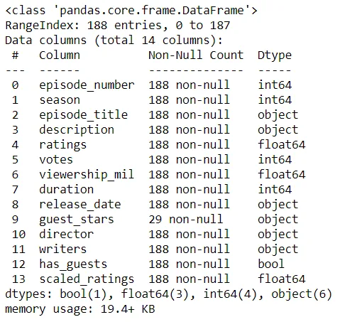
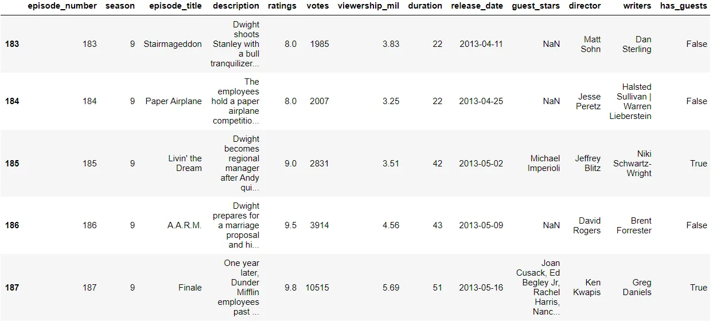
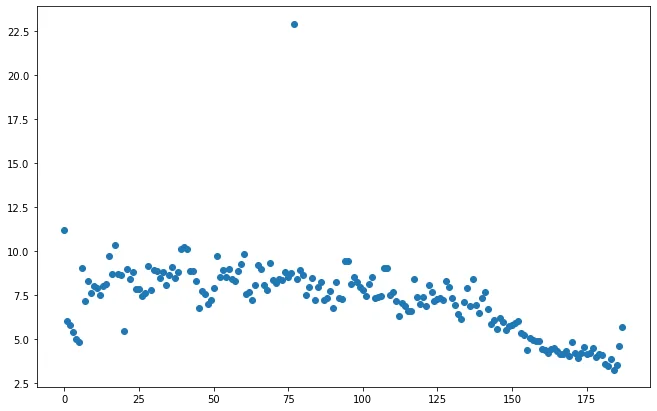
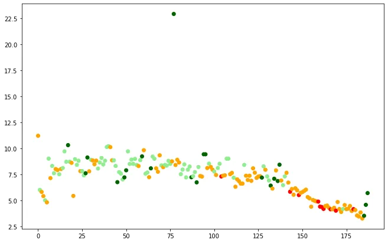
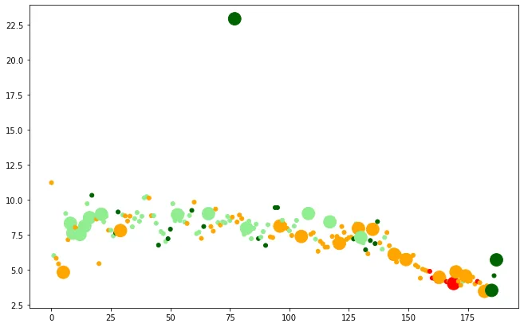
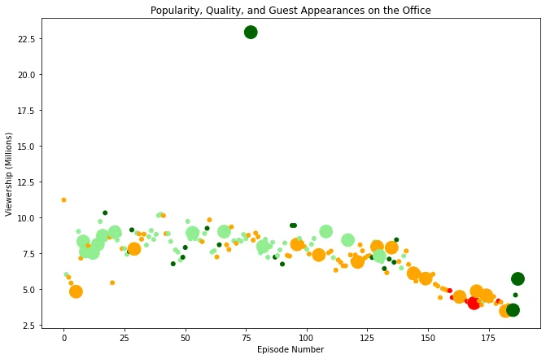
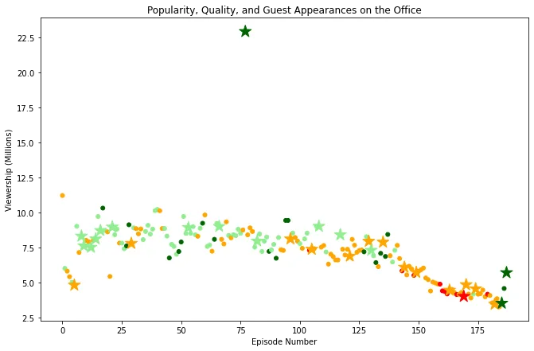

### The Office


The Office What started as a British mockumentary series about office culture in 2001 has since spawned ten other variants across the world, including an Israeli version (2010-13), a Hindi version (2019-), and even a French Canadian variant (2006-2007). Of all these iterations (including the original), the American series has been the longest-running, spanning 201 episodes over nine seasons.

In this notebook, we will take a look at a dataset of The Office episodes, and try to understand how the popularity and quality of the series varied over time. To do so, we will use the following dataset: datasets/office_episodes.csv, which was downloaded from Kaggle [here](https://www.kaggle.com/nehaprabhavalkar/the-office-dataset).

This dataset contains information on a variety of characteristics of each episode. In detail, these are:

**datasets/office_episodes.csv**

- **episode_number:** Canonical episode number.
- **season:** Season in which the episode appeared.
- **episode_title:** Title of the episode.
- **description:** Description of the episode.
- **ratings:** Average IMDB rating.
- **votes:** Number of votes.
- **viewership_mil:** Number of US viewers in millions.
- **duration:** Duration in number of minutes.
- **release_date:** Airdate.
- **guest_stars:** Guest stars in the episode (if any).
- **director:** Director of the episode.
- **writers:** Writers of the episode.
- **has_guests:** True/False column for whether the episode contained guest stars.
- **scaled_ratings:** The ratings scaled from 0 (worst-reviewed) to 1 (best-reviewed).

First, we have to import important libraries to begin processing.

```python
import pandas as pd
import matplotlib.pyplot as plt
```

In addition, we can set the figure size parameters to be able to see a larger version of our plot using this code.

```python
plt.rcParams['figure.figsize'] = [11, 7]
```

Then, we read the dataset and display some informations about it and the last five rows as example using tail function without parameters.

```python
office_df = pd.read_csv('datasets/office_episodes.csv')

office_df.info()
office_df.tail()
```





In this notebook, we will initiate this process by creating an informative plot of the episode data provided.

First, we will create a matplotlib scatter plot of the data where episode number is plotted along the x-axis and viewership(in millions) is plotted along the y-axis.

```python
plt.scatter(x=office_df['episode_number'],
            y=office_df['viewership_mil'])
```



Then, we will add a color scheme to our plot reflecting the scaled ratings of each episode, such that:

- Ratings < 0.25 are colored "red"
- Ratings >= 0.25 and < 0.50 are colored "orange"
- Ratings >= 0.50 and < 0.75 are colored "lightgreen"
- Ratings >= 0.75 are colored "darkgreen"

To do so, we need to initialize a list calles cols and fill it with colors based on the rating of each episode and add a parameter called c to our scatter function call.

```python
cols = []

for i, row in office_df.iterrows():
    if row['scaled_ratings'] < 0.25:
        cols.append('red')
    elif row['scaled_ratings'] < 0.5:
        cols.append('orange')
    elif row['scaled_ratings'] < 0.75:
        cols.append('lightgreen')
    else:
        cols.append('darkgreen')

print(cols[-1:-5:-1])
```

['darkgreen', 'darkgreen', 'darkgreen', 'orange']

```python
plt.scatter(x=office_df['episode_number'],
            y=office_df['viewership_mil'],
            c=cols)
```



To make our plot more readable we should introduce a sizing system, such that episodes with guest appearances have a marker size of 250 and episodes without are sized 25.

So we will implement a list calles sizes that contains sizes and also add the parameter s to our function.

```python
sizes = []

for i, row in office_df.iterrows():
    if row['has_guests']: sizes.append(250)
    else: sizes.append(25)

office_df['size'] = sizes

sizes[-1:-5:-1]
```

[250, 25, 250, 25]

```python
plt.scatter(x=office_df['episode_number'],
            y=office_df['viewership_mil'],
            c=cols,
            s=sizes)
```



Finally, we have to add a title reading "Popularity, Quality, and Guest Appearances on the Office", an x-axis label reading "Episode Number" and a y-axis label reading "Viewership (Millions)".

```python
plt.title("Popularity, Quality, and Guest Appearances on the Office")
plt.xlabel("Episode Number")
plt.ylabel("Viewership (Millions)")
```



### Bonus Step!

We can use different marker to visualize different data points and differentiate guest appearances not just with size, but also with a star!

```python
office_df['sizes'] = sizes
office_df['cols'] = cols
non_guest_df = office_df[office_df['has_guests'] == False]
guest_df = office_df[office_df['has_guests'] == True]

plt.scatter(x = non_guest_df['episode_number'],
            y = non_guest_df['viewership_mil'],
            c = non_guest_df['cols'],
            s = non_guest_df['sizes'])

plt.scatter(x = guest_df['episode_number'],
            y = guest_df['viewership_mil'],
            c = guest_df['cols'],
            s = guest_df['sizes'],
            marker = '*')

plt.title("Popularity, Quality, and Guest Appearances on the Office")
plt.xlabel("Episode Number")
plt.ylabel("Viewership (Millions)")
```



That's it !!

[**GitHub**](https://github.com/Jihed503/data_insight_Investigating_Guest_Stars_in_The_Office/blob/main/The_office1.ipynb)
