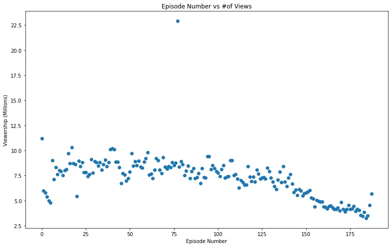
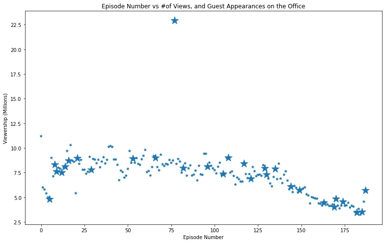
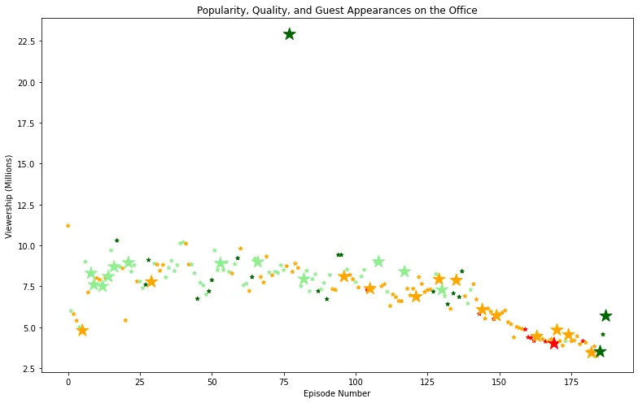

### Introduction

In this blog we try to explain how a simple data investigation task can be done on a dataset,we will try to get some hands on coding skills on how to use Python libraries - specifically Pandas and Matplotlib - to answer questions about data and try to manipulate data to find useful insights and information that we wouldn't notice without those techniques, the used dataset in this article is 'Office Series Investigation Dataset' and the part explained are part of a DataCamp project that you'll fully understand after finishing this article, though this investigation can be generalized and be used in the same manner for even bigger and more complex datasets with slightly small changes.


In the following article we will try to get some hands on data exploration with Python and you can follow up with the article as the code is here provided here;

[**Notebook:**](https://github.com/omarmohamed2011/Investigating-Guest-Stars-in-The-Office/blob/main/Notebook_Investigation.ipynb) [Investigating Netflix Movies and Guest Starts in the Office](https://github.com/omarmohamed2011/Investigating-Guest-Stars-in-The-Office/blob/main/Notebook_Investigation.ipynb)

### About Dataset

First, as intro about the dataset, it contains information on a variety of characteristics of each episode. In detail, these are the following columns and what each one contains:

- **episode_number:** Canonical episode number.
- **season:** Season in which the episode appeared.
- **episode_title:** Title of the episode.
- **description:** Description of the episode.
- **ratings:** Average IMDB rating.
- **votes:** Number of votes.
- **viewership_mil:** Number of US viewers in millions.
- **duration:** Duration in number of minutes.
- **release_date:** Airdate.
- **guest_stars:** Guest stars in the episode (if any).
- **director:** Director of the episode.
- **writers:** Writers of the episode.
- **has_guests:** True/False column for whether the episode contained guest stars.
- **scaled_ratings:** The ratings scaled from 0 (worst-reviewed) to 1 (best-reviewed).

So according to this info and columns, we can use it to answer some questions..

### Data Exploration

1) Let's first import the 'pandas' and 'matplotlib' in order to read the dataset, seek needed answers and visualize if needed..

```python
import pandas as pd
import matplotlib.pyplot as plt
```

And then easily reading the dataset here:

```python
offices_df = pd.read_csv('the_office_series.csv')
```

Now we can say that we have the dataset, we can use offices_df.head() to see the headline and the first rows. Let's get into the dataset and understand it..

2) Let's visualize the Episode Number vs Viewers in Millions in a plot which can indicate some things about our dataset:

```python
fig = plt.figure()
plt.scatter(x = offices_df.episode_number,y =  offices_df.viewership_mil)
plt.title('Episode Number vs #of Views')
plt.xlabel('Episode Number');plt.ylabel('Viewership (Millions)')
plt.rcParams['figure.figsize'] = [11, 7]
fig.show()
```

Here is the figure;



We can see that views are decreasing by the time we surpassed the hundredth episode, the views are decreasing until reaching the last episode. We also notice that some episode between 75 and 100 is the most viewed episode in the office, we can easily find out which one with a simple command;

```python
offices_df[offices_df.viewership_mil == offices_df.viewership_mil.max()].index
```

After that we know that the most viewed episode is the 77th and it's viewed by 23 Million viewers, wow !

We can easily know the guests in this episode with the following code;

```python
## Get the max viewrship episode's guest star names

offices_df[offices_df.viewership_mil== offices_df.viewership_mil.max()].guest_stars
```

and this has outputted the following names; Cloris Leachman, Jack Black, Jessica Alba, names who are popular enough to make most rated and most viewed episode in the series.

3) Let's visualize now the Episode Number vs Viewers in Millions in a plot but let's add a sizing system now, the sizing system easily draws a bigger size size for an episode with a guest appearance, we can easily detect a guest appearance by using the 'has_guests' column;

```python
 ## get guests appearance cases

size_system = []
for guest_appear in offices_df.has_guests:
    if guest_appear:
        size_system.append(250)
    else:
        size_system.append(25)
```

Now we can plot again but using the size_system list created from the code above that gives 20 times bigger marker for the episodes with a guest;

```python
fig = plt.figure()
plt.scatter(x = offices_df.episode_number,y =  offices_df.viewership_mil, s = size_system,marker='*')
plt.title('Episode Number vs #of Views, and Guest Appearances on the Office')
plt.xlabel('Episode Number');plt.ylabel('Viewership (Millions)')
plt.rcParams['figure.figsize'] = [11, 7]
fig.show()
```

We put our marker as ' \* ' to be even clearer for the eye to notice the difference between episodes with guests and without; let's see the plot:



Here we notice the dominance of the guests appearances in our dataset as every five episodes there is at least one episode with one or more than a guest appearance..

4) We can finally seek a full visualization for the data that can describe it very well, we will plot the same as before except that we will put colors to describe how well each episode is rated, red color for rates less than 0.25, orange color for rates between 0.25 and 0.5, lightgreen color for rates between 0.5 and 0.75, darkgreen color for rates more than 0.75 which are very high rates, let's code;

```python
## get rates from dataset and set color for rates seperately

color_scheme = []
for rate in offices_df.scaled_ratings:
    if rate < 0.25:
        color_scheme.append('red')
    elif rate >= 0.25 and rate < 0.5:
        color_scheme.append('orange')
    elif rate >= 0.5 and rate < 0.75:
        color_scheme.append('lightgreen')
    elif rate >= 0.75:
        color_scheme.append('darkgreen')
```

Now let's plot using the colors and try to gain some insights;

```python
fig = plt.figure()
plt.scatter(x = offices_df.episode_number,y =  offices_df.viewership_mil,c =color_scheme, s = size_system,marker='*')
plt.title('Popularity, Quality, and Guest Appearances on the Office')
plt.xlabel('Episode Number');plt.ylabel('Viewership (Millions)')
plt.rcParams['figure.figsize'] = [11, 7]
fig.show()
```

Let's see the output;



We can firstly notice that first 100 episodes are mostly colored light-greened which is a rate between 0.5 and 0.75, namely above average and sometimes there are some orange colored once which are getting less than the average rating, though rarely some are dark-greened getting high rates including the most viewed episode of course.

Secondly, taking the second hundred episodes we see that views are decreasing and this is happening simultaneously with the dominance of the orange color as most episodes are less than average here, completely logical as those under-average episodes have decreased the views, however they manged to end-up with the last episodes highly rated - darkgreen as we see in the plot.

Finally, we all know those aren't all info that can be extracted from this dataset, but those insights are good enough to help you out through exploring other columns in this dataset and can also be used in other datasets exploration.

### Acknowledgment

The dataset used for this article is downloaded from kaggle and you can find it [here](https://www.kaggle.com/nehaprabhavalkar/the-office-dataset) , and the project and the task here and everything is guidelined on DataCamp you can refer to the original project [here](https://projects.datacamp.com/projects/1170).
