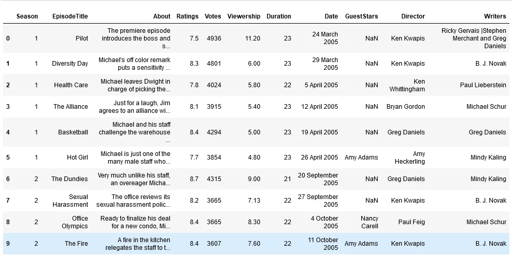
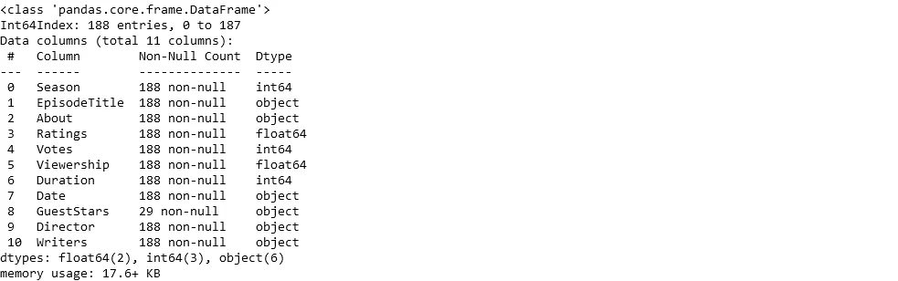
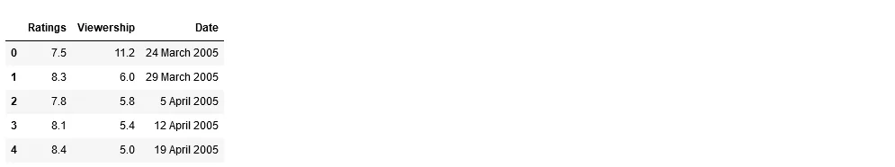
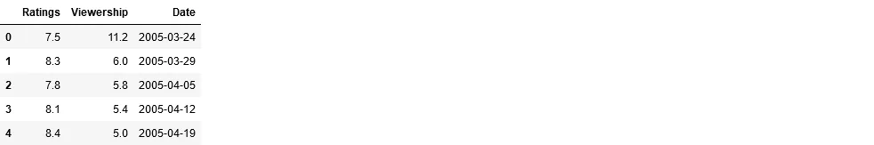
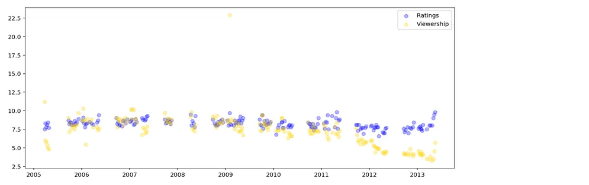
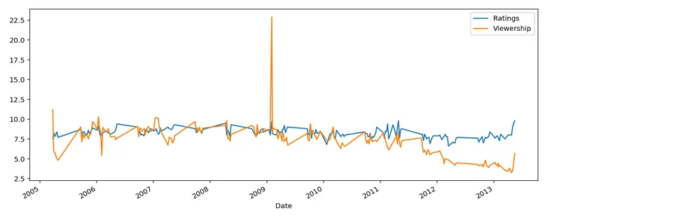

In this project, we will take a look at a dataset of The Office episodes, and try to understand how the popularity and quality of the series varied over time.

To do so, we will use the following dataset: datasets/office_episodes.csv, which was downloaded from [Here](https://www.kaggle.com/nehaprabhavalkar/the-office-dataset).

After downloading it let us open and read it using ower Jupyter Notebook.

```python
import pandas as pd
import numpy as np
import matplotlib.pyplot as plt
%matplotlib inline
%config InlineBackend.figure_format = 'retina'
pd.options.mode.chained_assignment = None  # default='warn'

df = pd.read_csv('the_office_series.csv', index_col = [0])
df.head(10)
```



Let us view its columns details.

```python
df.info()
```



Let's remove the unnecessary columns.

```python
df1 = df[['Ratings', 'Viewership', 'Date']]
df1.head()
```



Let's change the Date column type to be 'Date Time'

```python
df1['Date'] = pd.to_datetime(df1['Date'])
df1.head()
```



Let's now analys our data over time and show out the graphs.

```python
fig, ax = plt.subplots()
fig.set_figheight(5)
fig.set_figwidth(13)
ax.scatter(y= df1['Ratings'], x= df1['Date'], color = 'blue', alpha= 0.3)
ax.scatter(y= df1['Viewership'], x= df1['Date'], color = 'gold', alpha = 0.3)
ax.legend(['Ratings', 'Viewership'])
plt.show()
```



```python
df1.plot(y= ['Ratings','Viewership'], x= 'Date', figsize = (13, 5))
```



We can conclude that, the `**Quality**` of the series according to the `**Ratings**` of the viewers has not been affected by time. On the other hand we have seen that, the `**Popularity**` had an obvious declination in the last two years according to the `**Viewership**` values.
