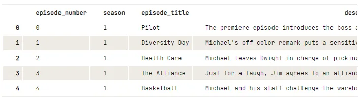
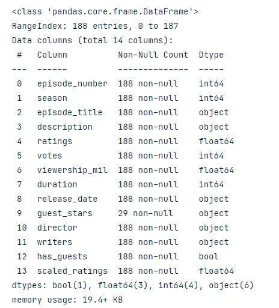
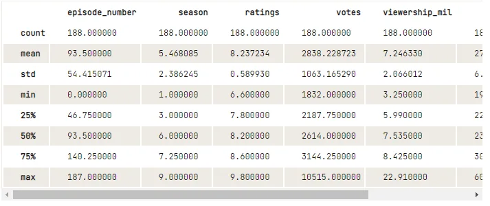
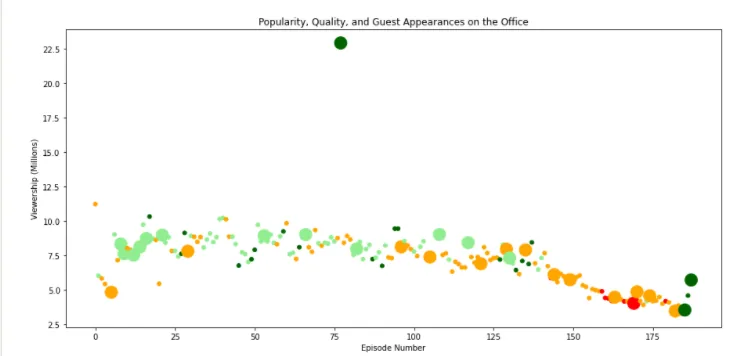
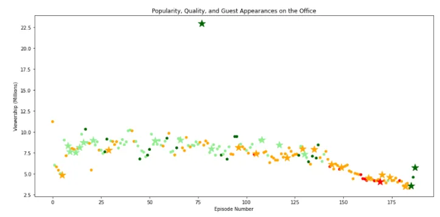
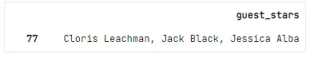

## Welcome


**The Office!** What started as a British mockumentary series about office culture in 2001 has since spawned ten other variants across the world, including an Israeli version (2010-13), a Hindi version (2019-), and even a French Canadian variant (2006-2007). Of all these iterations (including the original), the American series has been the longest-running, spanning 201 episodes over nine seasons.

In this notebook, we will take a look at a dataset of The Office episodes, and try to understand how the popularity and quality of the series varied over time. To do so, we will use the following dataset: datasets/office_episodes.csv, which was downloaded from Kaggle [here](https://www.kaggle.com/nehaprabhavalkar/the-office-dataset).

This dataset contains information on a variety of characteristics of each episode. In detail, these are:

```python
datasets/office_episodes.csv
episode_number: Canonical episode number.
season: Season in which the episode appeared.
episode_title: Title of the episode.
description: Description of the episode.
ratings: Average IMDB rating.
votes: Number of votes.
viewership_mil: Number of US viewers in millions.
duration: Duration in the number of minutes.
release_date: Airdate.
guest_stars: Guest stars in the episode (if any).
director: Director of the episode.
writers: Writers of the episode.
has_guests: True/False column for whether the episode contained guest stars.
scaled_ratings: The ratings scaled from 0 (worst-reviewed) to 1 (best-reviewed)
```

## Instructions

Data visualization is often a great way to start exploring your data and uncovering insights. In this notebook, you will initiate this process by creating an informative plot of the episode data provided to you. In doing so, you're going to work on several different variables, including the episode number, the viewership, the fan rating, and guest appearances. Here are the requirements needed to pass this project:

1. Create a matplotlib **scatter plot** of the data that contains the following attributes:

   - Each episode's **episode number plotted along the x-axis**
   - Each episode's **viewership (in millions) plotted along the y-axis**
   - A **color scheme** reflecting the **scaled ratings** (not the regular ratings) of each episode, such that:

     - Ratings < 0.25 are colored "red"
     - Ratings >= 0.25 and < 0.50 are colored "orange"
     - Ratings >= 0.50 and < 0.75 are colored "lightgreen"
     - Ratings >= 0.75 are colored "darkgreen"

- A **sizing system**, such that episodes with guest appearances have a marker size of 250 and episodes without are sized 25
- A **title**, reading "Popularity, Quality, and Guest Appearances on the Office"
- An **x-axis label** reading "Episode Number"
- A **y-axis label** reading "Viewership (Millions)"

1. Provide the name of one of the guest stars (hint, there were multiple!) who was in the most watched Office episode. Save it as a string in the variable top_star (e.g. top_star = "Will Ferrell").

## **Important**!

To test your matplotlib plot, you will need to initialize a matplotlib.pyplot fig object, which you can do using the code fig = plt.figure() (provided you have imported matplotlib.pyplot as plt). In addition, in order to test it correctly, **please make sure to specify your plot (including the type, data, labels, etc) in the same cell as the one you initialize your figure** (fig)! *You are still free to use other cells to load data, experiment, and answer Question 2.*
*In addition, if you want to be able to see a larger version of your plot, you can set the figure size parameters using this code (provided again you have imported matplotlib.pyplot as plt):*
plt.rcParams['figure.figsize'] = [11, 7]
Bonus Step!
Although it was not taught in Intermediate Python, a useful skill for visualizing different data points is to use a different marker. You can learn more about them via the [Matplotlib documentation](https://matplotlib.org/api/markers_api.html) or via our course [Introduction to Data Visualization with Matplotlib](https://learn.datacamp.com/courses/introduction-to-data-visualization-with-matplotlib). Thus, as a bonus step, try to differentiate guest appearances not just with size, but also with a star!
All other attributes still apply (data on the axes, color scheme, sizes for guest appearances, title, and axis labels).

##### Let's Start Coding!!
**Import necessary libraries**

```python
import matplotlib.pyplot as plt
import pandas as pd

#To see the large view of the data
plt.rcParams['figure.figsize'] = [15, 7
```

Read the dataset from Kaggle and print the first 5 rows.

```python
#read datset using pandas
data = pd.read_csv('datasets/office_episodes.csv')

#print first 5 rows of the dataset
data.head()
```

Output



Check the dataset, if it properly imported and its column

```python
#check the dataset
data.info()
```

Output



Get an overall idea of the dataset

```python
#describe the dataset for more clear view
data.describe()
```



Checking for the availability of guest stars

```python
# Checking for the presence of guest stars
size=[]for rows in data['has_guests']:if rows == False:
        size.append(25)else:
        size.append(250)
# Check first 10 values in the list
size[:10]
```

Output

```python
[25, 25, 25, 25, 25, 250, 25, 25, 250, 250]
```

Plot the scatter plot by checking two important conditions based on the availability of guest stars.

```python
#Only guest star apperances and non-guest star apperances with_guest = data[data['has_guests'] == True]
without_guest = data[data['has_guests'] == False]
#Plotting number of viwers in million per eposide number
fig = plt.figure()

# Create a scatter plot
plt.scatter(x=data['episode_number'],                              y=data['viewership_mil'],
c= cols,
s= size)
# Create a title

plt.title("Popularity, Quality, and Guest Appearances on the Office")

# Create an x-axis and an y-axis

plt.xlabel("Episode Number")
plt.ylabel("Viewership (Millions)")
# Show the plot
plt.show()
```



Let's use the marker as instructed to check non-guest starring episodes.

```python
# Plotting non-guest starring episodes data
fig = plt.figure()
plt.scatter(x=without_guest['episode_number'],
             y=without_guest['viewership_mil'],
             c= without_guest['colors'],
             s= without_guest['size'])
# Plotting guest starring episodes data
plt.scatter(x= with_guest['episode_number'],
            y= with_guest['viewership_mil'],
            c=  with_guest['colors'],
            s= with_guest['size'],
            marker = '*')
# Create a title
plt.title("Popularity, Quality, and Guest Appearances on the Office")
# Create an x-axis and an y-axis
plt.xlabel("Episode Number")
plt.ylabel("Viewership (Millions)")

# Show the plot
plt.show()
```



We are almost done with all the instructions. Let's check the last instruction to see the top star

```python
# The Maximum view
max_view = max(data["viewership_mil"])

# Filter the Dataframe row that has the most watched episode
most_watched_ep = data.loc[data["viewership_mil"] == max_view]

# Top guest stars that were in that
top_star = most_watched_ep[["guest_stars"]]

#print top stars
top_star
```



WOW!!!! Well done! Now that, we have the result we can write the name of the top star.

You can find the full project [here](https://app.datacamp.com/workspace/w/e2c5865f-d010-40fe-943c-2788d62d5473).

## Acknowledgment
This project is a part of Data Insight's Data Science Program 2021. This is an unguided project from DataCamp.
