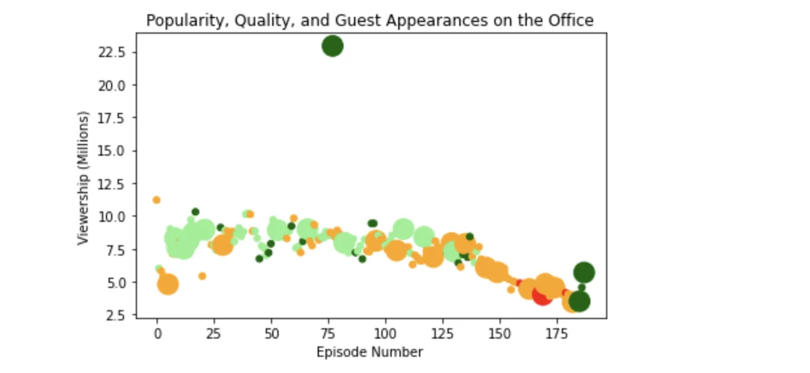

The Office is an American mocumentary sitcom television series that depicts everyday work lives of office employees in the Scranton. It originally released on 24 March 2005 and ran till May 16,2013.The Office is one of the greatest tv shows of all time and is in the list of top 100 of all time.
In this project, we will take a look at a dataset of The Office episodes, and try to understand how the popularity and quality of the series varied over time. To do so, we will use the following dataset: "datasets/office_episodes.csv", which was downloaded from [Kaggle](https://www.kaggle.com/nehaprabhavalkar/the-office-dataset).

The dataset contains information which can be seen in the notebook and distinguished over many fields for example votes, season, writers etc.

Our objective is the investigate the popularity of guest stars present in this show. In order to that ,we need to co-relate the data of viewership present over the number of episodes , and guest stars appeared over a period of time.

Let's start, first things first import pandas and read the dataset.

```python
import pandas as pd
import matplotlib.pyplot as plt
fig=plt.figure()
df = pd.read_csv('datasets/office_episodes.csv')
```

Now create a matplotlib create a scatter plot such that ratings of each episode is scaled and check for the size markers such as 250.Take x axis as "Episode Number" and y axis as "Viewership (Millions)" and make the same as labels as well.

```python
for i in range(len(df)):
    if df.loc[i,'scaled_ratings']<0.25:
        COLORS.append('red')
    if(df.loc[i,'scaled_ratings']>=0.25) and (df.loc[i,'scaled_ratings']<0.5) :
        COLORS.append('orange')
    if(df.loc[i,'scaled_ratings']>=0.5) and (df.loc[i,'scaled_ratings']<0.75) :
        COLORS.append('lightgreen')
    if df.loc[i,'scaled_ratings']>=0.75:
        COLORS.append('darkgreen')

    if df.loc[i,'has_guests']:
        SIZE.append(250)
    else:
        SIZE.append(25)
           plt.scatter(df['episode_number'],df['viewership_mil'] , c=COLORS,s=SIZE)
plt.title("Popularity, Quality, and Guest Appearances on the Office")
plt.xlabel("Episode Number")
plt.ylabel("Viewership (Millions)")
plt.show()
```



As you can clearly see the dark green are the ones where the stars appeared and very highly rated as per our instruction provided to solve the problem and the datasets were given.
Now all we have to do is extract those details and work along the lines of these details.To do so we need to create a data frame and save the result in top_star and print the result for the same.

```python
df_views=df_views.reset_index()

top_star=df_views.loc[0,'guest_stars'].split(',')[0]
print(top_star)
```

The result will be produced "Cloris Leachman". For more details check the python notebook click the picture.


