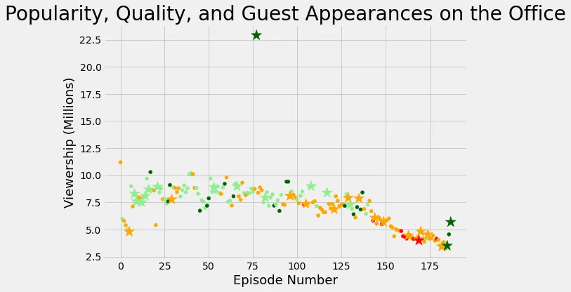

**The Office!** What started as a British mockumentary series about office culture in 2001 has since spawned ten other variants across the world, including an Israeli version (2010-13), a Hindi version (2019-), and even a French Canadian variant (2006-2007). Of all these iterations (including the original), the American series has been the longest-running, spanning 201 episodes over nine seasons.

In this notebook, we will take a look at a dataset of The Office episodes, and try to understand how the popularity and quality of the series varied over time. To do so, we will use the following dataset: datasets/office_episodes.csv, which was downloaded from Kaggle [here](https://www.kaggle.com/nehaprabhavalkar/the-office-dataset).

With the dataset provided, we will use it to investigate star guest appearances in each episode of The Office.

Since we are going to be working with a dataset, we will first import the 'pandas' library in python and save it under an alias 'pd'. This will help us convert the dataset in any form to a python DataFrame. And also, we will import a submodule 'pyplot' from the 'matplotlib' library for visualization purposes. Save it under the alias 'plt', which will help with easy referencing.

```python
import pandas as pd
import matplotlib.pyplot as plt
```

We convert The Office dataset which is a CSV file to a python DataFrame.

```python
office_df = pd.read_csv("the_office_series.csv", parse_dates=['Date'])
```

After converting the CSV file to a DataFrame we can now work with it in python. We create two empty lists. Values are going to be added to each of these lists after decisions have been made.

```python
color = []
sizes = []
```

Finding out the episode with the highest ratings and viewership will help us find which star guest appeared in an episode. Loops will be created to run till the end of the dataset. Inside these loops, decisions will be made to help us differentiate the visualization of the DataFrame.

To do this we will include sizes and name values that fall under certain categories and add these value names and sizes to the empty sets.

```python
#loop to add values to the list, color.
for ind, row in office_df.iterrows():
    if row['Ratings'] < 0.25:
        color.append('red')
    elif row['Ratings'] < 0.50:
        color.append('orange')
    elif row['Ratings'] < 0.75:
        color.append('lightgreen')
    else:
        color.append('darkgreen')

#loop to add values to the list, sizes.
for ind, row in office_df.iterrows():
    if row['has_guests'] == False:
        sizes.append(25)
    else:
        sizes.append(250)
```

We will create two new columns in The Office DataFrame. We will put the values that were added in the two empty lists under the columns they belong to.

```python
office_df['colors'] = color
office_df['sizes'] = sizes
```

Now, we will move on to find which episode had a guest star(s). We will filter the column 'has_guests

```python
non_guest_df = office_df[office_df['has_guests'] == False]
guest_df = office_df[office_df['has_guests'] == True]
```

After finding all this information, we can now go ahead and plot the graph.

Choose the kind of style you want to use and the plot size.

```python
plt.rcParams['figure.figsize'] = [11, 7]
plt.style.use('fivethirtyeight')
```

We will create two scatter plots for the regular episodes and the episodes with stars. Each of these plots will have 'episode_number' on the x-axis and 'viewership_mil' on the y-axis.

```python
plt.scatter(x=non_guest_df.episode_number, y=non_guest_df.viewership_mil,
                 c=non_guest_df['colors'], s=25)

plt.scatter(x=guest_df.episode_number, y=guest_df.viewership_mil,
                 c=guest_df['colors'], marker='*', s=250)
```

After differentiating which values are plotted on the x-axis and y-axis, we will name all the necessary parts of our graph.

```python
plt.title("Popularity, Quality, and Guest Appearances on the Office", fontsize=28)

plt.xlabel("Episode Number", fontsize=18)

plt.ylabel("Viewership (Millions)", fontsize=18)
```



To get the guest star, we will filter the 'viewership_mil' column of the dataset for views greater than twenty million.

```python
print(office_df[office_df['viewership_mil'] > 20]['guest_stars'])
```

From this analysis, we now know that the star guests are:

**Cloris Leachman, Jack Black**, and **Jessica Alba**.
