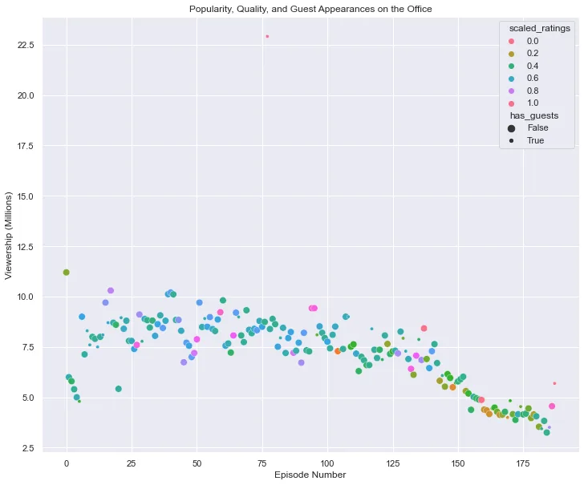
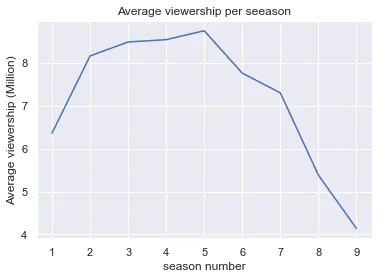
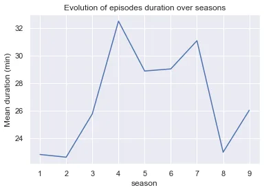
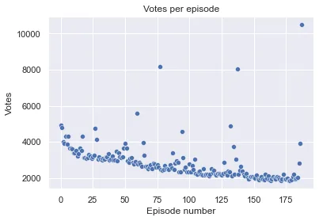
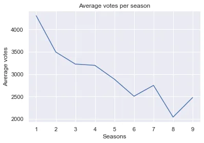
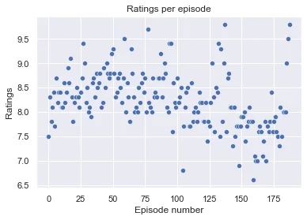
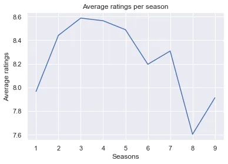

This is an extension of the [Datacamp](https://app.datacamp.com/) project originally entitled **Investigating Netflix Movies and Guest Stars in The Office**.

**The Office**, an American popular mockumentary sitcom, is a tv series that describes the daily life of office employees of the fictional Dunder Mifflin Paper Company, in its Scranton branch, Pennsylvania. It spread over 201 episodes divided into nine seasons.

In this post, we will take a look at the dataset of The Office episodes, and try to understand how the popularity of the series evolved over time. To do so, we will use the dataset **office_episodes**, the Datacamp's preprocessed version of **office_series**, from [kaggle](https://www.kaggle.com/nehaprabhavalkar/the-office-dataset).

## 1. Description of the dataset

The dataset contains 14 columns as follows:

- **episode_number:** Canonical episode number.
- **season:** Season in which the episode appeared
- **episode_title:** Title of the episode.
- **description:** Description of the episode.
- **ratings:** Average IMDB rating.
- **votes:** Number of votes.
- **viewership_mil:** Number of US viewers in millions.
- **duration:** Duration in number of minutes.
- **release_date:** Airdate.
- **guest_stars:** Guest stars in the episode (if any).
- **director:** Director of the episode.
- **writers:** Writers of the episode
- **has_guests:** True/False column for whether the episode contained guest stars.
- **scaled_ratings:** The ratings scaled from 0 (worst-reviewed) to 1 (best-reviewed).

## 2. Data loading and simple analysis
we store the data in a pandas dataframe, **df**.

```python
import matplotlib.pyplot as plt
import pandas as pd
import numpy as np
import seaborn as sns
# Use seaborn default parameters
sns.set()

df = pd.read_csv('datasets/office_episodes.csv', parse_dates = ['release_date'])
df.shape
```

```python
#output
(188, 14)
```

We can see that only 188 episodes out of 201 are recorded in our dataset.

```python
# Check for missing values
df.isna().sum()
```

```python
episode_number      0
season              0
episode_title       0
description         0
ratings             0
votes               0
viewership_mil      0
duration            0
release_date        0
guest_stars       159
director            0
writers             0
has_guests          0
scaled_ratings      0
dtype: int64
```

The only column with missing data is **guest-stars**, that is normal because not all episodes have guests. For the sake of confirmation, let's check if this result is in concordance with the **has_guests** column.

```python
with_guests = df[df['has_guests']]
without_guests = df[~df['has_guests']]
print(with_guests.has_guests.mean())
print(without_guests.has_guests.mean())
```

```python
1.0
0.0
```

***Note:****In python, the mean of a Boolean series is the ratio of* ***True*** *values, that is a mean of 1.0 means all values are true and 0.0 means all values are false.*

The result shows that the episodes with guests stars all have **True** as the value of **has_guests** and all the episodes without guests have **False**, what we wanted to confirm.

## 3. Data visualization

The viewership of the series is the first metric of its popularity, so we will first visualize the viewership, against episode numbers. Moreover, the scatter plot is the first type of plot used when looking for relationships in the data. Seaborn offers the possibility to set the colors of the plot according to a column in the dataset(**scaled_ratings** in this case) through the parameter **hue**. The size of each dot is related to whether or not the corresponding episode has guests.

```python
# define the figure
fig = plt.figure(figsize=(12,10))

# Create the scatter plot
sns.scatterplot(x = 'episode_number', y = 'viewership_mil', hue='scaled_ratings',
size='has_guests', data=df, palette='husl')
plt.title('Popularity, Quality, and Guest Appearances on the Office')
plt.xlabel('Episode Number')
plt.ylabel('Viewership (Millions)')
plt.show()
```



This plot shows a drop in viewership across episodes over time. Plotting the average viewership per season will make this clearer.

```python
seasons = df.groupby('season')
seasons.viewership_mil.mean().plot()
plt.xlabel('season number')
plt.ylabel('Average viewership (Million)')
plt.title('Average viewership per seeason')
plt.show()
```



The plot tells us that the popularity of 'The Office' has increased until season 5 after what it decreased steadily. This suggests that the quality of the series has significantly dropped. We might think that the fans have got tired and disgusted by the series because of its length, or the duration of the episodes became too high. The plot of the average episodes duration per season will tells us more.

```python
seasons.duration.mean().plot()
plt.ylabel('Mean duration (min)')
plt.title('Evolution of episodes duration over seasons')
plt.show()
```



The shape of this curve denies the hypothesis of drop in viewership because of the increasing length of the episodes over time. We can see that the mean duration of episodes globally decreased from season 5.

Now let's visualize the evolution of votes across episodes.

```python
sns.scatterplot(x='episode_number', y='votes', data=df)
plt.xlabel('Episode number')
plt.ylabel('Votes')
plt.title('Votes per episode')
plt.show()
```



Along with the viewership, the votes has decreased over time but unlike the viewership, the decay was steady from the beginning till the end, with few spikes corresponding to most appreciated episodes.

A plot of the average votes per season will tell us more.

```python
seasons.votes.mean().plot()
plt.xlabel('Seasons')
plt.ylabel('Average votes')
plt.title('Average votes per season')
plt.show()
```



Along with the scatter plot, this plot supports the idea of a steady decay in votes over seasons.

The last indicator of popularity we will investigate is the **ratings.**

```python
sns.scatterplot(x='episode_number', y='ratings', data=df)
plt.xlabel('Episode number')
plt.ylabel('Ratings')
plt.title('Ratings per episode')
plt.show()
```



This plot barely reminds us the plot of viewership against episode number. A plot of its average per season will tell us if both metrics describe the same behavior of the series popularity.

```python
seasons.ratings.mean().plot()
plt.xlabel('Seasons')
plt.ylabel('Average ratings')
plt.title('Average ratings per season')
plt.show()
```



Definitely, the plots of **viewership**  and  **ratings**  tell the identical history about the popularity of **The office**. It increased from season 1 to 5 and decreased for the last 4 seasons.

## Conclusion

The dataset of the major part of **The office** series has shown us that this mockumentary has been a great success for the its five first seasons, with the peak of **22.91 millions** views of episode 77, season 5, released on February 1st, 2009. The managers of the series would have better stopped at season 6 or 7 before the popularity drops critically, below its initial value.

The notebook of this post can be found [here](https://github.com/tem-ctrl/the_office_popularity).
