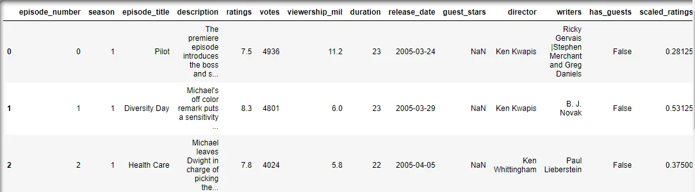
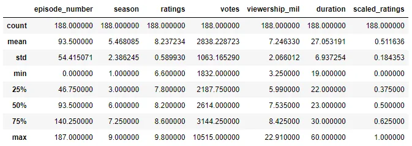
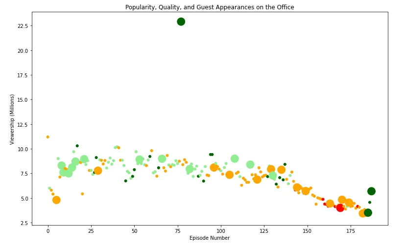
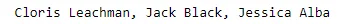

The Office mockumentary series gains popularity on Netflix subscribers. It shows the office culture and experiences on the day-to-day lives of workers in the offices. This blog interprets the popularity and the quality of the series as the episodes increment. The dataset used in this analysis is acquired from Kaggle, i.e., [The Office Dataset](https://www.kaggle.com/nehaprabhavalkar/the-office-dataset).

In this blog, we follow the instructions on the project in DataCamp entitled Project: Investigating Netflix Movies and Guest Stars in The Office.

1. Create a matplotlib scatter plot of the data that contains the following attributes:

- Each episode's episode number plotted along the x-axis
- Each episode's viewership (in millions) plotted along the y-axis
- A color scheme reflecting the scaled ratings (not the regular ratings) of each episode, such that:

  - Ratings < 0.25 are colored "red"
  - Ratings >= 0.25 and < 0.50 are colored "orange"
  - Ratings >= 0.50 and < 0.75 are colored "lightgreen"
  - Ratings >= 0.75 are colored "darkgreen"
- A sizing system, such that episodes with guest appearances have a marker size of 250 and episodes without are sized 25
- A title, "Popularity, Quality, and Guest Appearances on the Office"
- An x-axis label reading "Episode Number"
- A y-axis label reading "Viewership (Millions)"

2. Provide the name of one of the guest stars (hint, there were multiple!) who was in the most watched Office episode. Save it as a string in the variable top_star (e.g. top_star = "Will Ferrell").

To begin, we need to import the packages and the dataset to be used for interpretation.

```python
import matplotlib.pyplot as plt
import pandas as pd

data = pd.read_csv('datasets/office_episodes.csv')
```

Now, let's take a look at the first few rows of the dataset.

```python
data.head()
```



Let's check some information on the summary statistics of the dataset.

```python
data.describe()
```



Now, we create an empty list to classify the scaled ratings of each episode by color.

```python
colors=[]
```

Then, we generate for loop to loop over all the attributes in the scaled rating column and append it to the list.

```python
for lab, row in data.iterrows():
    if row['scaled_ratings'] < 0.25:
        colors.append('red')
    elif row['scaled_ratings'] < 0.50:
        colors.append('orange')
    elif row['scaled_ratings'] < 0.75:
        colors.append('lightgreen')
    else:
        colors.append('darkgreen')
```

Similarly, we create an empty list for size and generate a for loop that loops over the column that classifies whether there is a guest or no guest.

```python
sizes = []

for lab, row in data.iterrows():
    if row['has_guests'] == True:
        sizes.append(250)
    else:
        sizes.append(25)
```

Now, we create the scatter plot wherein the episode number is plotted on the x-axis and the viewership (in million) on the y-axis. Let us also add titles and labels for a meaningful visualization.

```python
fig = plt.figure()
plt.scatter(x=data['episode_number'],y=data['viewership_mil'],c=colors,s=sizes)

#Labels
plt.title("Popularity, Quality, and Guest Appearances on the Office")
plt.xlabel("Episode Number")
plt.ylabel("Viewership (Millions)")
plt.show()
```



As we can see, the plot illustrates that the viewership decreases as the number of episodes increases. It is decreasing even there are guest appearances or not. The ratings in the first hundred episodes are mostly in the range of 50%-75% scaled ratings, but most are those without guest appearances. The ratings are also decreasing to 25%-50% as the number of episodes increases. The lowest ratings, below 25% are in compact in about 170th episode. Most of the good ratings, more than 75%, are those episodes with guest appearances. The latest episodes show good ratings which imply there are guest appearances. The result also shows an outlier in about the 75th episode with a guest appearance that garnered a very high rating than usual.

Next, we determine the most popular guest star in The Office.

```python
print(data[data['viewership_mil'] > 20]['guest_stars'])
```



Thus, the most popular guest stars are Cloris Leachman, Jack Black, Jessica Alba.

To see my notebook on this analysis, click [here](https://github.com/aldwindavee/Data-Insight-Data-Scientist-Program/blob/main/Investigating_the_Popularity_of_The%20Office_%20A_Netflix_Series.ipynb).
