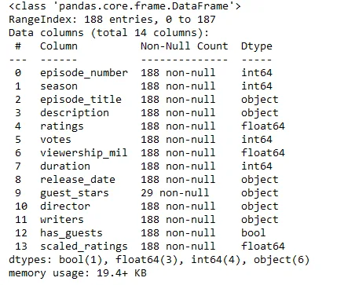
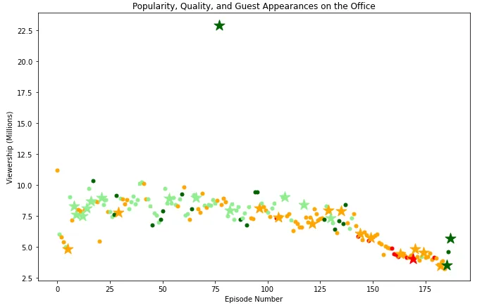

Table of Contents

1. Introduction
2. Import Relevant Packages
3. Load Dataset
4. Create Scatter Plot
5. Star in Most Watched Episode
6. Complete Code Notebook

## 1. Introduction

First aired in 2001, the Office is a popular British TV series which depicts the work lives of employees in an office of a paper manufacturing company.

The series ran for 9 seasons with a total of 201 episodes. In this post, we will analyze the popularity of each of the episodes by considering the following:

1. Viewership. The number of US viewers in millions
2. Rating of the Episodes. We consider a scaled rating from 0 being the worst to 1 being the best.
3. Star Features. We look at which of the episodes featured stars and which ones did not.

The analysis is accomplished using a scatterplot which incorporates the above three aspects. This is done using python programming.

## 2. Import Relevant Packages

The analysis uses pandas for importing data into a dataframe as well as for manipulating the data. We use matplotlib.pyplot for plotting

## 3. Load the Dataset

The dataset used contains information about each of the episodes. The data is downloaded from Kaggle [here](https://www.kaggle.com/datasets/nehaprabhavalkar/the-office-dataset).

The dataset has a total of 14 features (columns) and 188 observations (rows). The following shows the output for the info of the loaded dataset:

## 4. Create Scatterplot

We create a scatterplot of viewership in millions against the episode number from the first to the last. The scatterplot should provide an indication of the rating of the episode as well as whether the episode featured stars or not. To accomplish these, we first define these plot components to be used in the scatter plot.

### 4.1 Define the Plot Components

#### 4.1.1 Define x and y axes

We first define the x and the y variables to be used in the plot. The x-axis will have the episode number and the y-axis will plot the viewership in millions. We do this by sub setting these columns from the dataset.

#### 4.1.2 Define Color Scheme

Next we define the color scheme for the markers to represent the rating of the episode as follows:

- Rating below 0.25 - red
- Rating between [0.25, 0.5) - orange
- Rating between [0.5, 0.75) - lightgreen
- Rating equal or above 0.75 - darkgreen

This is accomplished by looping through the column for ratings and assigning a corresponding color for each rating. The result is a list of colors that represents each of the rating:

#### 4.1.3 Define Marker Size and Type

The markers should be represented with a bigger size and a star for episodes which had stars in them. The episodes with stars will have a marker with size of 250 whilst those without stars will have a marker of 25. This is accomplished by looping through the 'has_guests' column and assigning the size and type of marker according to whether the episode featured stars or not.

### 4.2 Plot Scatter Plot

In order to plot with the specified components, we loop through the defined lists for the x-axis, y-axis, markers, sizes and colors and for each plot the points on the scatterplot with each of the defined parameters. This plots a scatterplot with size and shape of the marker indicating the feature of stars and the color indicating the rating of an episode.

The following is the output scatter plot:

Majority of the episodes had viewership ranging between 7.5 million and 10 million. One episode had unusually high viewership of above 22.5 million. We note that towards the end beyond the 125th episode the viewership started declining together with the rating. The last three episodes, two of which had stars, had improved ratings.

## 5. Star in Most Watched Episode

We explore and see one of the stars that featured in the episode with the highest viewership.

We start by first getting the maximum viewership and then sub-seting the 'gust_stars' column where the viewrship is equal to maximum. This will give us a string of the stars that featured in that episode.

We then split the string by the comma in order to get a list of stars that featured in the episode with the most views.

To get the name of one of the stars that featured in the most watched episode, we index the list of the top stars by index 0:

## 6. Complete Code Notebook

The notebook for the complete code can be found from the following github [link](https://github.com/Musonda2day/Investigating-the-popularity-of-The-Office-TV-show).
