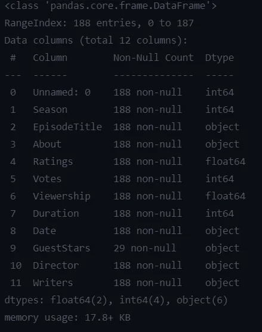
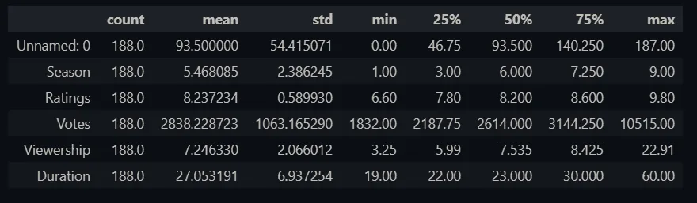
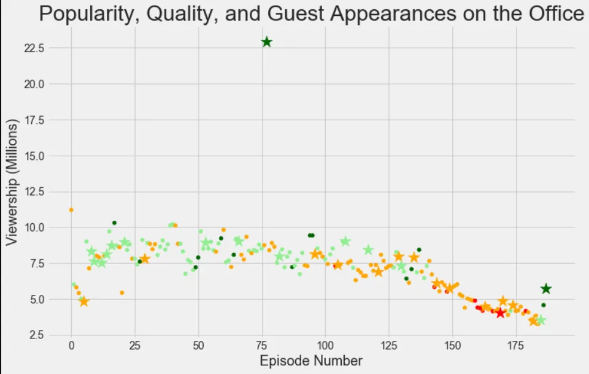
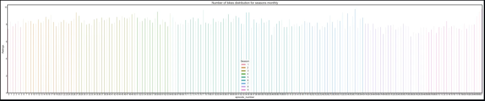
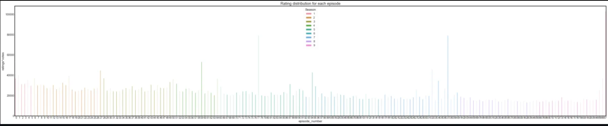
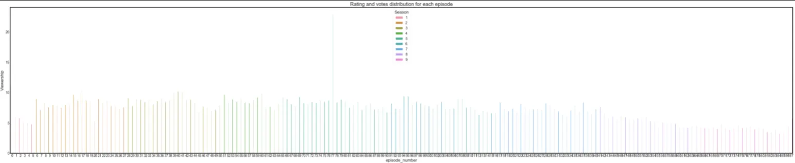

**"The Office"** is a British mockumentary sitcom series about an office. The series starts to telecast mid-2005 and become the longest-running, spanning 201 episodes over nine seasons ended in 2013. The Series was directed by various directors and also written by a number of writers too. The series is rated whopping 8.9 rating in the IMDB index and 89% in rotten tomatoes.

The data set was downloaded from Kaggle [here](https://www.kaggle.com/nehaprabhavalkar/the-office-dataset).

and today we are going to investigate what may be the reason behind the success of the drama series 'The office'

The data set obtained have the following data,

- **Unnamed:0 :** Canonical episode number.
- **season:** Season in which the episode appeared.
- **episode_title:** Title of the episode.
- **about:** Description of the episode.
- **ratings:** Average IMDB rating.
- **votes:** Number of votes.
- **viewership:** Number of US viewers in millions.
- **duration:** Duration in the number of minutes.
- **Date:** Airdate.
- **guest_stars:** Guest stars in the episode (if any).
- **director:** Director of the episode.
- **writers:** Writers of the episode

There were total of 188 instances corresponding to 1 entry per episode.

Importing required libraries

Let's import the required libraries for our analysis.

%matplotlib inline
import pandas as pd
import matplotlib.pyplot as plt
import seaborn as sns
sns.set_style('whitegrid')

Import the Dataset

*# Read in the csv as a DataFrame*
office_df = pd.read_csv('the_office_series.csv')

Preprocessing

Let's get a rough idea about our data set first.

office_df.info()

Output:

We have a total of 188 entries. categorized into 12 attributes. these attributes have float64, int64, and object data types.

mmm, seems we have some Null values in Guest stars. it shows only 29 are not null out of 188 instances. This means we have to deal with this in this preprocessing stage.

but before that let's dig deep into our data,

office_df.describe().transpose()

Output:

Here we can see that we have a mean rating of 8.237 which is very good. but this mean gives considering the mean value of all the episodes. there is no any number of views involved. so not that much useful in analyzing viewership.

Before analyzing Viewership, let's do something to guest stars.

*[#since](https://www.datainsightonline.com/blog/hashtags/since) we have guest stars null values*
guest=office_df.GuestStars.isnull()
has_guest=[False if i else True for i in guest]

office_df['has_guests']=has_guest
office_df

here what I did was create a new column considering the fact that whether there's a guest star or not. If there is a guest star we store boolean true if not we store False. This way it would be better for our analysis.

Then let's change 'Date' column to 'datatime64' much better that way.

office_df.Date = pd.to_datetime(office_df.Date)

And also let's rename 'Unnamed:0' column to episode number. it will be very informative and user-friendly that way.

office_df=office_df.rename(columns = {'Unnamed: 0': 'episode_number'})

now our preprocessing is over. Let's move on to visualizing.

Visualizing

Here what we are going to do is create two dataframes according to the fact that the episodes have guest appearance and not. now we are going to create two scatter plots with the episode number in the x-axis and the viewership in y-axis.

*# Split data into guest and non_guest DataFrames*
non_guest_df = office_df[office_df['has_guests'] == False]
guest_df = office_df[office_df['has_guests'] == True]

*# Set the figure size and plot style*
plt.rcParams['figure.figsize'] = [11, 7]
plt.style.use('fivethirtyeight')

*# Create the figure*
fig = plt.figure()

*# Create two scatter plots with the episode number on the x axis, and the viewership on the y axis*

*# Create a normal scatter plot for regular episodes*
plt.scatter(x=non_guest_df.episode_number, y=non_guest_df.Viewership, \
 *# Assign our color list as the colors and set marker and size*
 c=non_guest_df['colors'], s=25)

*# Create a starred scatterplot for guest star episodes*
plt.scatter(x=guest_df.episode_number, y=guest_df.Viewership, \
 *# Assign our color list as the colors and set marker and size*
 c=guest_df['colors'], marker='\*', s=250)

*# Create a title*
plt.title("Popularity, Quality, and Guest Appearances on the Office", fontsize=28)

*# Create an x-axis label*
plt.xlabel("Episode Number", fontsize=18)

*# Create a y-axis label*
plt.ylabel("Viewership (Millions)", fontsize=18)

*# Show the plot*
plt.show()

The above plot show that there was not much of a difference in having guest starts on the episode. also, viewership gradually decreased over time after the middle of the series. up until middle we can see some increase in viewership. Maybe a lot of regular viewers may have given up on the series in the midway.

Next we are going to see whether theres a particular difference in ratings in individual episodes.

*[#distribution](https://www.datainsightonline.com/blog/hashtags/distribution) with ratings Vs episode number*
fig,ax=plt.subplots(figsize=(50,10))
sns.set_style('white')
sns.barplot(x='episode_number',y='Ratings',data=office_df,hue='Season',ax=ax)
ax.set_title('Rating distribution for each episode')
plt.show()

Above plot shows there's a slight fluctuation in ratings between the episodes but not that much of a difference. this does not prooves the behavior of the previous plot.

let's include the vote factor to the rating.

*[#distribution](https://www.datainsightonline.com/blog/hashtags/distribution) with ratings\*votes Vs episode number*
fig,ax=plt.subplots(figsize=(50,10))
sns.set_style('white')
office_df['ratings\*votes'] = office_df['Ratings'] \* office_df['Votes']
sns.barplot(x='episode_number',y='ratings\*votes',data=office_df,hue='Season',ax=ax)
ax.set_title('Rating and votes distribution for each episode')
plt.show()

here what I did was multiply the rating value with the vote counts. because the rating may depend on how many numbers of people have voted on it. This is the output.

Here we can clearly see around 3-4 episodes have reached maximum success interms of votes and rating over the whole series. When we disregard that sudden changes the behavior of viewers losing their interest on the series is visible here by the gradual decrease of votes and rating value. since we see there not a much difference in rating the reason for this behavior is decreasing number of votes.

if we visualize the viewership against the episode number we can see this behavior very well

*[#distribution](https://www.datainsightonline.com/blog/hashtags/distribution) with ratings Vs episode number*
fig,ax=plt.subplots(figsize=(50,10))
sns.set_style('white')
sns.barplot(x='episode_number',y='Viewership',data=office_df,hue='Season',ax=ax)
ax.set_title('Viewership distribution for each episode')
plt.show()

Conclusion I came into is viewers lost their interest in the series over the large span of the series.
