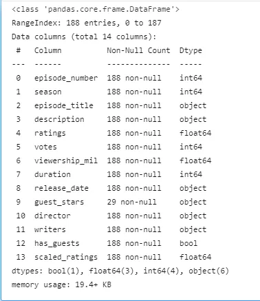
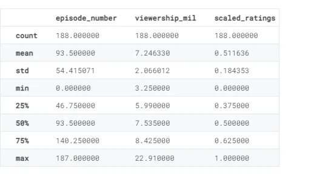
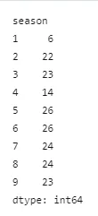
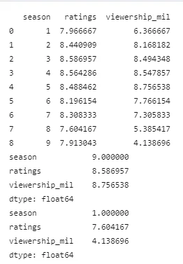
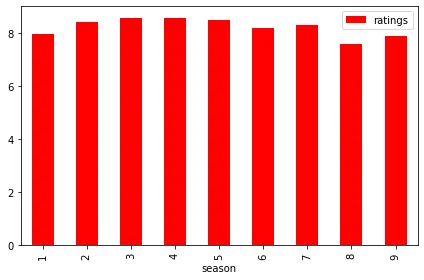
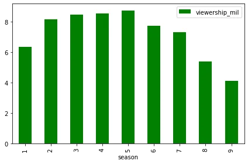
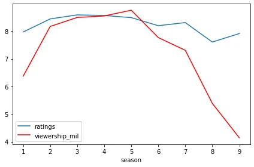

**The Office!** What started as a British mockumentary series about office culture in 2001 has since spawned ten other variants across the world, including an Israeli version (2010-13), a Hindi version (2019-), and even a French Canadian variant (2006-2007). Of all these iterations (including the original), the American series has been the longest-running, spanning 201 episodes over nine seasons.

In this notebook, we will take a look at a dataset of The Office episodes, and try to understand how the popularity and quality of the series varied over time. To do so, we use the following dataset: office_episodes.csv, which can find in my GitHub repo [here](https://github.com/ayenadikyaw/InvestingGuestStarsInTheOffice), together with the complete source code.

The dataset is originally scrapped from [IMDB](https://www.imdb.com/title/tt0386676/) and can download from Kaggle [here](https://www.kaggle.com/nehaprabhavalkar/the-office-dataset).

This dataset contains information on a variety of characteristics of each episode. In detail, these are:

- **episode_number:** Canonical episode number.
- **season:** Season in which the episode appeared.
- **episode_title:** Title of the episode.
- **description:** Description of the episode.
- **ratings:** Average IMDB rating.
- **votes:** Number of votes.
- **viewership_mil:** Number of US viewers in millions.
- **duration:** Duration in number of minutes.
- **release_date:** Airdate.
- **guest_stars:** Guest stars in the episode (if any).
- **director:** Director of the episode.
- **writers:** Writers of the episode.
- **has_guests:** True/False column for whether the episode contained guest stars.
- **scaled_ratings:** The ratings scaled from 0 (worst-reviewed) to 1 (best-reviewed).

Now, let's get started to explore the data set. First, import the necessary libraries and read the dataset as pandas dataframe to process. Then, take a look at the first few rows of the dataframe.

```python
# import necessary libraries
import pandas as pd
import matplotlib.pyplot as plt

#peek data set
df=pd.read_csv('datasets/office_episodes.csv')
df.head()
```

You will see like below.


Let's check the information about the dataframe as well.

```python
#check info
df.info()
```

output:



As we can see above, there is no null values in the columns except some values in guest stars columns. This means that some of the episodes has not guest stars. The data looks fine. Then, let's check some more information on the summary statistics of the interested columns of the dataset.

```python
# check statistics of necessary columns
df[['episode_number','viewership_mil','scaled_ratings']].describe()
```

output:



Data visualization is a good way to start exploring data. Scatter plots’ primary uses are to observe and show relationships between two numeric variables. The dots in a scatter plot not only report the values of individual data points, but also patterns when the data are taken as a whole. Now, let's start creating an informative plot of the episodes and let's try to answer the target question: Who is one of the most popular top star present in the most watched and the most rated episode?

```python
#color scheme
colors=[]

for key, value in df.iterrows():
    if value['scaled_ratings']<0.25:
        colors.append('red')
    elif value['scaled_ratings']<0.5:
        colors.append('orange')
    elif value['scaled_ratings']<0.75:
        colors.append('lightgreen')
    else:
        colors.append('darkgreen')

#sizing system
sizes=[]

for key,value in df.iterrows():
    if value['has_guests']==True:
        sizes.append(250)
    else:
        sizes.append(25)

# scatter plot
fig=plt.figure()
plt.scatter(x=df['episode_number'],y=df['viewership_mil'],c=colors,s=sizes)
#labels
plt.title("Popularity, Quality, and Guest Appearances on the Office")
plt.xlabel("Episode Number")
plt.ylabel("Viewership (Millions)")

#show the figure
plt.show()
```

output:


In the above scatter plot, dark green color data points represent the episodes which have the highest ratings. Among them, the bigger ones represent the episodes which has the guest stars. From the illustration of the plot, we can see that there is one top watched episode which has ratings more than 75% and also has guest stars in our dataset. Now, let's find out who is the top star being present in the most watched and the most rated episode.

```python
max_viewership=df['viewership_mil'].max()
#print(max_viewership)
top_stars=df.loc[df['viewership_mil']==max_viewership,'guest_stars'].iloc[0]
#print(top_stars)

top_stars_list=top_stars.split(',')
print(top_stars_list)

#random select one of top-stars
import random
top_star=random.choice(top_stars_list).strip()
print(top_star)
```

output:


Now, form the analysis result, it is find out that there are three guest stars participated in the most watched which has highest ratings episode. They are Cloris Leachman, Jack Black and Jessica Alba.

Now, let's find out more about the season-related information between seasons and viewership and ratings. Let's first check how many episodes are there for each season

```python
#check episode_count
print(df.groupby('season').size())
```

Output:



We can see that each season has different episode counts. To check the seasons which have highest viewership and highest ratings, the data frame is pivoted using pandas pivot-table function. Mean value for each season is calculated since there are different episode counts for each season

```python
import numpy as np

#pivot the dataframe to check relationship between
df_1=df.pivot_table(df,index=['season'],aggfunc={'ratings':np.mean,'viewership_mil':np.mean})
df_1.reset_index(inplace=True)
print(df_1)
print(df_1.max())
print(df_1.min())
```

Output:



Now let's visualize:

```python
df_1.plot(kind='bar',x='season',y='ratings',color='red')
df_1.plot(kind='bar',x='season',y='viewership_mil',color='green')

plt.show()

ax=plt.gca() # gca for get current axis
df_1.plot(kind='line',x='season',y='ratings',ax=ax)
df_1.plot(kind='line',x='season',y='viewership_mil',color='red',ax=ax)

plt.show()
```

Output:







We can see the average ratings for each season has no much difference where the highest average ratings is Season 4. Starting from season 2, the amount of viewers was increasing slightly by slightly and reached the peak at Season 5. The average viewers started to decline starting from season 6 where season 9 has the least average viewers. We can see that there is no relationship between viewership and ratings. Personally I think, even though viewers were getting less after Season 5, the viewers for each season satisfied and enjoyed watching the Office series because we can see that average rating for each season is more than 75%.
