NAICS TIME SERIES ANALYSIS TO OFFER SOME ANSWERS

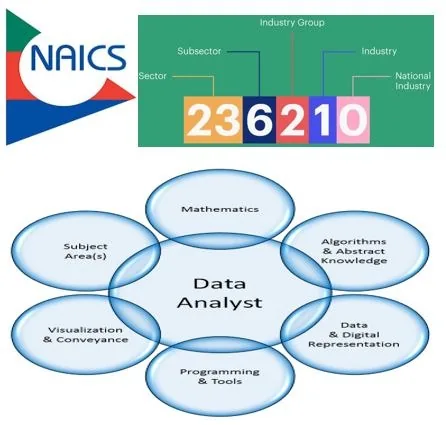

Data analyst is a professional who peruses information using data analysis tools such as R, SAS, and Python to gather data, clean, do statistical analysis and visualize them. Meaningful results must be provided to help employers, clients and even governments to make important decisions from the raw data after identifiable facts and trends are known. Creative and analytical thinking are the skills which every Data Analyst cannot forego and more importantly, curiosity and creativity are key attributes of good Data Analyst.

The data set to be used to answer the above question is from NAICS. The North American Industry Classification System (NAICS) is an industry classification system developed by the statistical agencies of Canada, Mexico, and the United States. NAICS is designed to provide common definitions of the industrial structure of the three countries and a common statistical framework to facilitate the analysis of the three economies.

The NAICS structure is hierarchical with a six-digit code numbering system adopted, of which the first five digits are used to describe the NAICS levels that will be used by the three countries (i.e. Canada, Mexico and the United States) to produce comparable data. The first two digits designate the sector, the third digit designates the sub-sector, the fourth digit designates the industry group and the fifth digit designates the industry. The sixth digit is used to designate national industries. A zero as the sixth digit indicates that there is no further national detail. Each as explained is represented in the figure above.

The hierarchical structure of the NAICS defines industries at different levels of aggregation with highest aggregate been a 2-digit NAICS industry (e.g., 23 - Construction) which is then composed of some 3-digit NAICS industries (236 - Construction of buildings, 237 - Heavy and civil engineering construction, and a few more 3-digit NAICS industries). Similarly, a 3-digit NAICS industry (e.g., 236 - Construction of buildings), is composed of 4-digit NAICS industries (2361 - Residential building construction and 2362 - Non-residential building construction). The above example is top-down approach while down-top approach will be the smaller industries with 4-digit NAICS making up a 3-digit NAICS industry which in turn make a 2-digit NAICS industry. For more information can be found at <https://www.statcan.gc.ca/eng/subjects/standard/naics/2017/index> on the files and datasets used in the analysis.

**Description of datasets used**

The file containing the datasets used in this time series analysis is obtained from https://wixlabs-file-sharing.appspot.com. The zipped files consist of 15 CSV files beginning with RTRA (i.e. Real Time Remote Access). These files contain employment data by industry at different level of aggregation; 2-digit NAICS, 3-digit NAICS, and 4-digit NAICS from Real Time Remote Access (RTRA) data of the Labour Force Survey (LFS) by Statistics Canada. Below is the description of the column names as used in each dataset (CSV file):

1. SYEAR: Survey Year

2. SMTH: Survey Month

3. NAICS: Industry name and associated NAICS code in the bracket

4. _EMPLOYMENT_: Number of Employment offered in the industry aggregate.

Each level of aggregation (i.e.2-digit NAICS, 3-digit NAICS, and 4-digit NAICS) has survey data from 1997 to 2020 segregated into 1997-1999, 2000-2005, 2006-2010, 2011-2015 and 2016-2020 with 2020 data yet not available and 2019 data not completed during the time of this analysis, therefore the analysis will be done on data from 1997 to 2018.

**Concatenating the data files and datasets**

Since the data has been segregated and as stated above, data gathering is one of the roles of Data Analyst, therefore the data must be consolidated into one DataFrame (i.e. Python data structure for table-like object).

First, each aggregate level data is saved to a file using the glob package which allows for filename pattern matching using various wildcards. It came handy in this case with less code for readability and understanding. Then list comprehension is used to read each CSV file into a list of DataFrames for each aggregate level. The datatypes of the "SYEAR" and "SMTH" columns are converted to object (i.e. string). For convenience, code maintenance and re-usability, a function is used to concatenate the list of DataFrames into a single DataFrame for the Exploratory Data Analysis (EDA).

Below is the function to concatenate each industry level data into one data and then also add a DAY column and a DATE column (set as the index for the convenience slicing).

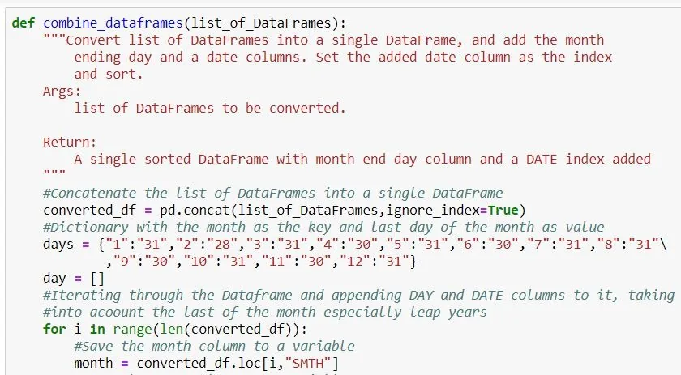

The code of each industry is attached to their name, hence there is the need to separate them and the function below does just that.

The function call are then used to concatenate and split the code from the names as shown in the code below.

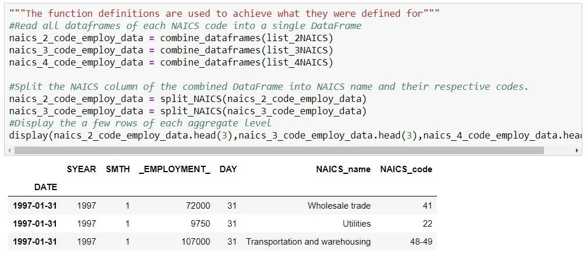

All the data for 2-digit NAICS industries are read into the variable naics_2_code_employ_data, 3-digit NAICS industries in naics_3_code_employ_data and 4-digit NAICS industries in naics_4_code_employ_data

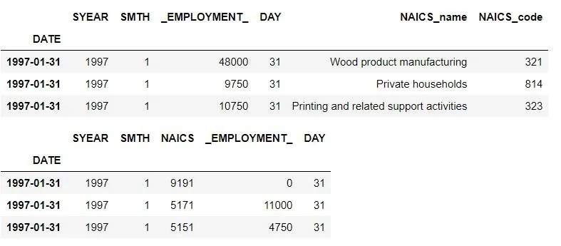

The 'NAICS' column in the "naics_4_employ_data" is inconsistent with the column names of the other DataFrames, therefore it will be renamed for consistency.

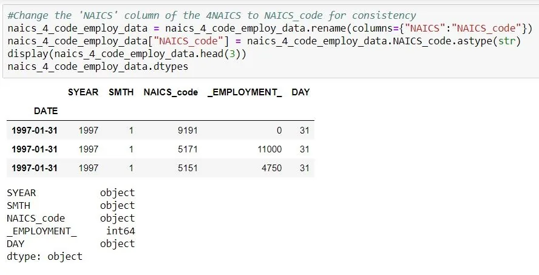

Now that all that CSV files have been loaded into their respective DataFrames; they will be concatenated into one DataFrame for further analysis.

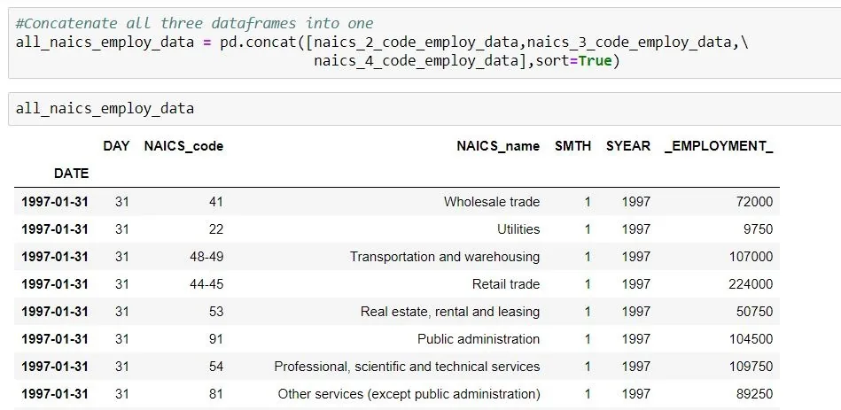

In the beginning, we talked about some of the roles of Data Analyst and have demonstrated some along the way, it is therefore imperative to make known the rest of roles and even in more detailed. Below are the detailed roles of a Data Analyst:

- extract the useful information from raw data using advanced computerized models or tools
- remove bad or corrupted data
- initially assess the quality of the data to be used
- do further analysis to determine the meaning of the data
- then perform final analysis to provide additional data screening
- prepare and present reports based on analysis to employer, client, or management

It was needful echo the above because exploratory data analysis (EDA) was done on the data before concatenating them into one DataFrame, which is like the initial analysis stated above.

Now the data will undergo another EDA to screen, correct and fill any missing value where necessary.

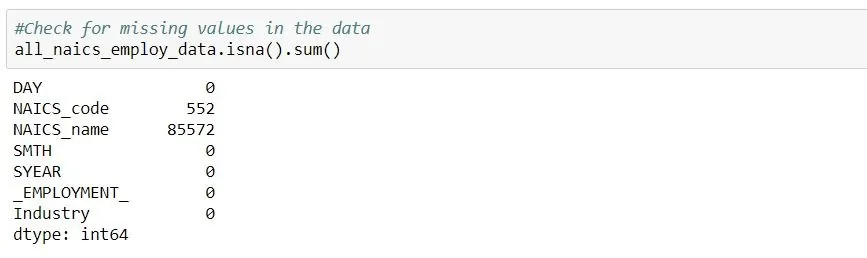

The output above showed 552 entries with NaN (i.e. missing values) for NAICS_code columns and 85 572 for the NAICS_name column. Therefore, further analysis on the data would reveal the course of the missing value.

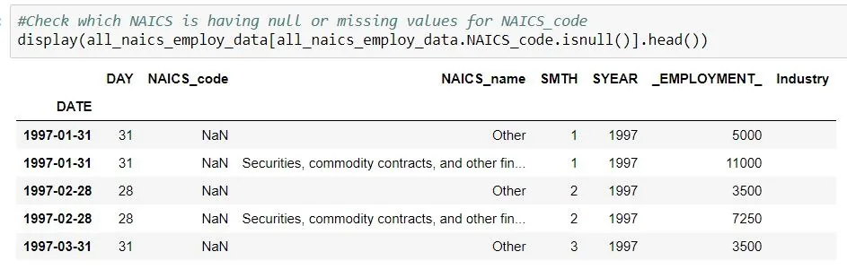

It is evident that "Securities, commodity contracts, and other fin" and "Other" NAICS do not have associated NAICS codes. Therefore, there is the need to resolve them. From the booklet, North American Industry Classification System (NAICS) Canada 2017 Version 1.0 (pdf) which can be obtained at https://www.statcan.gc.ca/eng/subjects/standard/naics/2017/index, specify the 3-digit NAICS of "Securities, commodity contracts, and other financial investment and related acti" as 523, however there is no specify 3-digit NAICS for "Other". Further checks showed that no industry is with the NAICS code “999”, therefore, the NAICS_code for the entries of "Other" would be assigned the value of “999”.

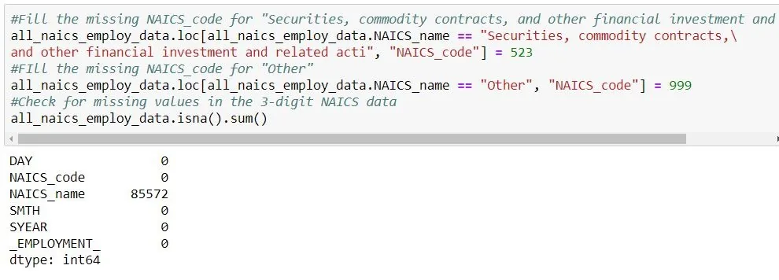

The missing values for NAICS_name is as the results of the data from the 4-digit NAICS industries and since our analysis would make use of the code instead of the industry’s name, it will be left as it is since it would not affect the analysis. However, this is not the case for all data, hence Data Analyst (aspiring Data Analyst also included) must always check for missing values in the data to see if their presence would affect the analysis or not.

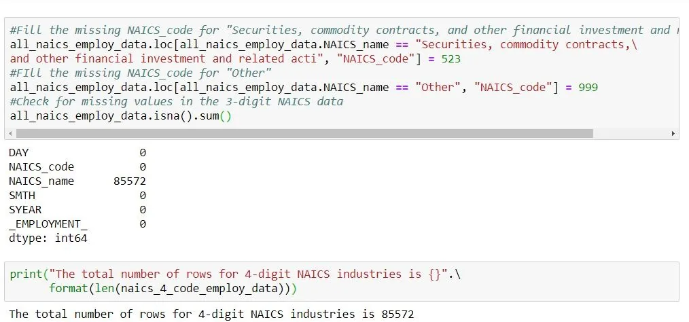

Now, the data is ready for mapping, therefore, dictionary variable is declared with the names of the industries as the key and their respective codes as the values (i.e. for all the 59 industries).

This analysis is focused on 59 main industries which are frequently used, and these come along with a combination of different industry code from 2-digit to 4-digit NAICS codes. Hence the dictionary declared above is used to map each industry in the data to its corresponding industry in the 59 frequently used ones. As mentioned earlier, for code re-usability and convenience, a function is used in this endeavor and is shown below.

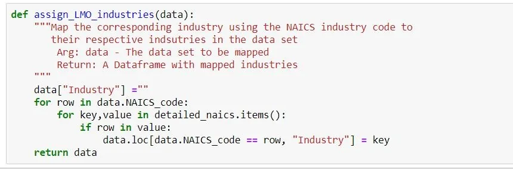

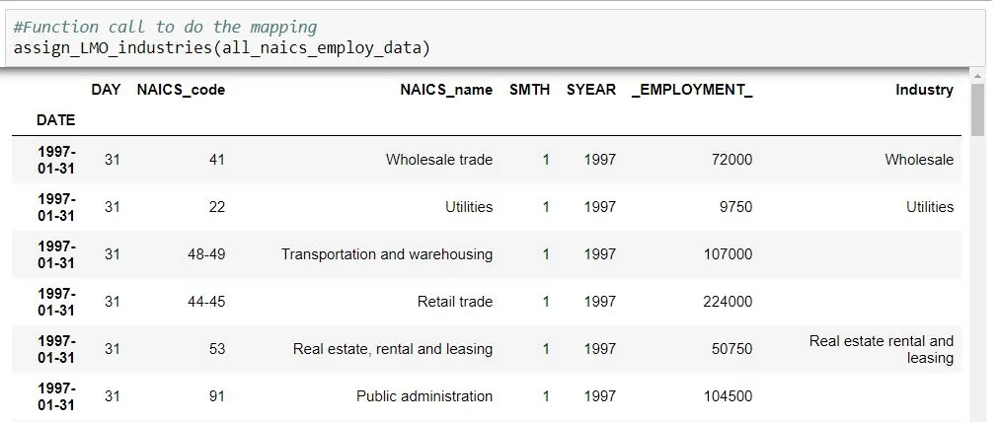

The needed data is extracted from the all_naics_employ_data. The criteria used is that any row without LMO Detailed Industry will be excluded from the data for the analysis. SO that the data will be in consistent with Data Output Template provided (i.e. data for only the 59 industries).

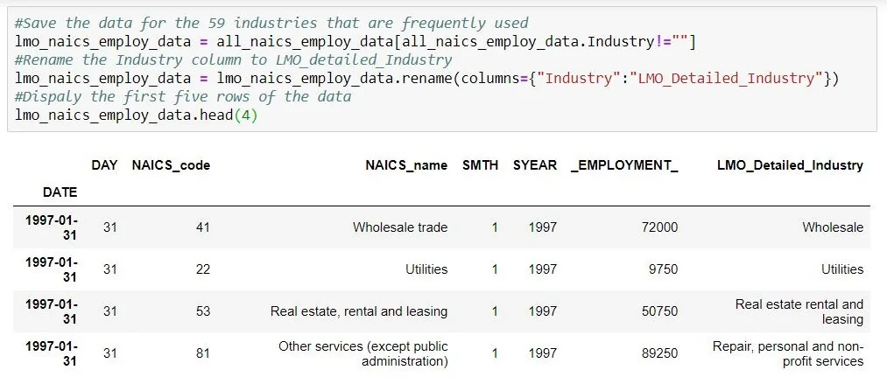

The output below shows how the data output now would be for each of the 59 industries per month for every year from 1997 to 2018.

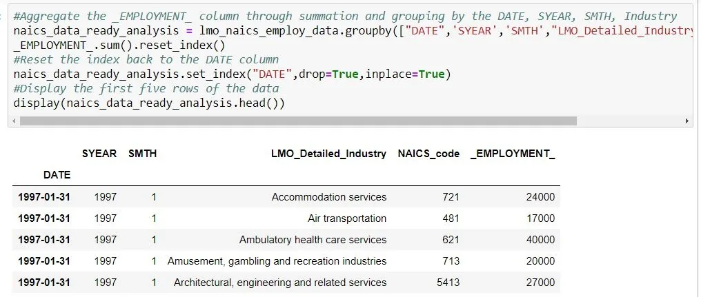

**QUESTIONS DRIVING THE TIME SERIES ANALYSIS**

The following questions would drive the time series analysis of the data.

1. How employment in Construction evolved overtime?

2. How employment in Construction evolved over time, compared to the total employment across all industries?

3. How the total employment evolve overtime?

4. What is the peak month (s) for employment overtime?

5. Which is the most employing NAICS industry?

***1. How employment in Construction evolved overtime?***

The Construction industry is coded by the NAICS 2-digit code "23". Therefore the code is used to select all rows with NAICS_code as 23. The function below is used to perform such selection and accepts two arguments the data and the code to match and returns a DataFrame of the selected rows.

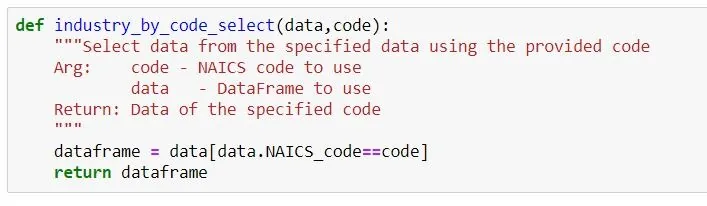

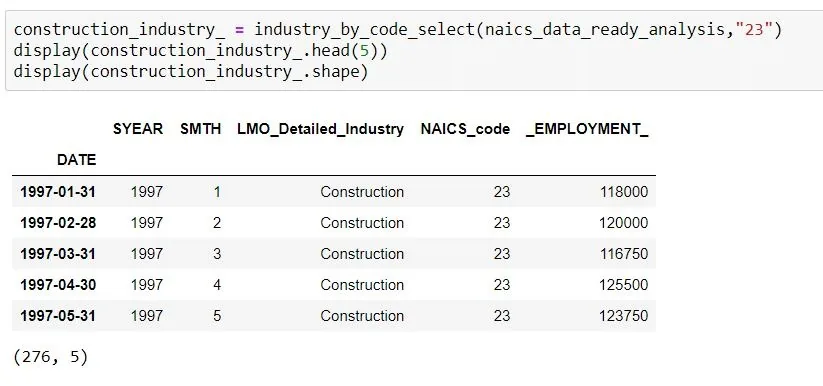

The shape of the construction industry employment data is 276 rows with 6 columns, which will make it difficult to observe the any trend in employment overtime. Therefore the data will be resampled yearly to observe it trend over the 22 years range.

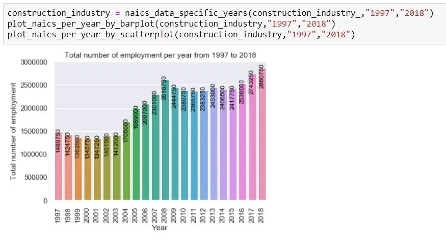

Employment in the construction industry got off on a better note (i.e. in 1997), however, decline in the next four subsequent year (i.e. 1998-2001) and saw some **fifty-four thousand, two hundred and fifty (54 250)** increase in employment from 2001's figure. The industry's employment figures continue to increase steadily until its sharp increase from the year 2004 to 2008. Then after, the industry started to see a decline in employment from 2009 to 2011 and a slight increase from 2012 and 2013 and then again, a decline in 2014 and 2015. The second sharp increase of the industry's employment occurs 2016 to 2018 reaching the peak value for the industry in 2018 with the total employment of **two million eight hundred and sixty thousand seven hundred and fifty (i.e. 2 860 750)**. Although, the first few years (i.e. 1997-2003) have the least numbers of employment in the industry, the industry started employing more people during the 2005 and 2008 period.

In all, the employment regarding the construction industry has been unstable with some fluctuations here and there whose cause is not available from the data available in this analysis.

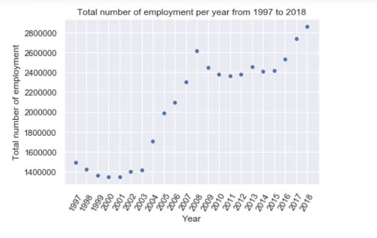

***2. How employment in Construction evolved over time, compared to the total employment across all industries?***

To find the trend of all other industry as compared to the Construction industry, the data of these industries must first be extracted from the dataset. Below is the first few rows of all other industries excluding the construction industry

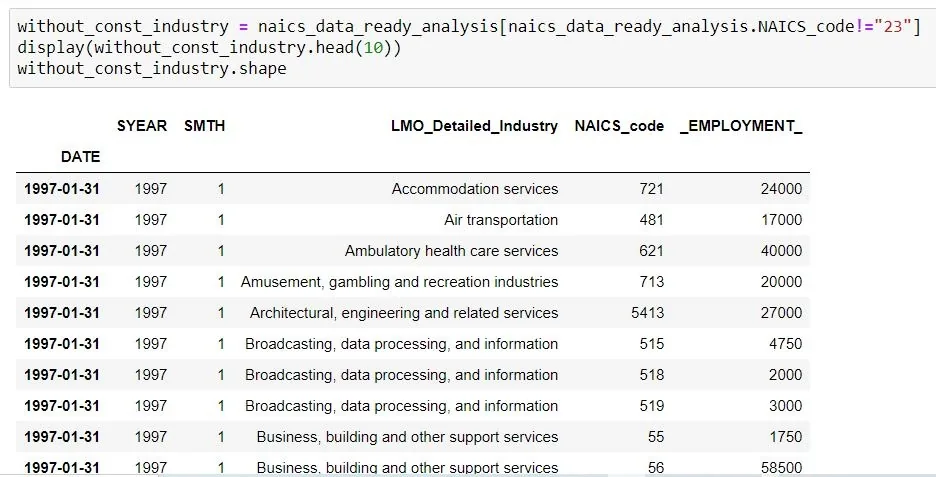

As expected, the data is 28416 rows with 5 columns, which will make it difficult to compare the construction employment with non-construction industry employment (i.e. all other industries). Therefore, the data will be resampled yearly to do the comparison over the 22 years range.

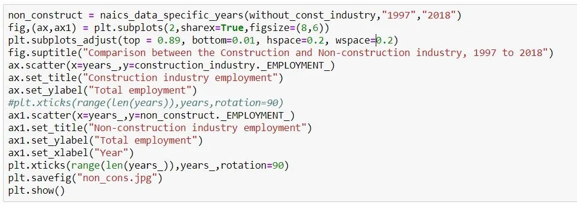

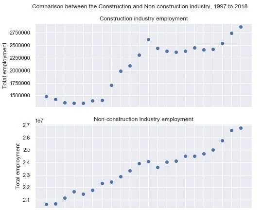

As the construction industry's employment started on decreasing spree, non-construction industries' employment however, started with a steadily increase from 1997 until the year 2000 and saw a decline in the year 2001 and then continues with its increasing spree but this time more steadily (i.e. from 2002 to 2008) than previously with a slight drop in 2004 employment figures. Within the same period (i.e. 2002 to 2008), the construction industry however, saw a sharp increase every year to reach its third highest employment within the 22 years range (i.e. behind 2017 and 2018). Although both industries declined in the employment figures in 2009, non-construction picked up in the subsequent years from 2010 to 2012 but with a slight decrease in 2013 (i.e. **4 750** less of 2012's employment), however, the construction industry's employment decline continued until 2011 and appreciated in 2012 and 2013 with 69 750 more of 2012's employment figures in 2013.

From 2014 to 2018, the employment figures in the non-construction industries again saw a significant increase over the period reaching its peak employment in 2018 with a total of **Twenty-six million, seven hundred and seventy-eight thousand** (**26 778 000**). While there was continues increase in employment values for the non-construction industry from 2014 to 2018, there was rather a decline in employment in the construction industry in 2014 and 2015 and then a continuous significantly increase afterwards until 2018 been the peak employment of the construction industry(i.e.**Two million eight hundred and sixty thousand seven hundred and fifty, 2 860 750**).

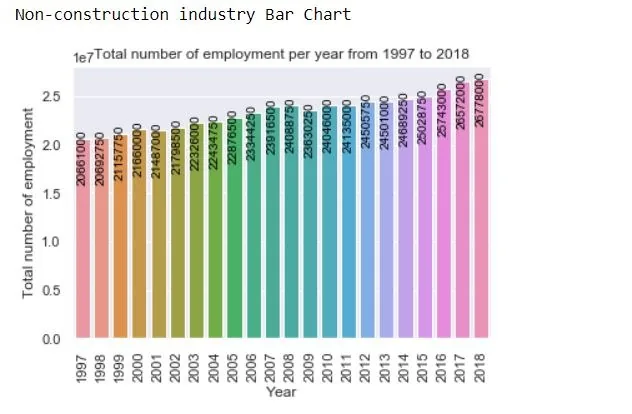

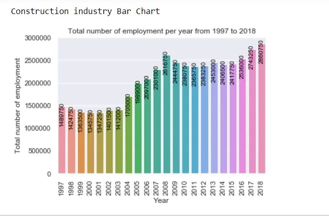

Scatter plots for the monthly employment for 2016, 2017 and 2018 for both category of industries is below.

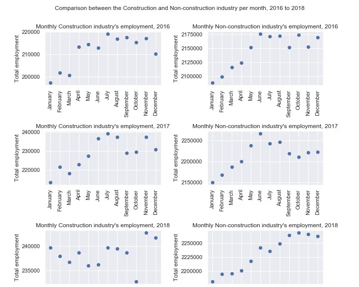

***3. How the total employment evolve overtime?***

In this analysis, we want to find out how the total accumulated employment from all sectors evolve over time in respect to 22 year range. As usual we have to aggregate the data for total employment for each year from 1997 to 2018. A few rows of the data is shown below.

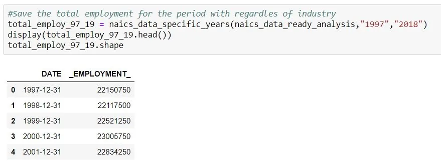

From the onset the total employment saw a decline in *1998* with **Thirty-three thousand two hundred and fifty (33 250)** less of the *1997* employment figures. It then started to increase sharply from 2001 to 2008, but there was a slight decline in 2001 (i.e.**171 500** less of 2000's employment figure) when the figures started to increase from 1999. After 2008, 2009 saw a drop of **Six hundred and thirty thousand, fifty hundred**, **630 500** employments as against the 2008's figure, thereafter there was a steadily increase in total employment up to 2015 and a sharp increase from 2015 to 2018. 2018 again saw the highest employment across all industries with a total employment of **Twenty-nine million, six hundred and thirty-eight thousand seven hundred and fifty**, **29 638 750** which is consistent with the data we've analyzed so far.

However the reason for 2018 been the year with the highest number of employment is not available with the data available hence further data and analysis would be needed to reveal the reasons thereof.

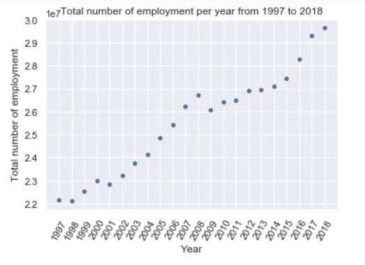

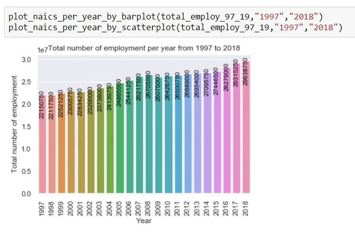

***4. What is the peak month (s) for employment overtime?***

In this analysis, we would approach it in two ways. First, we will determine the peak month when the data is aggregated on monthly basis for each year and secondly, the peak month when the aggregation is done monthly for the whole period (i.e. 1997-2019).

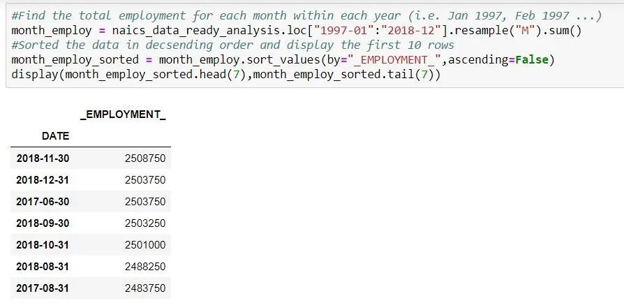

Out of the first *seven (7)* months with highest number of employment figures five of them were from 2018 and the other two been the 2017.The first ten monthly employment across all category of industries per year are from the second part of the year with June, July and August dominating.

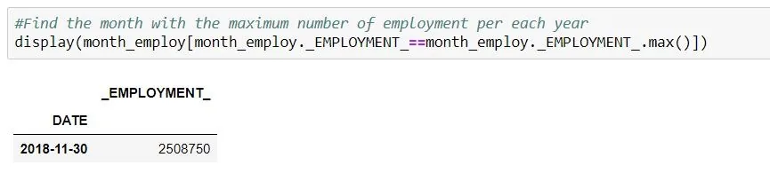

The month employing the highest number of people from 1997 to 2018 was *November, 2018* with a total of **Two million, five hundred and eight thousand seven hundred and fifty 2 508 750**.

To shed more light on the above analysis, a comparison is done between the two years with the highest number in the first seven, i.e. 2017 and 2018.

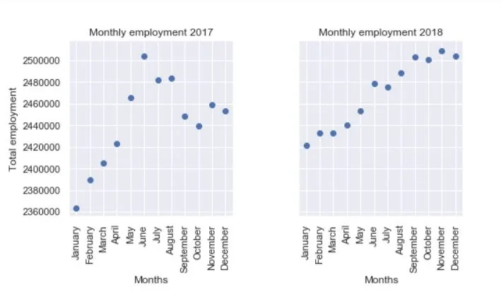

The second aspect of the analysis is below, the aggregation as stated earlier is done on monthly base over the entire period not for each year.

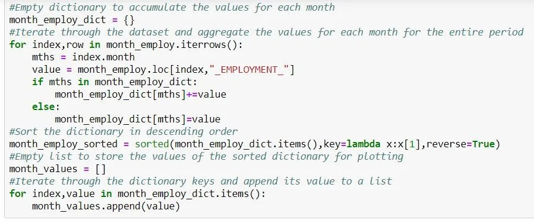

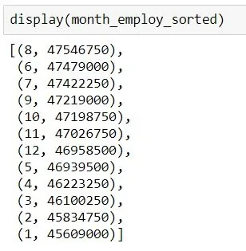

Although November 2018 was the month employing the highest number in terms of monthly employment for every year from 1997 to 2018, however, if the employment in each month is aggregated over the 22-year period, the month of August is the month with the highest number of employment employing a total of Forty-seven million, five hundred and forty-six thousand, seven hundred and fifty (i.e. 47 546 750), followed closely by June with 47 479 000, July, 47 422 250 and September with 47 219 000 in that order. January is the month with the least number of employment for the period with 45 609 000.

This is evident that people get employed more during the second half of every year especially from June to September as revealed above and the analysis on each year's monthly employment figures.

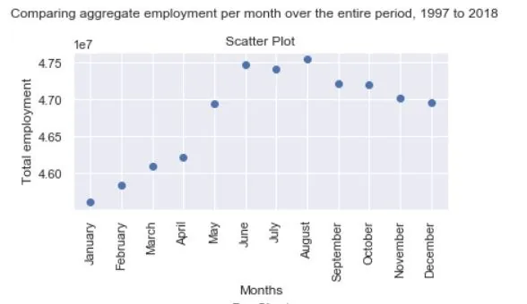

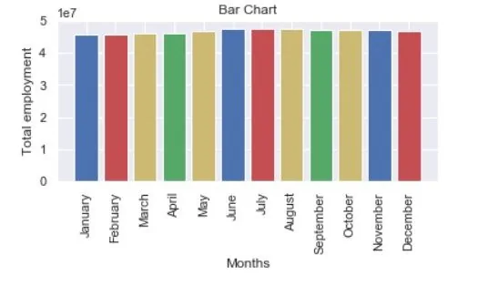

***5. Which industry employ most people?***

Before the analysis to answer the above question, aggregation of the number of employments in each industry must be performed and the result sorted descending and a graph is plotted.

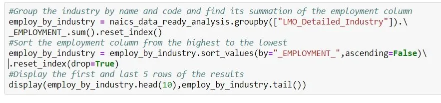

Displaying a plot of all fifty-nine industries would be unreadable and irrelevant for the analysis, therefore only the first ten employing industries would be visually displayed and analyzed.

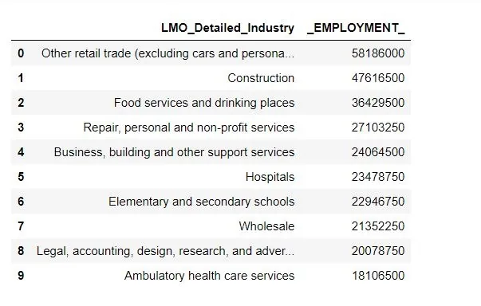

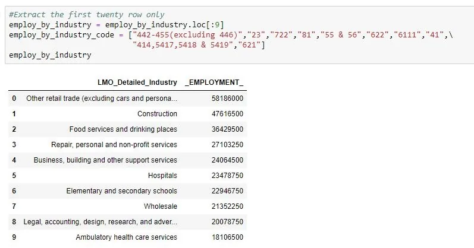

A scatter plot and a bar chart showing the total employment for the first ten industries out of the 59 industries are shown below.

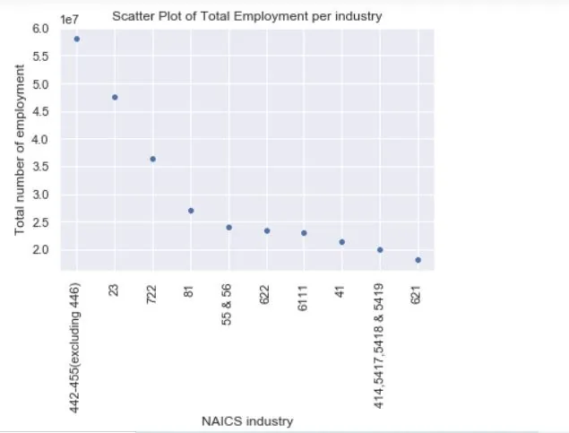

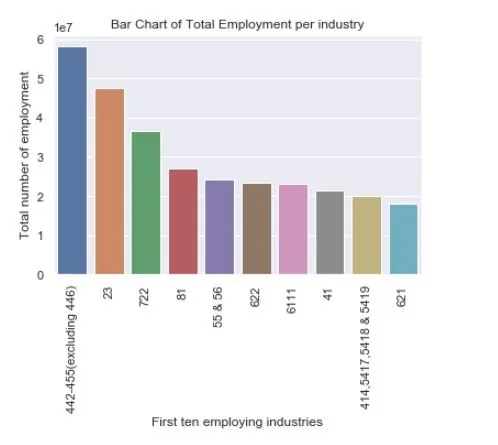

Out of the total of ***Five Hundred and Eighty-four million, four hundred and three thousand, seven hundred and fifty (i.e.584 403 750)*** employment provided across all the industries, *Other retail trade (excluding cars and personal care) with code 442 - 455* employed a total of ***Fifty-eight million, one hundred and eighty-six thousand (i.e. 58 186 000)*** representing ***9.96% approximately 10%*** followed by *Construction (23)* with ***47 616 500*** total employment, *Food services and drinking places (722)*, *Repair, personal and non-profit services (81)*, and *Business, building and other support services (55 & 56)* in that order for the best five employable industries.

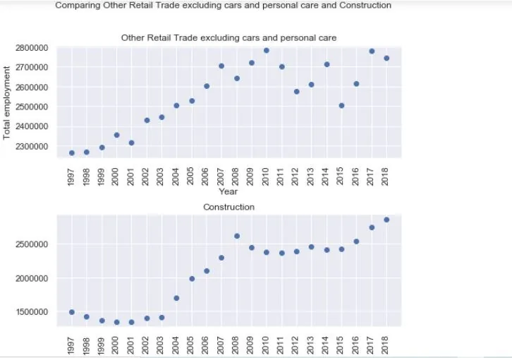

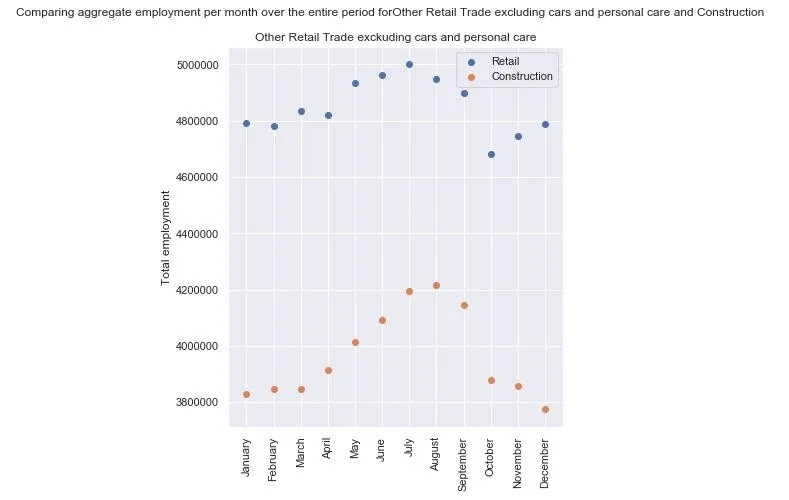

Critically looking at the two graphs confirms the earlier state assumption that more people are employed during the second half of the year, which at times start from May to September with the reasons yet known and further studies and research on the Canadian industries would be able to point out such reasons.

**Findings**

Some of the findings of the analysis include the following:

1. Other retail trade which excludes car and personal care employs most of the people followed by the construction industry.

2. The industries employ more people during the second half of the year and some cases starts from May

3. Employment in the construction industry may not be increasing steadily from year to year however, it employed 8% of the total jobs offered across all 58 industries

4. The 59 industries offered a total of ***Five Hundred and Eighty-four million, four hundred and three thousand, seven hundred and fifty (i.e.584 403 750)*** jobs from 1997 to 2018.

5. Data wrangling is not the only roles of Data analyst but others like cleaning and processing, and visualizing are also part.

**Recommendations**

It is recommended that:

1. Business in the retail trade must be assisted to continue to provide the  job opportunity it has provided over the years for economic growth.

2. Other industries where less people are employed must be assisted to position themselves to provide the more job opportunities.

3. Aspiring and current Data Analyst must always analyse the data as new data is been added to ensure the data quality before reports are generated from them. EDA should not be done once or twice but as and when the need arises.

4. Data analyst must possess strong communication skill, creative and analytical thinking skills.

**List of References**

[DATA SCIENTIST PROGRAM](https://www.datainsightonline.com/data-scientist-program), 2020. Project: Time series analysis of NAICS. *Data Insight*

North American Industry Classification System (NAICS) Canada 2017 Version1.0 Available at [<https://www.statcan.gc.ca/eng/subjects/standard/naics/2017/index>] Assessed on 26 August 2020 13:44

<https://www.mastersindatascience.org/careers/data-analyst/>

https://targetjobs.co.uk/careers-advice/job-descriptions/454089-data-analyst-job-description/
