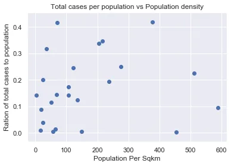
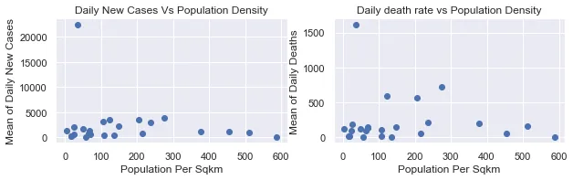
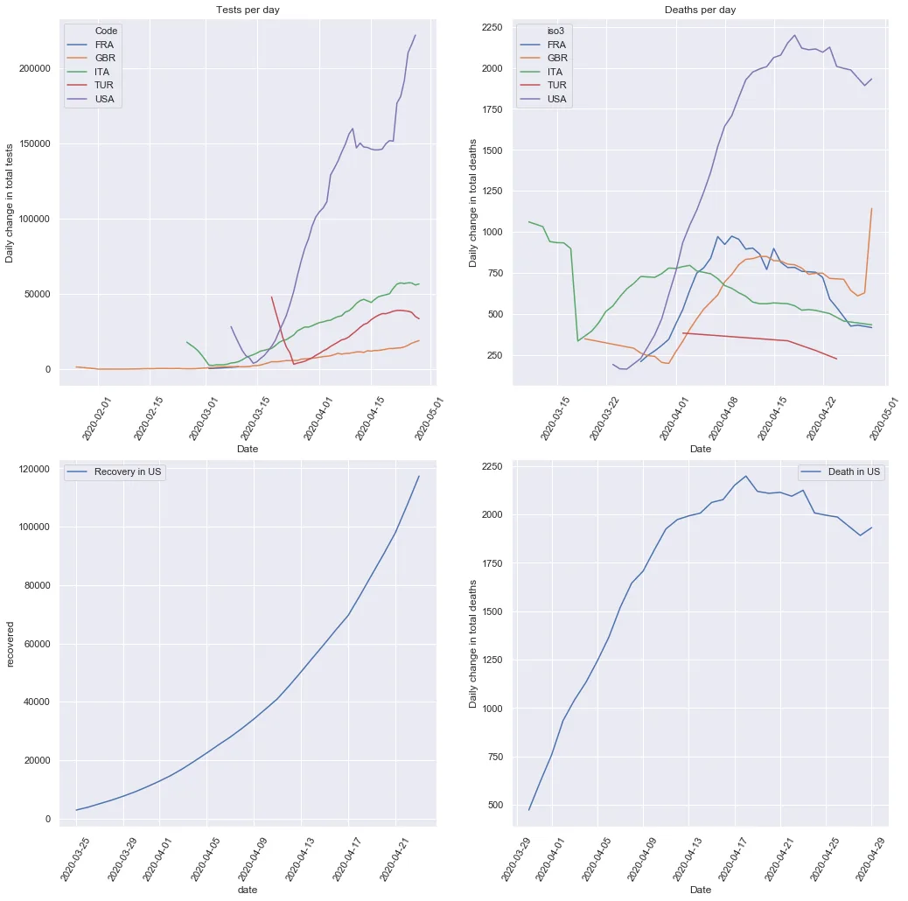

The novel COVID-19 has been a perplexing headache for the world since couple of months back. Scientists around the world are working with great effort to rectify the damage the virus is entailing and to find a cure to stop it and albeit, the virus transmission has kept inclined. One of the many hypothesis with regard to things that are exacerbating its transmission is population density. In this article I have analysed whether the idea that most crowded countries are the most affected is fair or just a misplaced one. In addition to that, I have analyzed whether countries doing more tests are seeing the flattening of the mortality curve earlier than others.

I have used datasets from John Hopkins University's github repo for getting information about COVID-19, ourworldindata.org and World Bank indicator to gather information of population density in my analysis.

The first analysis focus on studying the correlation between COVID-19's transmission and population density and before anything, I would import the python libraries used in throughout the analysis and then bring the datasets to my notebook and merge them based on the each country's iso3 code.

```python
import pandas as pd
import numpy as np
import matplotlib.pyplot as plt
import seaborn as sns

pd.set_option('display.max_rows', None)

covid19_cases = pd.read_csv('Datasets\COVID-19 Cases.csv', index_col='Date', parse_dates=True)
population_density = pd.read_csv('Datasets\API_EN.POP.DNST_DS2_en_csv_v2_988966.csv', index_col='Country Code')
total_population = pd.read_csv('Datasets\API_SP.POP.TOTL_DS2_en_csv_v2_988606.csv', index_col='Country Code')
```

Next I extract the relevant columns for our analysis and sliced the dataframe into the two case types investigated on, the Confirmed and Deaths into separate dataframes.

```python
#extract relevant columns covid19_cases = covid19_cases[['Case_Type', 'People_Total_Tested_Count',  'Cases',  'Difference','Country_Region', 'Province_State', 'Admin2', 'iso3', 'Difference']] #merge with population density data covid19_cases = covid19_cases.merge(population_density[['2018']], left_on='iso3', right_index=True) #rename the column covid19_cases = covid19_cases.rename(columns={'2018':'Population_density-sqKm'})  confirmed = covid19_cases[covid19_cases['Case_Type']=='Confirmed'] deaths = covid19_cases[covid19_cases['Case_Type']=='Deaths']
```

Rather than comparing the COVID-19 cases in the total population against the population density, I decided to calculate the percentage of reported cases per each country's population and compare it against the population density. To see how strong is the correlation between these two variables, I calculated the Pearson Correlation coefficient and find out that the Pearson Correlation coefficient between them is about 0.15, which doesn't show there is much linear correlation between them. This isn't good enough to make a decision about the dependence between the variables and therefore I had to graphically analyze if there is some non-linear relationship between the two variables and as it is seen in the picture, the scatter plot seems to be so sparse.



The other important insight I made is with regard to the dependence between the population density and the mean of cases and deaths reported for each country. And here is the result for both cases.



The above plots may seem to be cluttered around low values of the dependent variables and difficult make a judgement because of the extreme values but even filtering out those values, the plots are reshaped into a random scatter that doesn't show any significant linear correlation between the variables.

The next hypothesis I tested is whether the countries increasing the number of tests conducted each day are seeing a relative flattening of the curves for mortality and positive cases reported each day. It is generally believed that doing more cases per day allows affected people to minimize the death risk that would occur otherwise.

The additional datasets I used here is of one containing information about the total tests conducted per day for most countries and the other one is one that shows the number of recovered people each day in the US, taken from ourworldindata.org and the COVID Tracking Project respectively.

Focusing on the top countries affected for which full data is found, it is evident that the moving average of new positive cases and deaths is inversely related to the change in the number of tests conducted per day. Moving average is the best approach of aggregation in such scenario.

If we look at the US specifically, the curve for daily death reports by the virus seems to start declining around the days they start conducting more tests, April 15.



What we learn from the above analysis is that it is always important to test our hypothesis before making any judgment to make further decisions based on it.
