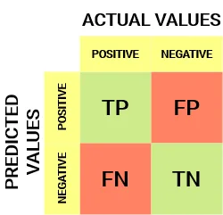
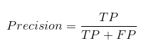
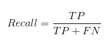
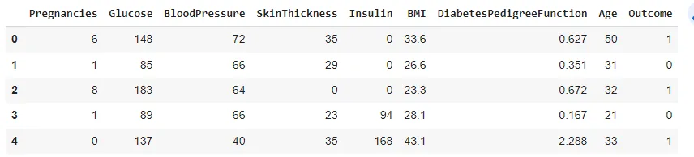
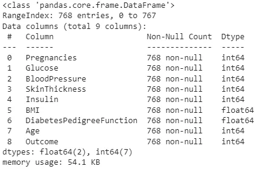
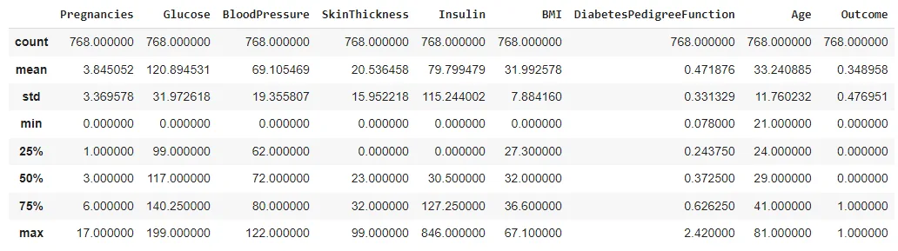
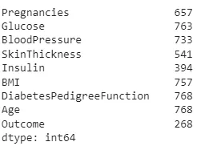
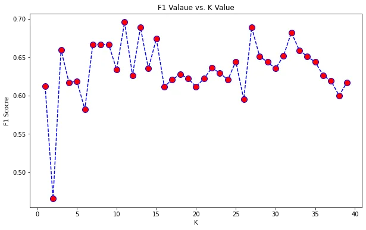

This tutorial will focus on KNN(K-Nearest Neighbors), which is a Machine learning algorithm which can be used for both regression and classification. However, it is mostly used for classification.

Before diving into the model, we need to understand what a machine learning is.

## What is Machine Learning?

Machine learning is the science of giving computers the ability to learn to make decisions from data without being explicitly programmed. Unlike traditional programming, we put data and output to the computer in order to train a model and use that model on new data. Somehow means that Machine learning is extracting knowledge by learning from experiences. Through the use of statistical methods, algorithms are trained to make predictions or classifications, in other words, uncovering key insights from data. These insights subsequently drive decision making within applications and businesses. As big data continues to expand and grow, the more research on ML algorithms is a demand as well as the use of those are keep increasing in answering business questions.

### Examples of ML Applications

Face recognition, Facebook auto tagging, Speech Recognition, Recommendation systems, email filtering, autonomous cars, cyber fraud detection, and so on.

### Classification of Machine Learning

Machine Learning can be classified into three types:

1. Supervised
2. Unsupervised and
3. Reinforcement

## KNN(K-Nearest Neighbors)

As I mentioned earlier, KNN is a supervised learning algorithm which can be used for both regression and classification. So let's try to understand "Supervised Learning".

### Supervised Learning

In supervised machine learning, the algorithms or models are trained from the labeled data first and then predict the output.

The system creates a model using labeled data to understand the datasets and learn about each data, once the training and processing are done then we test the model by providing a sample data to check whether it is predicting the exact output or not.

The goal of supervised learning is to map input data with the output data. Supervised learning is based on supervision, and it is the same as when a student learns things under the supervision of the teacher. The example of supervised learning is spam filtering.

Supervised learning can be grouped further in two categories of algorithms:

- Classification (predict categorical or class label output)
- Regression ( predict real number or continuous output)

### Classification

Classification is actually identifying different categories of the corresponding data. In machine learning, data with labels (which is already classified as the correct category) is being trained to get a classification model and later this model is used to classify new observation data into a number of classes or groups such as Yes or No, Spam or not Spam, etc. More precisely, Classification is a task that requires the use of machine learning algorithms that learn how to assign a class label to examples from the problem domain.

There are many different types of classification tasks that you may encounter in machine learning and in this tutorial, one of the classification algorithms which is K-Nearest Neighbors is discussed.

### Model Explanation

KNN is a simple, easy to understand and implement algorithm. The algorithm assumes the similarity between the new data point and the available data points, then puts the new data point into the category that is most similar to the available categories. It stores all the available data and classifies a new data point based on the similarity.

It is a non-parametric algorithm, which means it does not make any assumption on underlying data. It is also called a lazy learner algorithm because it does not learn from the training set immediately instead it stores the dataset and at the time of classification, it performs an action on the dataset.

The KNN algorithm at the training phase just stores the dataset and when it gets new data, then it classifies that data into a category that is much similar to the new data.

**K** in KNN is a parameter that refers to the number of nearest neighbors to include in the majority voting process which is a mechanism to determine the class of an unseen observation. This means that the class with the majority vote will become the class of the new observation data point.

If the value of **K** is equal to one, then we'll use only the nearest neighbor to determine the class of a data point. If the value of **K** is equal to ten, then we'll use the ten nearest neighbors, and so on.

Using K-Nearest Neighbor, we predict the category of the test point from the available class labels by finding the distance between the test point and trained k nearest feature values. As a result, it’s often referred to as a distance-based algorithm.

To calculate the distance, we usually use the Euclidean approach, which is the most widely used distance measure to calculate the distance between test samples and trained data values.

### How should we select the right value of K?

There is no no pre-defined statistical method to find the most favorable value of **K**. It is recommended to choose an odd number of **K** a situation may arise in which the elements from both groups are equal. Some authors suggest to set k equal to the square root of the number of observations in the training dataset.

### Impact of choosing K

The key to choosing an appropriate k value is to strike a balance between overfitting and underfitting.

Larger **K** value: The case of underfitting occurs when the value of k is increased. In this case, the model would be unable to correctly learn on the training data.

Smaller **K** value: The condition of overfitting occurs when the value of k is smaller. The model will capture all of the training data, including noise. The model will perform poorly for the test data in this scenario.

### Can we select optimal k?

We may try the following steps:

1. Initialize a random **K** value and start computing.
2. Choosing a small value of **K** leads to unstable decision boundaries.
3. The substantial **K** value is better for classification as it leads to smoothening the decision boundaries.
4. Derive a plot between error rate / accuracy score or F1 score and **K** denoting values in a defined range. Then choose the **K** value as having a minimum error rate or maximum accuracy or F1 score.

### How does KNN work?

The K-NN working can be explained on the basis of the below algorithm:

Step-1: Select the number **K** of the neighbors

Step-2: Calculate the Euclidean distance of K number of neighbors

Step-3: Take the **K** nearest neighbors as per the calculated Euclidean distance.

Step-4: Among these k neighbors, count the number of the data points in each category.

Step-5: Assign the new data points to that category for which the number of the neighbor is maximum.

Step-6: Our model is ready.

*If we have a labeled, noise-free small data set, KNN is supposed to be performed well.*

### How to judge whether our model performs well or not?

It is important to measure the performance of model.

#### Classification Metric

The most straightforward and commonly used evaluation metric for classification performance is the accuracy score. Accuracy is calculated as the fraction of predictions that are correct.

You could compute the accuracy on the data you used to fit the classifier. However, as this data was used to train it, the classifier's performance will not be indicative of how well it can generalize to unseen data. For this reason, it is common practice to split your data into two sets, a training set and a test set. You train or fit the classifier on the training set. Then you make predictions on the labeled test set and compare these predictions with the known labels. You then compute the accuracy of your predictions. (credit: Hugo,Datacamp)

Another metric we can used in Confusion Matrix and based on that, we can computer recall, precision and accuracy.

#### Confusion Matrix

A Confusion matrix is an N x N matrix used for evaluating the performance of a classification model, where N is the number of target classes. The matrix compares the actual target values with those predicted by the machine learning model.

For a binary classification problem, we would have a 2 x 2 matrix as shown below with 4 values:



**True Positive (TP)**

The predicted value matches the actual value

The actual value was positive and the model predicted a positive value

**True Negative (TN)**

The predicted value matches the actual value

The actual value was negative and the model predicted a negative value

**False Positive (FP)**

The predicted value was falsely predicted

The actual value was negative but the model predicted a positive value

**False Negative (FN)**

The predicted value was falsely predicted

The actual value was positive but the model predicted a negative value

#### Precision Vs Recall

**Precision** tells us how many of the correctly predicted cases actually turned out to be positive.



Recall tells us how many of the actual positive cases we were able to predict correctly with our model.



## Model Implementation

To implement the model, the diabetes data set which you can find [here](https://www.kaggle.com/saurabh00007/diabetescsv/version/1) from Kaggle is used. **The main objective is to predict whether a person is diagnosed with diabetes or not.**

First, let’s import the necessary libraries.

```python
#import necessary libraries
import pandas as pd
import numpy as np
from sklearn.model_selection import train_test_split
from sklearn.preprocessing import StandardScaler
from sklearn.neighbors import KNeighborsClassifier
from sklearn.metrics import confusion_matrix,precision_score, recall_score, f1_score,accuracy_score
```

Load the dataset and peek some few rows

```python
#import data
df=pd.read_csv('diabetes.csv')
df.head()
```

Output:



```python
#EDA
df.info()
```

Output:



```python
df.describe()
```



We can see some of the features has a minimum of 0 which shouldn't be. So, we need to do some preprocessing. Now, I will check the count of non-zeros for each column.

```python
# count nonzero values in dataset
df.astype(bool).sum(axis=0)
```



The columns which should not be zero are Glucose, BloodPressure, SkinThickness, Insulin and BMI. So, I am going to replace the zeros of those columns with mean value.

```python
#replace zeros with nan and then filled with mean
impossible_zero=['Glucose','BloodPressure','SkinThickness','Insulin','BMI']
for column in impossible_zero:
  df[column]=df[column].replace(0,np.nan)
  mean=int(df[column].mean(skipna=True))
  df[column]=df[column].replace(np.nan,mean)
```

Then, now it is ready to prepare our data set. We need to split the data into X and y. X is the features data and y is the output data. After ready, we should split the into train and test set.

```python
# prepare model train, first split data
X=df.drop('Outcome',axis=1)
y=df['Outcome']
#split train and test data
X_train,X_test,y_train,y_test=train_test_split(X,y,random_state=0,test_size=0.2)
```

To avoid some skewness, feature scaling will be performed.

```python
#feature scaling to avoid skew
#fit-transform X, and transform y
sc=StandardScaler()
X_train=sc.fit_transform(X_train)
X_test=sc.transform(X_test)
```

To choose **K**, first I find the square root of the number of observations in the training dataset and choose an odd number.

```python
# find sqrt of data : k
import math
print(len(y_test))
math.sqrt(len(y_test))
```

Output:

```python
154
12.409673645990857
```

Since the output is 12, 11 is chosen as **K**.

Now, it's time to train the model.

```python
# define the model: initiate KNN
# choose k odd number
knn=KNeighborsClassifier(n_neighbors=11,p=2,metric='euclidean') # p-euclidean power
```

```python
#fit the model
knn.fit(X_train,y_train)
```

After fit the model, test data sent can be predict using that model.

```python
#predict the test set
y_pred=knn.predict(X_test)
```

Then, we need to evaluate the model's performance.

```python
#Evaluate model : confusion matrix
cm=confusion_matrix(y_test,y_pred)
cm
```

Output:

```python
array([[94, 13],
   [15, 32]])
```

Then, compute the F1 Score.

```python
# compute f1-score
print(f1_score(y_test,y_pred))
```

Output:

```python
0.6956521739130436
```

Followed by accuracy score.

```python
# accuracy score
print(accuracy_score(y_test,y_pred))
```

Output:

```python
0.8181818181818182
```

I have also tested to find the optimal **K** value as follows:

```python
# test to find optimal k
# ref: https://towardsdatascience.com/how-to-find-the-optimal-value-of-k-in-knn-35d936e554eb#:~:text=The%20optimal%20K%20value%20usually,be%20aware%20of%20the%20outliers.
F1=[]
for i in range(1,40):
  knn1=KNeighborsClassifier(n_neighbors=i,p=2,metric='euclidean')
  knn1.fit(X_train,y_train)
  pred_i=knn1.predict(X_test)
  F1.append(f1_score(y_test,pred_i))
```

Then, plot the F1 scores for K=1 to 40.

```python
#plot
import matplotlib.pyplot as plt
plt.figure(figsize=(10,6))
plt.plot(range(1,40),F1,color='blue',linestyle='dashed',marker='o',markerfacecolor='red',markersize=10)
plt.title('F1 Valaue vs. K Value')
plt.xlabel('K')
plt.ylabel('F1 Scocre')
print("Maximum F1:",max(F1),"at K =",F1.index(max(F1))+1) # need to add 1 coz index starts at 0
```

Output:

```python
Maximum F1: 0.6956521739130436 at K = 11
```



The same **K** value is chosen as an optimal **K**. However, this might not be always true. It might depends on the data size as well. More research needs to do.

This is the end of this article.

Credit: DataCamp- Supervised Learning with sklearn course: <https://app.datacamp.com/learn/courses/supervised-learning-with-scikit-learn> Youtube Simplilearn: <https://www.youtube.com/channel/UCsvqVGtbbyHaMoevxPAq9Fg>
