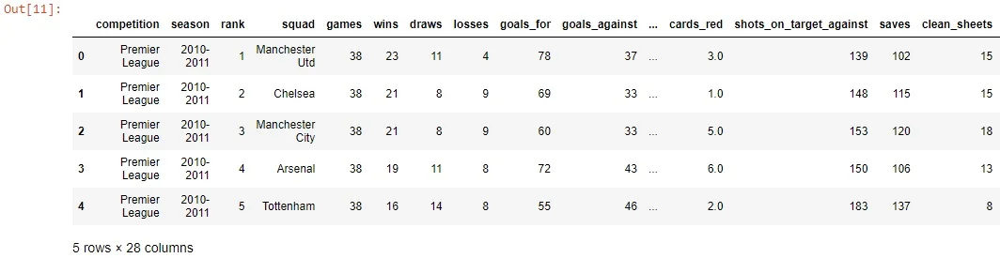
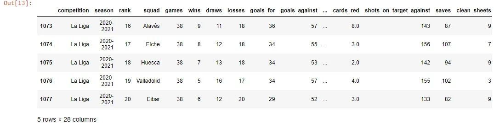
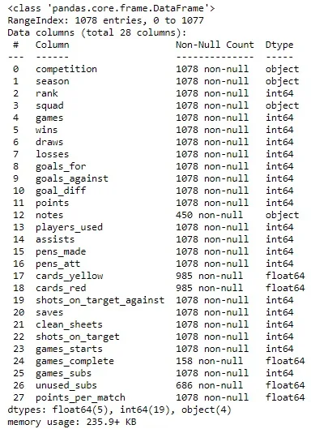
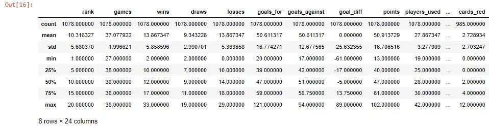
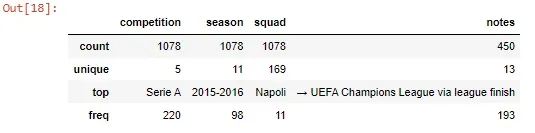
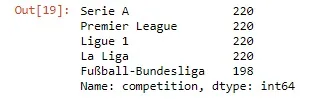
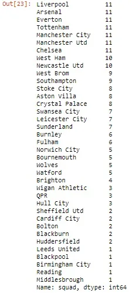
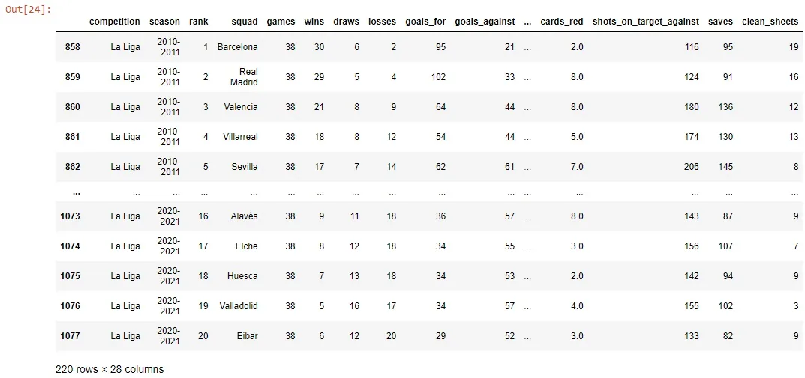
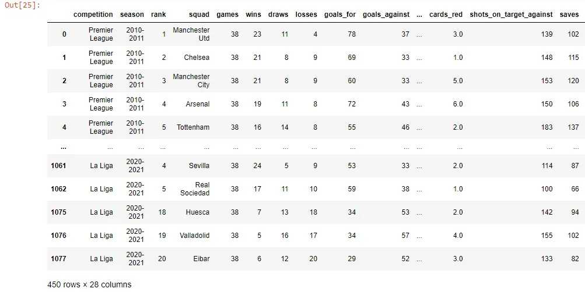

Once we observe, We can then reach a good conclusion. When dealing with large data sets that need to be observed and explored carefully to get interesting insights. but how should we extract those insights? pandas to the rescue. pandas which is one of the most important libraries in python in dealing with data. In this tutorial, we will go through how to explore and get some summary about our data and how pandas and their data structures do these tasks.

firstly, we will be working with data from [Kaggle](https://www.kaggle.com/jehanbhathena/big-5-european-football-leagues-stats).

let's import the data using pandas:

```python
df=pd.read_csv('Big 5 European football leagues teams stats.csv')
```

the first thing we should do when dealing with data for the first time is simply to view some of its records or rows as follows:

```python
df.head()
```



or

```python
df.tail()
```



this is used to view some number of rows from the end of the data frame.

When we saw the different columns of the data frame, it appeared that some columns contain different values for different variables. what if we want to do some operations on the rows of the data frame? so it will depend on the type of data in that column.

We want to know the data types for each column and this done using the following method:

```python
df.info()
```



As we saw, it did not just tell us the data types of the columns like int64, float64, and object, But also if these columns have null values or not.

And we can know the number of rows in the data frame by using the **shape** attribute:

```python
df.shape
```

```python
(1078, 28)
```

From that, we can determine which columns have null values by comparing them with the total number of rows.

We can summarize the data using some descriptive statistics like the mean, median, standard deviation, and so on. We can do that like that:

```python
df.describe()
```



If you notice that the **describe()** method calculates these measures for columns that are numerical. So we also want to use it with other types of data let's do it:

```python
df.describe(include=object)
```



The previous code will calculate some measures (not mean or standard deviation and so on). and we did this using the *include* parameter

and then specify the data type to be included.

One of the most important methods is value_counts() which is very helpful if we want to know the values of a certain column:

```python
df['competition'].value_counts()
```



So it gets the values of a certain column and counts its occurrences.

Another one uses the same logic:

```python
df.loc[df['competition']=='Premier League','squad'].value_counts()
```



Here we used the loc to select only the premier league competition and then get the values of the squad column but these values are under the premier league competition.

What we talked about so far was really for exploring our data and part of the Exploratory data analysis process. But also we can not finish this article without talking about selecting and subsetting certain data from the whole data frame.

In the following examples, we clarify the part of subsetting:

```python
df[df['competition']=='La Liga']
```



```python
df[~df['notes'].isna()]
```



In the last example, we view all the rows that have values under the column notes(which means that it does not contain null values).

All that we talked about in this article is considered a single step in the process of getting useful insight from the data at hand. So there is more to come next.

Link for GitHub repo [here](https://github.com/Abdelrahman7000/pandas_Techniques_for_data_science_exploring_data).

For Resources: [here](https://realpython.com/pandas-python-explore-dataset/).

*That was part of Data insight's Data Scientist program*
