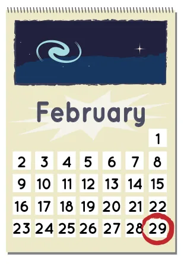
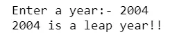
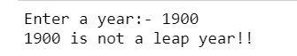

In this post, we will develop an app that can determine if a year is a leap year or not. A leap year is a year, occurring once every four years, which has 366 days including 29 February as an intercalary day.

Follow these steps to determine whether a year is a leap year:

1. If the year is evenly divisible by 4, go to step 2. Otherwise, the year is not a leap year

2. If the year is evenly divisible by 100, go to step 3. Otherwise, The year is a leap year.

3. If the year is evenly divisible by 400, the year is a leap year. Otherwise, the year is not a leap year. The year is a leap year if has 366 da.

```python
year = int(input("Enter a year:- "))# Here, you take the input from the user

# step 1 : check if year is eveanly devide by 4 go to step 2   otherwise go to step 4

if year % 4 ==0:
# step 2: check if year is not evenly devided by 100 otherwise go to step 3
    if year %100 !=0:
        print("{0} is a leap year!!".format(year))

#step 3: check if year is evenly devided by 400
    else:
        if year %400==0:
            print("{0} is a leap year!!".format(year))
        else:
             print("{0} is not a leap year!!".format(year))
#step 4
else:
    print("{0} is not a leap year!!".format(year))
```

Results:





The source code is available on [Github](https://github.com/safia-bashir/Leap-Year-app-)
