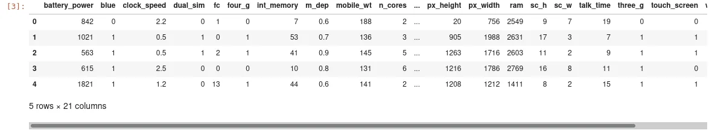

This dataset comes from [Kaggle](https://www.kaggle.com/iabhishekofficial/mobile-price-classification?select=test.csv). His main purpose is to classify mobile phones into different price ranges based on their features (eg: RAM, battery power, etc).

This dataset has two files:

- **train.csv** which contains 20 features and 1 target variable which is **price_range**
- **test.csv** which contains 20 features

In this tutorial, we will explore KNN algorithm using **train.csv** file.

## [**1.Import data**](https://app.datacamp.com/workspace/w/de511a8e-ce42-46de-90fd-96a402d54b04#1import-data)

The first thing we need to do is to import our data from a CSV file to a pandas DataFrame.

```python
import pandas as pd
data = pd.read_csv('train.csv')
data.head()
```



This data has **21 columns** where **20 columns** are features and the columns price_range is the target. So we will train our model to predict price_range base on feature variables. Let's split our data into the feature and the target variable. Scikit-learn works with numeric data stored as **NumPy array, Scipy sparse matrices, or pandas DataFrame**.

```python
X = data.drop(columns="price_range")
y = data['price_range']
```

## 2. Split data into train/test set
To be able to evaluate well our model, we will split our data into **train** and **test** sets. This will allow us to better evaluate our model with data that we know the result. Once our model will be well train with the best parameters, then we'll use it to predict the target of data in the **test.csv** that we don't know what the **price_range** is.

The function **train_test_split** from module **sklearn.model_selection** accepts multiple parameters. We have:

- **test_size** which indicates the percentage of data to use for testing and the remaining for training. For example, if we set test_size=0.2, this means that we'll split our data with 80% for training and 20% for testing. This parameter accepts a number between 0.0 and 1.0. Alternatively, you can use **train_size** to indicate the size of data of training and the remaining for testing.
- **random_state** is used to control the random action so we can reproduce it identically many time as we want. This parameter is used only if the parameter **shuffle** is set to **True**. By default, it's **True**

To know more about the other parameters accepted by **train_test_split**, read the [scikit-learn documentation on this part](https://scikit-learn.org/stable/glossary.html#term-random_state)

```python
from sklearn.model_selection import train_test_split

X_train, X_test, y_train, y_test = train_test_split(X, y, test_size=0.3, random_state=38, stratify=y)
```

## 3. Let's fit our model with KNN algorithm
The KNN algorithm has multiple optional parameters where one of the most important is **n_neighbors** which indicate the number of neighbors to choose. By default, this parameter is 5. For now, we'll choose this parameter randomly and hope this will give us better accuracy.

```python
from sklearn.neighbors import KNeighborsClassifier

knn = KNeighborsClassifier(n_neighbors=4)

knn.fit(X_train,y_train)
```

## 4. Let's compute the accuracy
```python
knn.score(X_test, y_test)

output: 0.8883333333333333
```

If we use 4 as n_neighbors, we have 88.33% of accuracy. We randomly choose this number and we are not sure this value gives us the better result possible. For that, we can test many values and choose the one which provides us good results or we can use certain methods that will help us to find the better parameter: **it is what we call hyperparameter tuning**

## 5. Hyperparameter tuning
To find the best parameter for our model, we can use **Grid Search** or **Random Search**.

### 5.1. Grid Search
```python
from sklearn.model_selection import GridSearchCV
import numpy as np

knn = KNeighborsClassifier()
param_grid = {"n_neighbors": np.arange(1,50)}
knn_cv = GridSearchCV(knn, param_grid, cv=5)
knn_cv.fit(X_test,y_test)
knn_cv.best_params_

output: {'n_neighbors': 13}
```

Now, we see that in the interval 1 to 50, 13 is the best value for **n_neighbors**. We will use this value to fit our model and calculate to score to look to it's better.

```python
knn = KNeighborsClassifier(n_neighbors=13)
knn.fit(X_train,y_train)
knn.score(X_test, y_test)

output: 0.9
```

With this value, we have an accuracy of 90.83%. Better than with the value 4 as n_neighbors. Now we'll try to reduce to the interval where we search the better parameter to look if we can get better accuracy.

```python
knn = KNeighborsClassifier()
param_grid = {"n_neighbors": np.arange(1,10)}
knn_cv = GridSearchCV(knn, param_grid, cv=5)
knn_cv.fit(X_test,y_test)
knn_cv.best_params_

output: {'n_neighbors': 5}
```

```python
knn = KNeighborsClassifier(n_neighbors=5)
knn.fit(X_train,y_train)
knn.score(X_test, y_test)

output: 0.9266666666666666
```

We can remark that when we reduce our search interval to 1 to 10, we have an accuracy of 91.33% with the new value of n_neighbors.

### 5.2. Random Search
```python
from sklearn.model_selection import RandomizedSearchCV

knn = KNeighborsClassifier()
param_grid = {"n_neighbors": np.arange(1,50)}
knn_cv = RandomizedSearchCV(knn, param_grid, cv=5)
knn_cv.fit(X_test,y_test)
knn_cv.best_params_

output: {'n_neighbors': 9}
```

With randomizedSearchCV, we have **9** as n_neighbors and this value gives us an accuracy of **92.66%**.

**6. Final code**
We have built our model and now we can use it to predict a price range for the unseen data.

```python
import pandas as pd
from sklearn.model_selection import train_test_split
from sklearn.neighbors import KNeighborsClassifier

data = pd.read_csv('train.csv')
X = data.drop(columns="price_range")
y = data['price_range']

X_train, X_test, y_train, y_test = train_test_split(X, y, test_size=0.3, random_state=38, stratify=y)

knn = KNeighborsClassifier(n_neighbors=9)
knn.fit(X_train,y_train)
knn.score(X_test, y_test)
```

## Conclusion
The source code used for this article is downloading [here](https://github.com/tderick/mobile-price-classification). This article is written in part of the data insight online program.
