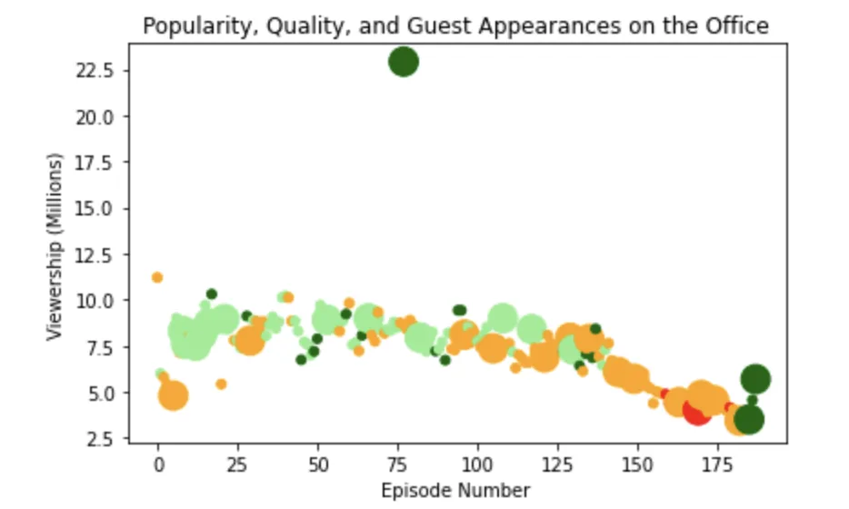

"The Office" is a well-known British series which depicts the stories about the office culture. Due to its immense popularity, this series has been spawned into various variants around the world. Amongst all the other variants, the American series has been one of the most successful and longest-running series.

In this blog and code, we will analyze the dataset of the "The Office" series. This dataset can be downloaded from Kaggle from this [link](https://www.kaggle.com/nehaprabhavalkar/the-office-dataset).

**The Office!** What started as a British mockumentary series about office culture in 2001 has since spawned ten other variants across the world, including an Israeli version (2010-13), a Hindi version (2019-), and even a French Canadian variant (2006-2007). Of all these iterations (including the original), the American series has been the longest-running, spanning 201 episodes over nine seasons.

In this notebook, we will take a look at a dataset of The Office episodes, and try to understand how the popularity and quality of the series varied over time. To do so, we will use the following dataset: datasets/office_episodes.csv, which was downloaded from Kaggle [here](https://www.kaggle.com/nehaprabhavalkar/the-office-dataset). This dataset contains information on the different features of each episode. It consists of the following detailed information:

- **episode_number:** Canonical episode number.
- **season:** Season in which the episode appeared.
- **episode_title:** Title of the episode.
- **description:** Description of the episode.
- **ratings:** Average IMDB rating.
- **votes:** Number of votes.
- **viewership_mil:** Number of US viewers in millions.
- **duration:** Duration in number of minutes.
- **release_date:** Airdate.
- **guest_stars:** Guest stars in the episode (if any).
- **director:** Director of the episode.
- **writers:** Writers of the episode.
- **has_guests:** True/False column for whether the episode contained guest stars.
- **scaled_ratings:** The ratings scaled from 0 (worst-reviewed) to 1 (best-reviewed).

Let's begin with the fun part and start exploring the dataset.

The first step is to import the necessary packages. For this analysis we will require the panda and matplotlib package.

```python
# Use this cell to begin your analysis, and add as many as you would like!
import matplotlib.pyplot as plt
import pandas as pd
import random
```

The second step is to load the dataset into panda dataframe so that we can use and process it.

```python
""" Read CSV file through panda """
episodes_df=pd.read_csv("datasets/office_episodes.csv")
episodes_df.head()
episodes_df.head(5)
```

Use panda's read_csv and load it into a variable. To check the first few rows of the dataframe, simply use head() method. If you want to view only certain number of rows then you can provide the number of rows as a parameter.

If you want to check the information of the dataframe, you can use the info() method.

```python
episodes_df.info()
```

Now, let's move onto the analysis phase of the project. We will create a scatter graph with each episode's **episode number plotted** along the x-axis and each episode's **viewership (in millions) plotted** along the y-axis. Before creating the final graph, we will add few features to it.

Our initial step is to create a **color scheme** reflecting the **scaled ratings**(not the regular ratings) of each episode, such that:

- Ratings < 0.25 are colored "red"
- Ratings >= 0.25 and < 0.50 are colored "orange"
- Ratings >= 0.50 and < 0.75 are colored "lightgreen"
- Ratings >= 0.75 are colored "darkgreen"

```python
""" Color scheme reflecting the scaled ratings """
colors = []

for key, value in episodes_df.iterrows():
    if value["scaled_ratings"] < 0.25:
        colors.append("red")
    elif value["scaled_ratings"] < 0.5:
        colors.append("orange")
    elif value["scaled_ratings"] < 0.75:
        colors.append("lightgreen")
    else:
        colors.append("darkgreen")
```

First, we will initialize an empty array named colors. We will then iterate over each row of the dataframe and compare each dataframe's **scaled_ratings** column's value. Based on the scaled_ratings value the colors of each scatter plot's data's color will be decided on.

We will also add the sizing feature. The episodes with guest appearance have a marker size of 250 and the ones withouth the guest appearance have a marker size of 25.

```python
""" Sizing system: episodes with guest appearance has marker size of 250 and episodes without guest appearnace of has marker size of 25 """

sizes = []

for key,value in episodes_df.iterrows():
    if value["has_guests"] == True:
        sizes.append(250)
    else:
        sizes.append(25)
```

For the sizing feature, we will check whether each row's **has_guests** column's value is True or False. Based on this value, we will assign the marker's size.

Now, we will begin plotting the scatter plot. The title of the plot will be assigned through plt.title("Popularity, Quality, and Guest Appearances on the Office"). The name of the xlabel will be assigned as plt.xlabel("Episode Number") and ylabel as plt.ylabel("Viewership (Millions)"). Finally, plt.scatter(episodes_df["episode_number"],episodes_df["viewership_mil"],c = colors, s = sizes) will be used to plot the scatter graph.

```python
fig = plt.figure()
plt.title("Popularity, Quality, and Guest Appearances on the Office")
plt.xlabel("Episode Number")
plt.ylabel("Viewership (Millions)")
plt.scatter(episodes_df["episode_number"],episodes_df["viewership_mil"],c = colors, s = sizes)
```



Here is the graph that you will see. If you want to use a more bigger graph, you can use plt.rcParams['figure.figsize'] = [11, 7].

Now, we will try to find one of the guest stars who was in the most watched "The Office" episode. First, we will find the maximum viewership from the entire dataframe through **max()** method. Then, we will get the guest stars with that **max_view** value and put those in a list. Finally, through random package's **choice()** method, we can randomly get a guest star's name from the list.

```python
""" Find one of the guest stars who was in the most watched "The Office" episode. """

### Get the maximum viewership from the dataframe ###
max_view = episodes_df["viewership_mil"].max()

### Get the guest stars from the maximum viewership ###
top_stars=episodes_df.loc[episodes_df["viewership_mil"] == max_view, "guest_stars"].iloc[0]

### Put the guest stars in the list ###
top_stars_list = top_stars.split(',')

### Randomly choose one of the guest stars from the list ###
print("The name of one of the guest stars:\n")
top_star = random.choice(top_stars_list)
print(top_star)
```
